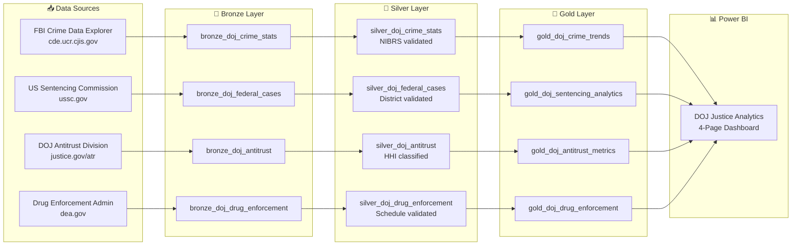

# ⚖️ Tutorial 38: DOJ Justice Analytics

<div align="center" markdown>


</div>

> 🏠 **[Home](https://github.com/fgarofalo56/Suppercharge_Microsoft_Fabric/blob/main/README.md)** > 📖 **[Tutorials](../index.md)** > ⚖️ **DOJ Justice Analytics**

---

!!! note "Third-party references — publicly sourced, good-faith comparison"
    This page references non-Microsoft products and services. That information is drawn from each vendor's **publicly available documentation** and is offered for honest, good-faith comparison only. This is a personal project written from a Microsoft Fabric and Azure perspective; it does **not** claim expertise in, or authority over, any third-party product, and nothing here is an official statement by, or endorsed by, those vendors. Capabilities, pricing, and features change often — always verify against the vendor's current official documentation. Where a third-party offering is the stronger choice, we say so plainly.

---

## ⚖️ Tutorial 38: DOJ Justice Analytics

| | |
|---|---|
| **Difficulty** | ⭐⭐ Intermediate |
| **Time** | ⏱️ 90-120 minutes |
| **Focus** | Crime Statistics, Federal Sentencing, Antitrust Enforcement, Drug Seizure Analytics |

---

### 📊 Progress Tracker

```
┌──────┬──────┬──────┬──────┬──────┬──────┬──────┬──────┬──────┬──────┬──────┬──────┬──────┬──────┐
│  00  │  01  │  02  │  03  │  04  │  05  │  06  │  07  │  08  │  09  │  10  │  11  │  12  │  13  │
│SETUP │BRNZE │SILVR │ GOLD │  RT  │ PBI  │PIPES │ GOV  │MIRRR │AI/ML │TDATA │ SAS  │CICD  │MIGR  │
├──────┼──────┼──────┼──────┼──────┼──────┼──────┼──────┼──────┼──────┼──────┼──────┼──────┼──────┤
│  ✅  │  ✅  │  ✅  │  ✅  │  ✅  │  ✅  │  ✅  │  ✅  │  ✅  │  ✅  │  ✅  │  ✅  │  ✅  │  ✅  │
└──────┴──────┴──────┴──────┴──────┴──────┴──────┴──────┴──────┴──────┴──────┴──────┴──────┴──────┘

┌──────┬──────┬──────┬──────┬──────┬──────┬──────┬──────┬──────┬──────┬──────┬──────┬──────┬──────┬──────┬──────┬──────┬──────┐
│  14  │  15  │  16  │  17  │  18  │  19  │  20  │  21  │  22  │  23  │  24  │  25  │  26  │  27  │  28  │  29  │  30  │  31  │
│ SEC  │ COST │PERF  │ MON  │SHARE │COPLT │WKBST │ GEO  │ NET  │SHIR  │ SNW  │ DB2  │MULTI │VIDEO │ MOVE │GEOLC │TRIBL │ DOT  │
├──────┼──────┼──────┼──────┼──────┼──────┼──────┼──────┼──────┼──────┼──────┼──────┼──────┼──────┼──────┼──────┼──────┼──────┤
│  ✅  │  ✅  │  ✅  │  ✅  │  ✅  │  ✅  │  ✅  │  ✅  │  ✅  │  ✅  │  ✅  │  ✅  │  ✅  │  ✅  │  ✅  │  ✅  │  ✅  │  ✅  │
└──────┴──────┴──────┴──────┴──────┴──────┴──────┴──────┴──────┴──────┴──────┴──────┴──────┴──────┴──────┴──────┴──────┴──────┘

┌──────┬──────┬──────┬──────┬──────┬──────┬──────┐
│  32  │  33  │  34  │  35  │  36  │  37  │  38  │
│ USDA │ SBA  │ NOAA │ EPA  │ DOI  │GRAPH │ DOJ  │
├──────┼──────┼──────┼──────┼──────┼──────┼──────┤
│  ✅  │  ✅  │  ✅  │  ✅  │  ✅  │  ✅  │  🔵  │
└──────┴──────┴──────┴──────┴──────┴──────┴──────┘
                                           ▲
                                    YOU ARE HERE
```

| Navigation | |
|---|---|
| ⬅️ **Previous** | [37-Graph Analytics](../37-graph-analytics/README.md) |
| ➡️ **Next** | — (Final Tutorial) |

---

## 📖 Overview

The **Department of Justice (DOJ)** is the largest law enforcement agency in the world, encompassing the FBI, DEA, Bureau of Prisons, US Attorneys, and the Antitrust Division. This tutorial builds a complete analytics pipeline for four DOJ data domains using Microsoft Fabric's medallion architecture.

### What You'll Build



### Four DOJ Domains

| Domain | Source Agency | Key Data | Records |
|--------|-------------|----------|---------|
| **Crime Statistics** | FBI (UCR/NIBRS) | Incidents, offenses, victims, clearances by 18,000+ agencies | ~700K/year |
| **Federal Cases** | US Sentencing Commission | Sentencing data across 94 districts, 13 circuits | ~70K/year |
| **Antitrust** | DOJ Antitrust Division | Merger filings, HSR reviews, cartel prosecutions | ~2K/year |
| **Drug Enforcement** | DEA | Drug seizures by type, schedule, region, quantity | ~50K/year |

---

## 📋 Prerequisites

Before starting this tutorial, ensure you have:

- [x] Completed [Tutorial 00: Environment Setup](../00-environment-setup/README.md)
- [x] Completed [Tutorial 01-03: Bronze/Silver/Gold Layers](../01-bronze-layer/README.md)
- [x] A Microsoft Fabric workspace with a Lakehouse
- [x] Python 3.10+ with `numpy`, `faker`, `pandas` installed
- [x] (Optional) FBI API key from [api.usa.gov](https://api.usa.gov/signup/) for live data

---

## 🔧 Step 1: Generate Synthetic DOJ Data

The DOJ data generator produces realistic records across all four domains.

### 1.1 Install Dependencies

```bash
cd data_generation
pip install -r requirements.txt
```

### 1.2 Generate Records

```python
from generators.federal.doj_generator import DOJGenerator

gen = DOJGenerator(seed=42)

# Generate 10,000 records per domain
crime_records = gen.generate_batch(count=10000, domain="crime_stats")
cases_records = gen.generate_batch(count=10000, domain="federal_cases")
antitrust_records = gen.generate_batch(count=5000, domain="antitrust")
drug_records = gen.generate_batch(count=10000, domain="drug_enforcement")

print(f"Crime stats: {len(crime_records)} records")
print(f"Federal cases: {len(cases_records)} records")
print(f"Antitrust: {len(antitrust_records)} records")
print(f"Drug enforcement: {len(drug_records)} records")
```

### 1.3 Explore a Sample Record

```python
# Crime statistics record
record = gen.generate_record(domain="crime_stats")
print(f"Incident: {record['incident_id']}")
print(f"Agency: {record['agency_name']} ({record['ori_code']})")
print(f"State: {record['state_code']}")
print(f"Offense: {record['offense_description']} ({record['offense_code']})")
print(f"Category: {record['offense_category']}")
print(f"Victims: {record['victim_count']}")
print(f"Clearance: {record['clearance_status']}")
```

### 1.4 Verify with Unit Tests

```bash
pytest validation/unit_tests/federal/test_doj_generator.py -v
# Expected: 29 passed
```

> **Checkpoint:** You should see 29 tests passing across crime_stats, federal_cases, antitrust, and drug_enforcement domains.

---

## 📥 Step 2: Download Real Open Data

The DOJ download module provides access to real, publicly available federal datasets.

### 2.1 FBI Crime Data Explorer

```bash
# Download FBI NIBRS data (requires free API key from api.usa.gov)
python -m data_generation.open_data.doj_download \
  --dataset fbi_crime \
  --output-dir ./data/doj \
  --year 2023
```

### 2.2 All DOJ Datasets

```bash
# Download all available datasets
python -m data_generation.open_data.doj_download \
  --dataset all \
  --output-dir ./data/doj
```

### Available Datasets

| Dataset | Command | Source | Auth Required |
|---------|---------|-------|---------------|
| FBI Crime Data | `--dataset fbi_crime` | FBI CDE REST API | Free API key |
| Federal Sentencing | `--dataset sentencing` | USSC bulk files | No |
| Antitrust Cases | `--dataset antitrust` | data.gov CSV | No |
| HSR Filings | `--dataset hsr` | data.gov CSV | No |
| DEA Seizures | `--dataset dea` | DEA statistics | No |

> **Tip:** If APIs are unavailable, the download module falls back to representative synthetic data matching published statistical distributions.

---

## 🥉 Step 3: Bronze Layer Ingestion

Import and run the Bronze notebook in your Fabric workspace.

### 3.1 Import Notebook

1. Navigate to your Fabric Lakehouse
2. Click **Import notebook**
3. Select `notebooks/bronze/18_bronze_doj.py`

### 3.2 Bronze Schema Overview

The Bronze layer ingests raw data with minimal transformation and adds metadata columns.

**Crime Statistics Schema:**
```
incident_id         STRING    -- UUID primary key
ori_code            STRING    -- Agency ORI identifier
agency_name         STRING    -- Reporting agency name
agency_type         STRING    -- City/County/State/Federal/Tribal
state_code          STRING    -- 2-letter state abbreviation
incident_date       DATE      -- Date of incident
offense_code        STRING    -- NIBRS offense code (30 codes)
offense_category    STRING    -- Persons/Property/Society
offense_description STRING    -- Human-readable offense name
victim_count        INTEGER   -- Number of victims (0 for Society)
offender_count      INTEGER   -- Number of known offenders
arrest_made         BOOLEAN   -- Whether arrest was made
weapon_involved     STRING    -- None/Firearm/Knife/Other
location_type       STRING    -- 15 location categories
clearance_status    STRING    -- Cleared/Not Cleared/Exceptionally Cleared
population_group    STRING    -- City population size bucket
reporting_year      INTEGER   -- Reporting year
_bronze_ingested_at TIMESTAMP -- Ingestion timestamp
_bronze_source_file STRING    -- Source file path
_bronze_batch_id    STRING    -- Batch identifier
_bronze_load_date   DATE      -- Partition key
```

### 3.3 Run the Notebook

Execute all cells. The notebook creates four Delta tables:

| Table | Partition | Records |
|-------|-----------|---------|
| `bronze_doj_crime_stats` | `_bronze_load_date` | 10,000 |
| `bronze_doj_federal_cases` | `_bronze_load_date` | 10,000 |
| `bronze_doj_antitrust` | `_bronze_load_date` | 5,000 |
| `bronze_doj_drug_enforcement` | `_bronze_load_date` | 10,000 |

> **Checkpoint:** Verify all four tables appear in your Lakehouse explorer with the expected row counts.

---

## 🥈 Step 4: Silver Layer Transformations

The Silver notebook cleanses, validates, and enriches the Bronze data.

### 4.1 Import and Run

Import `notebooks/silver/18_silver_doj.py` into your Fabric workspace.

### 4.2 Key Transformations

**NIBRS Offense Code Validation:**
```python
# Validate against 30 known NIBRS offense codes
VALID_NIBRS_CODES = {"09A", "09B", "09C", "100", "11A", "11B", "11C", "11D",
                     "120", "13A", "13B", "13C", "200", "210", "220", "23A",
                     "23B", "23C", "23D", "23E", "23F", "23G", "23H", "240",
                     "250", "26A", "26B", "270", "290", "35A", "35B"}

df = df.withColumn("nibrs_valid",
    F.when(F.col("offense_code").isin(VALID_NIBRS_CODES), True)
     .otherwise(False))
```

**HHI Market Concentration Classification (2023 Merger Guidelines):**
```python
# Apply DOJ/FTC 2023 Merger Guidelines thresholds
df = df.withColumn("concentration_level",
    F.when(F.col("hhi_post_merger") > 2500, "Highly Concentrated")
     .when(F.col("hhi_post_merger") >= 1500, "Moderately Concentrated")
     .otherwise("Unconcentrated"))

# Flag presumptively anticompetitive mergers
df = df.withColumn("merger_presumption",
    F.when(
        (F.col("hhi_post_merger") > 2500) & (F.col("hhi_delta") > 200), True
    ).when(
        (F.col("hhi_post_merger") >= 1500) & (F.col("hhi_delta") > 100), True
    ).otherwise(False))
```

**Federal District Validation:**
```python
# Validate against 94 federal judicial districts + DC
FEDERAL_DISTRICTS = ["SDNY", "EDNY", "NDCA", "CDCA", "NDIL", ...]  # 95 total
df = df.withColumn("district_valid",
    F.col("district_court").isin(FEDERAL_DISTRICTS))
```

**Data Quality Scoring:**
```python
# DQ score (0-100) based on field completeness and validity
df = df.withColumn("_dq_score",
    (F.when(F.col("nibrs_valid"), 25).otherwise(0) +
     F.when(F.col("state_code").rlike("^[A-Z]{2}$"), 25).otherwise(0) +
     F.when(F.col("victim_count") >= 0, 25).otherwise(0) +
     F.when(F.col("clearance_status").isNotNull(), 25).otherwise(0)))
```

### 4.3 Silver Output Tables

| Table | Key Enrichments |
|-------|----------------|
| `silver_doj_crime_stats` | NIBRS validation, arrest_rate, crime_severity |
| `silver_doj_federal_cases` | District validation, guideline compliance, departure analysis |
| `silver_doj_antitrust` | HHI classification, merger_presumption flag |
| `silver_doj_drug_enforcement` | Schedule validation, street_value_per_kg, outlier flags |

> **Checkpoint:** Query `silver_doj_antitrust` and verify that `merger_presumption = true` only for records where `hhi_post_merger > 2500 AND hhi_delta > 200`.

---

## 🥇 Step 5: Gold Layer Analytics

The Gold notebook produces four aggregation tables optimized for Power BI Direct Lake.

### 5.1 Import and Run

Import `notebooks/gold/19_gold_doj_analytics.py` into your Fabric workspace.

### 5.2 Gold Table: Crime Trends

```sql
-- gold_doj_crime_trends: Crime patterns by state, category, year
SELECT state_code, offense_category, reporting_year,
       COUNT(*) as incident_count,
       SUM(victim_count) as total_victims,
       AVG(CASE WHEN clearance_status = 'Cleared by Arrest' THEN 1.0 ELSE 0.0 END) as clearance_rate,
       AVG(CASE WHEN arrest_made THEN 1.0 ELSE 0.0 END) as arrest_rate,
       AVG(CASE WHEN weapon_involved = 'Firearm' THEN 1.0 ELSE 0.0 END) as firearm_rate
FROM silver_doj_crime_stats
GROUP BY state_code, offense_category, reporting_year
```

### 5.3 Gold Table: Sentencing Analytics

```sql
-- gold_doj_sentencing_analytics: Sentencing patterns by district
SELECT district_court, offense_category, fiscal_year,
       COUNT(*) as case_count,
       AVG(sentence_months) as avg_sentence_months,
       PERCENTILE_APPROX(sentence_months, 0.5) as median_sentence_months,
       AVG(CASE WHEN departure_type != 'None' THEN 1.0 ELSE 0.0 END) as departure_rate,
       AVG(CASE WHEN plea_type = 'Guilty Plea' THEN 1.0 ELSE 0.0 END) as plea_rate,
       AVG(fine_amount) as avg_fine
FROM silver_doj_federal_cases
GROUP BY district_court, offense_category, fiscal_year
```

### 5.4 Gold Table: Antitrust Metrics

```sql
-- gold_doj_antitrust_metrics: Market concentration and enforcement
SELECT industry_sector, industry_name, fiscal_year,
       COUNT(CASE WHEN case_type = 'Merger Review' THEN 1 END) as merger_count,
       AVG(CASE WHEN doj_action IN ('Challenged', 'Blocked') THEN 1.0 ELSE 0.0 END) as challenge_rate,
       AVG(hhi_delta) as avg_hhi_delta,
       SUM(penalty_amount_usd) as total_penalties,
       COUNT(CASE WHEN cartel_type != 'None' THEN 1 END) as cartel_count
FROM silver_doj_antitrust
GROUP BY industry_sector, industry_name, fiscal_year
```

### 5.5 Gold Table: Drug Enforcement

```sql
-- gold_doj_drug_enforcement: DEA seizure analytics
SELECT region as dea_region, drug_type, fiscal_year,
       COUNT(*) as seizure_count,
       SUM(quantity_kg) as total_quantity_kg,
       SUM(estimated_street_value_usd) as total_street_value,
       AVG(arrests_count) as avg_arrests
FROM silver_doj_drug_enforcement
GROUP BY region, drug_type, fiscal_year
```

### 5.6 ZORDER Optimization

All Gold tables are ZORDER-optimized for Direct Lake query patterns:

```sql
OPTIMIZE gold_doj_crime_trends ZORDER BY (state_code, offense_category)
OPTIMIZE gold_doj_sentencing_analytics ZORDER BY (district_court, offense_category)
OPTIMIZE gold_doj_antitrust_metrics ZORDER BY (industry_sector, fiscal_year)
OPTIMIZE gold_doj_drug_enforcement ZORDER BY (dea_region, drug_type)
```

> **Checkpoint:** Query each Gold table and verify aggregations produce expected metrics (clearance rates ~30-60%, plea rates ~90%+, positive seizure quantities).

---

## 🔍 Step 6: Data Quality Validation

### 6.1 Great Expectations Suites

Four GE suites validate data quality across all DOJ domains:

| Suite | Key Validations |
|-------|----------------|
| `doj_crime_stats_suite.json` | Unique incident_id, state_code regex `^[A-Z]{2}$`, offense_category in set, victim_count >= 0 |
| `doj_federal_cases_suite.json` | Unique case_id, sentence_months >= 0, defendant_age 18-75, departure_type in set |
| `doj_antitrust_suite.json` | Unique case_id, industry_sector `^\d{2}$`, HHI 0-10000, transaction_value > 0 |
| `doj_drug_enforcement_suite.json` | Unique seizure_id, drug_type in 7 types, quantity_kg > 0, quarter 1-4 |

### 6.2 Running Validations

```python
import great_expectations as gx

context = gx.get_context()
suite = context.get_expectation_suite("doj_crime_stats_suite")
results = context.run_checkpoint(checkpoint_name="doj_checkpoint")
print(f"Passed: {results.success}")
```

---

## 📊 Step 7: Power BI Direct Lake Dashboard

### 7.1 Create Semantic Model

1. In your Fabric workspace, navigate to the Gold Lakehouse
2. Click **New semantic model** → Name it `sm_doj_justice`
3. Select all four `gold_doj_*` tables
4. Set mode to **Direct Lake**

### 7.2 Key DAX Measures

```dax
// Crime clearance rate
Clearance Rate =
AVERAGE(gold_doj_crime_trends[clearance_rate])

// Total drug seizure street value
Total Seizure Value =
SUM(gold_doj_drug_enforcement[total_street_value])

// Antitrust challenge rate
Challenge Rate =
AVERAGE(gold_doj_antitrust_metrics[challenge_rate])

// Average sentence length
Avg Sentence =
AVERAGE(gold_doj_sentencing_analytics[avg_sentence_months])

// HHI concentration alert
High Concentration Markets =
CALCULATE(
    COUNTROWS(gold_doj_antitrust_metrics),
    gold_doj_antitrust_metrics[avg_hhi_delta] > 200
)
```

### 7.3 Report Pages

The Power BI report template (`docs/powerbi/doj_justice_report.json`) defines four dashboard pages:

1. **Crime Overview** — State map, offense category bars, clearance rate cards, firearm involvement trends
2. **Sentencing Dashboard** — District comparison bars, departure rate analysis, plea rate by offense
3. **Antitrust Analysis** — HHI scatter plot with 2500 threshold lines, challenge rate heatmap, penalty waterfall
4. **Drug Enforcement** — Seizure volume by drug type, street value by DEA region, quarterly trends

---

## 🔬 Step 8: Crime Analytics Deep Dive

### Clearance Rate Analysis

Clearance rates vary dramatically by offense category and geography:

```python
# Top 10 states by violent crime clearance rate
crime_trends = spark.table("lh_gold.gold_doj_crime_trends")
crime_trends.filter(F.col("offense_category") == "Persons") \
    .groupBy("state_code") \
    .agg(F.avg("clearance_rate").alias("avg_clearance")) \
    .orderBy(F.desc("avg_clearance")) \
    .show(10)
```

### Offense Trend Analysis

```python
# Year-over-year change in property crimes
crime_trends.filter(F.col("offense_category") == "Property") \
    .groupBy("reporting_year") \
    .agg(
        F.sum("incident_count").alias("total_incidents"),
        F.avg("yoy_change").alias("avg_yoy_pct")
    ) \
    .orderBy("reporting_year") \
    .show()
```

---

## ⚖️ Step 9: Antitrust Analytics Deep Dive

### HHI Market Concentration

The **Herfindahl-Hirschman Index (HHI)** measures market concentration. The 2023 DOJ/FTC Merger Guidelines establish these thresholds:

| HHI Range | Classification | Enforcement Posture |
|-----------|---------------|-------------------|
| < 1,500 | Unconcentrated | Generally no concern |
| 1,500 - 2,500 | Moderately Concentrated | Scrutiny if delta > 100 |
| > 2,500 | Highly Concentrated | Presumptive concern if delta > 200 |

```python
# Markets most at risk of DOJ challenge
antitrust = spark.table("lh_gold.gold_doj_antitrust_metrics")
antitrust.filter(F.col("avg_hhi_delta") > 200) \
    .select("industry_name", "fiscal_year", "merger_count",
            "challenge_rate", "avg_hhi_delta", "total_penalties") \
    .orderBy(F.desc("avg_hhi_delta")) \
    .show(10)
```

### Merger Review Pipeline

```
HSR Filing → Initial Review (30 days) → Second Request → Extended Review → Decision
                                                                              │
                                              ┌───────────────────────────────┤
                                              ▼               ▼              ▼
                                          Approved     Consent Decree    Challenged
                                                                              │
                                                                    ┌─────────┤
                                                                    ▼         ▼
                                                                 Blocked   Abandoned
```

### Challenge Rate by Industry

```python
# Industries with highest DOJ challenge rates
antitrust.filter(F.col("merger_count") >= 5) \
    .select("industry_name", "merger_count", "challenge_rate", "avg_hhi_delta") \
    .orderBy(F.desc("challenge_rate")) \
    .show(15)
```

---

## 💊 Step 10: Drug Enforcement Deep Dive

### Seizure Analysis by Drug Type

```python
drug = spark.table("lh_gold.gold_doj_drug_enforcement")

# Total seizures and street value by drug type
drug.groupBy("drug_type") \
    .agg(
        F.sum("total_quantity_kg").alias("total_kg"),
        F.sum("total_street_value").alias("total_value"),
        F.sum("seizure_count").alias("total_seizures")
    ) \
    .orderBy(F.desc("total_value")) \
    .show()
```

### Regional Enforcement Patterns

```python
# Top DEA regions by seizure volume
drug.groupBy("dea_region") \
    .agg(
        F.sum("total_quantity_kg").alias("total_kg"),
        F.sum("total_street_value").alias("total_value"),
        F.avg("avg_arrests").alias("avg_arrests_per_seizure")
    ) \
    .orderBy(F.desc("total_kg")) \
    .show(10)
```

---

## 🔗 Step 11: Cross-Domain Analysis

### DOJ x SBA: Market Consolidation Impact on Small Business Lending

```python
# Join antitrust metrics with SBA lending by industry (NAICS)
antitrust = spark.table("lh_gold.gold_doj_antitrust_metrics")
sba = spark.table("lh_gold.gold_sba_economic_impact")

cross = antitrust.join(sba,
    antitrust.industry_sector == sba.naics_code,
    "inner")

# Do highly concentrated markets see less small business lending?
cross.groupBy("concentration_level") \
    .agg(
        F.avg("total_loan_amount").alias("avg_sba_lending"),
        F.avg("avg_hhi_delta").alias("avg_concentration_change")
    ) \
    .show()
```

### DOJ x EPA: Environmental Enforcement Correlation

```python
# States with high environmental violations and DOJ prosecution rates
crime = spark.table("lh_gold.gold_doj_crime_trends")
epa = spark.table("lh_gold.gold_epa_compliance_trends")

env_crime = crime.filter(F.col("offense_category") == "Society") \
    .join(epa, crime.state_code == epa.state, "inner") \
    .select("state_code", "incident_count", "violation_count", "clearance_rate")
```

---

## ❓ Step 12: Troubleshooting

| Issue | Cause | Solution |
|-------|-------|----------|
| FBI API returns 403 | Missing/invalid API key | Sign up at [api.usa.gov](https://api.usa.gov/signup/) |
| `weighted_choice` error | Weight arrays don't sum to 1.0 | Regenerate with `seed=42` to use normalized weights |
| HHI values null | Non-merger case type | HHI fields only populated for `case_type = "Merger Review"` |
| Bronze table empty | Source path mismatch | Check `SOURCE_PATHS` in notebook match your data location |
| Silver DQ score = 0 | Invalid reference data | Verify NIBRS codes and district names in generator |
| Gold ZORDER fails | Small table | ZORDER requires sufficient data volume; skip for < 1000 rows |

---

## 📚 Step 13: Published References

### Federal Open Data Sources

| Resource | URL | Description |
|----------|-----|-------------|
| FBI Crime Data Explorer | https://cde.ucr.cjis.gov | NIBRS crime statistics, agency data, arrest records |
| USSC Research & Data | https://www.ussc.gov/research | Federal sentencing data files, annual reports |
| DOJ Open Data Portal | https://www.justice.gov/open/open-data | Cross-division datasets |
| DOJ Antitrust Case Filings | https://www.justice.gov/atr/antitrust-case-filings | Merger reviews, cartel prosecutions |
| 2023 Merger Guidelines | https://www.justice.gov/atr/2023-merger-guidelines | Current HHI thresholds and framework |
| DEA Data & Statistics | https://www.dea.gov/data-and-statistics | Drug seizure data, scheduling |
| BOP Statistics | https://www.bop.gov/about/statistics/ | Federal prison population data |
| BJS (Bureau of Justice Statistics) | https://bjs.ojp.gov | NCVS, prosecution, courts data |
| Vera Institute | https://github.com/vera-institute/incarceration-trends | County-level incarceration data |
| ICPSR NACJD | https://www.icpsr.umich.edu/web/pages/NACJD/index.html | 3,683 criminal justice studies |

### Related Use Cases

- [Antitrust Analytics](../../use-cases/antitrust-analytics.md) — Deep dive into HHI concentration analysis and merger review
- [Federal Justice Analytics](../../use-cases/federal-justice-analytics.md) — Crime, sentencing, and prosecution pipeline
- [References](../../use-cases/references/README.md) — Complete curated resource catalog

---

## ✅ Step 14: Summary

In this tutorial you built a complete DOJ Justice Analytics pipeline:

| What You Built | Details |
|---------------|---------|
| **Data Generator** | `DOJGenerator` with 4 domains, 29 unit tests |
| **Open Data Download** | 5 real federal data sources (FBI, USSC, Antitrust, HSR, DEA) |
| **Bronze Layer** | 4 raw ingestion tables with schema enforcement |
| **Silver Layer** | NIBRS validation, HHI classification, DQ scoring, dedup |
| **Gold Layer** | 4 aggregation tables with ZORDER optimization |
| **Data Quality** | 4 Great Expectations suites |
| **Power BI** | 4-page Direct Lake dashboard |
| **Cross-Domain** | DOJ x SBA, DOJ x EPA analytical joins |

### Key Concepts Learned

- **NIBRS offense codes** — National Incident-Based Reporting System classification
- **HHI concentration** — 2023 DOJ/FTC Merger Guidelines thresholds
- **Federal sentencing guidelines** — Departure types, criminal history categories
- **DEA drug scheduling** — Controlled Substances Act schedule classification
- **Cross-domain analytics** — Joining federal datasets on shared dimensions (state, NAICS)

### Files Created/Used

| File | Purpose |
|------|---------|
| `data_generation/generators/federal/doj_generator.py` | DOJ data generator |
| `data_generation/open_data/doj_download.py` | Real data downloader |
| `notebooks/bronze/18_bronze_doj.py` | Bronze ingestion |
| `notebooks/silver/18_silver_doj.py` | Silver transformations |
| `notebooks/gold/19_gold_doj_analytics.py` | Gold analytics |
| `validation/great_expectations/expectations/doj_*.json` | GE suites (4) |
| `docs/powerbi/doj_justice_report.json` | Power BI template |

---

> 🎉 **Congratulations!** You've completed Tutorial 38 — the final tutorial in the Supercharge Microsoft Fabric series. You now have a complete DOJ Justice Analytics pipeline ready for production use.

| Navigation | |
|---|---|
| ⬅️ **Previous** | [37-Graph Analytics](../37-graph-analytics/README.md) |
| 🏠 **Home** | [README](https://github.com/fgarofalo56/Suppercharge_Microsoft_Fabric/blob/main/README.md) |
| 📖 **All Tutorials** | [Tutorial Index](../index.md) |
