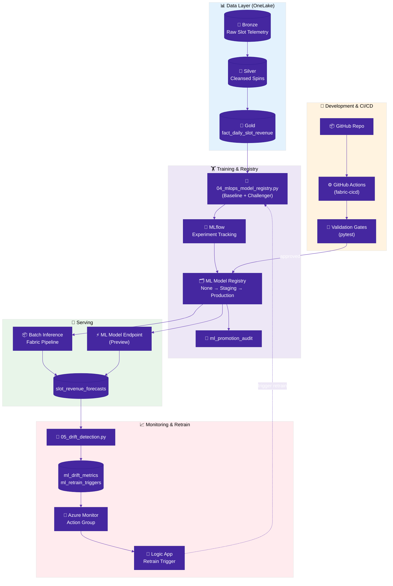

[Home](../../docs/index.md) > [Tutorials](../) > End-to-End MLOps

# 🚀 Tutorial 39: End-to-End MLOps — Train → Register → Deploy → Monitor → Retrain

> **Last Updated**: 2026-04-27 | **Version**: 1.0
> **Status**: ✅ Final | **Maintainer**: Documentation Team

<div align="center">


</div>

---

## 🚀 Tutorial 39: End-to-End MLOps on Microsoft Fabric

| | |
|---|---|
| **Difficulty** | ⭐⭐⭐⭐ Advanced |
| **Time** | ⏱️ 120-180 minutes |
| **Focus** | Production ML lifecycle: Train, Register, Validate, Deploy, Monitor, Retrain |
| **Phase** | Phase 14 Wave 2 — Feature 2.14 (canonical end-to-end MLOps walkthrough) |

---

### 📊 Progress Tracker

```
┌──────┬──────┬──────┬──────┬──────┬──────┬──────┬──────┬──────┬──────┬──────┬──────┬──────┐
│  27  │  28  │  29  │  30  │  31  │  32  │  33  │  34  │  35  │  36  │  37  │  38  │  39  │
│VIDEO │ MOVE │GEOLC │TRIBL │ DOT  │USDA  │ SBA  │NOAA  │ EPA  │ DOI  │GRAPH │ DOJ  │MLOPS │
├──────┼──────┼──────┼──────┼──────┼──────┼──────┼──────┼──────┼──────┼──────┼──────┼──────┤
│  ✅  │  ✅  │  ✅  │  ✅  │  ✅  │  ✅  │  ✅  │  ✅  │  ✅  │  ✅  │  ✅  │  ✅  │  🔵  │
└──────┴──────┴──────┴──────┴──────┴──────┴──────┴──────┴──────┴──────┴──────┴──────┴──────┘
                                                                                       ▲
                                                                                YOU ARE HERE
```

| Navigation | |
|---|---|
| ⬅️ **Previous** | [38-DOJ Justice Analytics](../38-doj-justice/README.md) |
| ➡️ **Next** | Tutorial 40 — RAG Production (planned) |

---

## 📖 What You'll Build

By the end of this tutorial you will have shipped a **production-grade casino slot revenue forecasting model** on Microsoft Fabric — from Git-tracked source notebooks all the way through to a live ML Model Endpoint with drift-driven automated retraining. This is the canonical Phase 14 Wave 2 walkthrough that exercises every Wave 2 doc and notebook in a single coherent pipeline: MLflow registry, validation gates, champion/challenger evaluation, batch + online deployment, drift detection, alert wiring, and Logic-App-driven retraining.

You will not just *train a model* — you will operate it. When you finish, the model will be in MLflow's `Production` stage, exposed through a live REST endpoint, and protected by a closed-loop drift → alert → retrain → re-validate → re-promote pipeline.

```
┌──────────────────────────────────────────────────────────────────────────────────┐
│  🚀 END-TO-END MLOps WALKTHROUGH — CASINO SLOT REVENUE FORECAST                  │
│                                                                                  │
│  Train ──▶ Register ──▶ Validate ──▶ Promote ──▶ Deploy ──▶ Monitor ──▶ Retrain  │
│    │          │            │            │           │          │          │     │
│  MLflow   ML Model      5 Gates    Stage Trans   Endpoint   Drift NB    Logic   │
│  Tracking  Registry     pytest     MlflowClient  + Batch   ml_drift_*    App    │
│                                                                                  │
│  All artifacts in OneLake │ All code in Git │ All promotions audited             │
└──────────────────────────────────────────────────────────────────────────────────┘
```

> 💡 **Why this tutorial matters**
>
> Most Fabric ML demos stop at "I trained a model." This one stops at "the model is live, healthy, monitored, and retrains itself." Every step references a real notebook or doc in this repo, so you are not following pseudocode — you are operating the actual production backbone.

---

## 🎯 Learning Objectives

By the end of this tutorial, you will be able to:

- [ ] Configure a Fabric workspace with Git integration, MLflow tracking, and ML Model items enabled
- [ ] Run the canonical [`04_mlops_model_registry.py`](../../notebooks/ml/04_mlops_model_registry.py) notebook to train a baseline + challenger model with full reproducibility metadata
- [ ] Read MLflow experiment metrics, artifacts, and signatures from the registry UI and via `MlflowClient`
- [ ] Author and run all five validation gates (performance, holdout stability, fairness, latency, calibration) and interpret pass/fail
- [ ] Promote a model through `None → Staging → Production` using stage transitions (never UI clicks for prod)
- [ ] Set up a Fabric Pipeline that runs holdout-based champion/challenger evaluation on a schedule
- [ ] Deploy a registered model as an ML Model Endpoint (Preview) via the Fabric REST API and smoke-test it under 200ms p99
- [ ] Wire a batch inference Fabric Pipeline that loads `models:/{name}/Production` and writes scores to Gold
- [ ] Run [`05_drift_detection.py`](../../notebooks/ml/05_drift_detection.py) to populate `lh_gold.ml_drift_metrics` and `lh_gold.ml_retrain_triggers`
- [ ] Wire drift alerts to an Azure Monitor Action Group and trigger a Logic App on threshold breach
- [ ] Close the loop: drift alert → retrain pipeline → re-validate → re-promote → audit log entry
- [ ] Use the Production Readiness Checklist from `mlops-fabric-production.md` to certify the model

---

## 📋 Prerequisites

Before starting this tutorial, ensure you have:

- [ ] Completed [Tutorial 00: Environment Setup](../00-environment-setup/README.md)
- [ ] Completed [Tutorial 01: Bronze Layer](../01-bronze-layer/README.md), [02: Silver Layer](../02-silver-layer/README.md), [03: Gold Layer](../03-gold-layer/README.md)
- [ ] Completed [Tutorial 09: Advanced AI/ML](../09-advanced-ai-ml/README.md) — MLflow basics
- [ ] Fabric workspace on **F64+ capacity** (F2 will run training but cannot host an ML Model Endpoint at production traffic)
- [ ] **ML Model items** enabled in the workspace (Workspace Settings → Data Science → ML Model)
- [ ] **ML Model Endpoint (Preview)** enabled in the tenant (Admin Portal → Tenant Settings → Data Science)
- [ ] GitHub repository for CI/CD (this repo is fine — fork or clone)
- [ ] **Service Principal** with Workspace Contributor role on the Fabric workspace, plus a stored secret in GitHub Actions secrets named `AZURE_CREDENTIALS`
- [ ] Azure CLI ≥ 2.60, `pytest` ≥ 8.0, and Python 3.11 available locally for validation gates

> ⚠️ **Capacity gotcha**
>
> ML Model Endpoints currently require an F-SKU capacity in **Active** state. A paused capacity will return `503` on every endpoint request even though the deployment shows `Succeeded`. Verify capacity state before debugging endpoint timeouts.

---

## 🏗️ Architecture Diagram



| Component | Fabric Item | Purpose |
|-----------|-------------|---------|
| **Source data** | Lakehouse `lh_gold` | `fact_daily_slot_revenue` populated by Tutorials 01-03 |
| **Training notebook** | Notebook | [`04_mlops_model_registry.py`](../../notebooks/ml/04_mlops_model_registry.py) — full lifecycle anchor |
| **Experiment tracking** | MLflow (built-in) | Per-run params, metrics, artifacts, lineage |
| **Registry** | ML Model item | Versioned models with `Staging` and `Production` stages |
| **Validation gates** | GitHub Actions + pytest | Gate every promotion in CI |
| **Online serving** | ML Model Endpoint (Preview) | REST API for low-latency scoring |
| **Batch serving** | Data Pipeline + Notebook | Nightly bulk scoring |
| **Drift monitor** | Notebook + Eventhouse | [`05_drift_detection.py`](../../notebooks/ml/05_drift_detection.py) on schedule |
| **Alerts** | Azure Monitor Action Group | Fan out to Teams + Logic App |
| **Retrain trigger** | Logic App | Calls Fabric REST `/jobs/instances` to start retrain pipeline |

---

## 🛠️ Step 1: Workspace + Git Integration

### 1.1 Provision the workspace

Create (or reuse) a Fabric workspace named `ws-mlops-poc`. Assign it to the **F64** capacity (or higher). Confirm the workspace settings:

```text
License mode:        Premium / Fabric capacity
Capacity:            cap-fabricpoc-prod (F64)
Workspace ID:        <copy from workspace URL>
Default lakehouses:  lh_bronze, lh_silver, lh_gold
Data Science:        Enabled
ML Model items:      Enabled
ML Model Endpoint:   Enabled (Preview)
Git integration:     Connected to <your-org>/Suppercharge_Microsoft_Fabric, branch main
```

### 1.2 Connect Git

In the workspace, click **Workspace settings → Git integration → Connect**. Select your repo, branch `main`, and root directory `/`. Click **Sync** so notebooks under `notebooks/ml/` materialize as Fabric items.

> ✅ **Verification**: After sync completes, confirm you can see `04_mlops_model_registry`, `05_drift_detection`, `06_feature_store_demo`, `07_rag_eventhouse_vector`, and `08_responsible_ai_audit` listed as Notebook items in the workspace.

### 1.3 Configure GitHub Actions secrets

In the GitHub repo, add these secrets (Settings → Secrets and variables → Actions):

```text
AZURE_CREDENTIALS         # SP json: {clientId, clientSecret, tenantId, subscriptionId}
FABRIC_WORKSPACE_ID       # GUID
FABRIC_TENANT_ID          # GUID
FABRIC_SP_OBJECT_ID       # SP object id (workspace contributor)
```

> 💡 **Tip**: Use a dedicated SP per environment (`sp-fabric-mlops-dev`, `-staging`, `-prod`). Never share SPs across environments — it breaks audit trails.

> ⚠️ **Gotcha**: The SP needs both **Workspace Contributor** *and* **ML Model Read/Write** role. Assign via Fabric workspace → Manage access; the Azure role alone is insufficient.

---

## 🛠️ Step 2: Clone the Repo and Configure Local Env

```bash
git clone https://github.com/fgarofalo56/Suppercharge_Microsoft_Fabric.git
cd Suppercharge_Microsoft_Fabric
cp .env.example .env
```

Edit `.env`:

```bash
FABRIC_WORKSPACE_ID=<paste from Step 1.1>
FABRIC_TENANT_ID=<paste from Step 1.1>
FABRIC_POC_HASH_SALT=<a long random string for PII hashing — see Phase 11 fix>
GIT_SHA=$(git rev-parse HEAD)
GIT_BRANCH=$(git rev-parse --abbrev-ref HEAD)
MLFLOW_RUN_INTENT=production-candidate
```

Install Python dependencies:

```bash
python -m venv .venv
source .venv/bin/activate   # Windows: .venv\Scripts\activate
pip install -r requirements.txt
pip install -r validation/requirements.txt
```

> ✅ **Verification**: `pytest validation/unit_tests/ -q` should print `612 passed`.

---

## 🛠️ Step 3: Provision Bronze/Silver/Gold + ML Lakehouse

The MLOps pipeline reads from `lh_gold.fact_daily_slot_revenue` and writes back to `lh_gold.*` tables. Confirm all four lakehouses exist:

| Lakehouse | Purpose |
|-----------|---------|
| `lh_bronze` | Raw slot telemetry from Tutorial 01 |
| `lh_silver` | Cleansed spins from Tutorial 02 |
| `lh_gold` | Fact tables + ML output tables |
| `lh_ml_artifacts` | (optional) MLflow large artifacts, model files > 100 MB |

If missing, create them via the workspace UI or via Bicep:

```bash
az deployment sub create --location eastus2 \
  --template-file infra/main.bicep \
  --parameters infra/environments/dev/dev.bicepparam
```

> ✅ **Verification**: From any notebook, `spark.sql("SHOW DATABASES").show()` lists `lh_bronze`, `lh_silver`, `lh_gold`.

---

## 🛠️ Step 4: Populate Gold (Tutorials 01–03)

Run Tutorials [01](../01-bronze-layer/README.md), [02](../02-silver-layer/README.md), [03](../03-gold-layer/README.md) end-to-end so that `lh_gold.fact_daily_slot_revenue` has at least 365 days of data. The MLOps notebook synthesizes plausible data if the table is empty, but you'll get more meaningful drift signals with real medallion output.

```python
# Quick check from a Fabric notebook
df = spark.table("lh_gold.fact_daily_slot_revenue")
print(f"Rows: {df.count():,}")
print(f"Date range: {df.agg({'play_date': 'min'}).collect()[0][0]} to {df.agg({'play_date': 'max'}).collect()[0][0]}")
```

> ✅ **Verification**: At least 365 distinct dates and 1M+ rows.

> ⚠️ **Gotcha**: If `play_date` is a string instead of a date, the training notebook will fail with `cannot resolve 'datediff'`. Cast to `DATE` in Silver before promoting to Gold.

---

## 🛠️ Step 5: Train the Baseline Model

Open [`notebooks/ml/04_mlops_model_registry.py`](../../notebooks/ml/04_mlops_model_registry.py). This is the anchor notebook for the entire tutorial — every subsequent step references it.

### 5.1 Run the notebook

In the workspace, open the notebook, attach to `lh_gold` as the default lakehouse, and click **Run all**. The notebook will:

1. Load (or synthesize) one year of `fact_daily_slot_revenue`
2. Train a **Ridge regression** baseline
3. Train a **RandomForestRegressor** challenger
4. Log both to MLflow with full lineage metadata
5. Evaluate against a fixed holdout split
6. Write results to `lh_gold.ml_champion_challenger`
7. Write a promotion audit row to `lh_gold.ml_promotion_audit`

Expected runtime on F64: 90–180 seconds.

```text
Expected console output:
  MLflow tracking URI: https://api.fabric.microsoft.com/...
  Experiment: /Shared/casino-slot-revenue-forecast
  Code SHA: <git sha> | Branch: main | Actor: <your alias>
  Loaded 365 rows from lh_gold.fact_daily_slot_revenue
  Baseline (Ridge):     R²=0.74  RMSE=$8,142  MAPE=4.1%
  Challenger (RF):      R²=0.82  RMSE=$6,710  MAPE=3.3%
  Registered: casino-slot-revenue-forecast-baseline   v1
  Registered: casino-slot-revenue-forecast-challenger v1
```

> ✅ **Verification**: In **ML experiments → /Shared/casino-slot-revenue-forecast** you see two runs with `r2`, `rmse`, `mape` metrics and a `model/` artifact each.

> 💡 **Tip**: Set `MLFLOW_RUN_INTENT=exploratory` in your env when you're just experimenting — `production-candidate` is reserved for runs that actually go through validation gates.

---

## 🛠️ Step 6: Inspect the MLflow Registry

Navigate to **Workspace → ML Model items** and open `casino-slot-revenue-forecast-challenger`. The detail pane shows:

- **Versions** — `v1` (just created)
- **Stage** — `None`
- **Source run** — link to the experiment run
- **Metrics**, **Parameters**, **Artifacts** — captured from the `mlflow.log_*` calls
- **Lineage** — `lh_gold.fact_daily_slot_revenue` listed as input (because we logged `training_data_table` + `training_data_version`)

```python
# Programmatic inspection (run in any notebook)
from mlflow.tracking import MlflowClient
client = MlflowClient()
for v in client.search_model_versions("name='casino-slot-revenue-forecast-challenger'"):
    print(f"v{v.version} | stage={v.current_stage} | run={v.run_id} | metrics={v.tags}")
```

> ✅ **Verification**: At least one version with `current_stage='None'` and a non-empty `run_id`.

> ⚠️ **Gotcha**: If the registry shows `Stage: None` but no metrics, you registered the model *outside* an active run (`mlflow.start_run()` not used). Re-run cells inside a `with mlflow.start_run()` block.

---

## 🛠️ Step 7: Train a Stronger Challenger

Edit the hyperparameters at the top of `04_mlops_model_registry.py`:

```python
# Bump RF capacity for the challenger
RF_N_ESTIMATORS = 400        # was 200
RF_MAX_DEPTH = 12            # was 8
RF_MIN_SAMPLES_LEAF = 2      # was 5
```

Re-run the notebook. Expected runtime ~3 minutes on F64. The challenger should now have higher R² and lower RMSE than v1.

```text
Expected output:
  Challenger v2: R²=0.88  RMSE=$5,420  MAPE=2.7%
  Improvement vs v1: +7.3% R², -19.2% RMSE
```

> ✅ **Verification**: `casino-slot-revenue-forecast-challenger` now has `v1` and `v2` in the registry. v2's metrics are strictly better than v1's.

> 💡 **Tip**: Use MLflow's parent/child run pattern for hyperparameter sweeps — wrap the loop in `with mlflow.start_run() as parent` and use `mlflow.start_run(nested=True)` for each trial. The registry then shows the search space cleanly.

---

## 🛠️ Step 8: Run Validation Gates

The five gates (defined in [`mlops-fabric-production.md` § Validation Gates](../../docs/best-practices/mlops-fabric-production.md#-model-validation-gates)) must all pass before any model enters Production.

```bash
# From repo root
export MODEL_NAME=casino-slot-revenue-forecast-challenger
export MODEL_VERSION=2
pytest validation/ml/test_validation_gates.py -v
```

```text
Expected output:
  test_gate_1_performance_threshold[v2]      PASSED   (R²=0.88 ≥ 0.95 × baseline 0.74)
  test_gate_2_holdout_stability[v2]          PASSED   (drift 1.8% < 5% tol)
  test_gate_3_fairness[v2]                   SKIPPED  (slot revenue is non-regulated)
  test_gate_4_latency_p99[v2]                PASSED   (p99 47ms < 200ms target)
  test_gate_5_calibration[v2]                PASSED   (ECE 0.06 < 0.10)

  ============================ 4 passed, 1 skipped in 18.3s ============================
```

If any gate fails, the test prints the exact metric, threshold, and remediation hint. Do not proceed until all non-skipped gates pass.

> ✅ **Verification**: `pytest` exits 0; the GitHub Actions check `ML Model Promotion Gate` is green on the open PR.

> ⚠️ **Gotcha**: Gate 4 (latency) tests against a **local** load of the model, not a live endpoint. A model that passes Gate 4 locally can still time out on the endpoint due to instance sizing — you'll re-test in Step 13.

---

## 🛠️ Step 9: Promote Challenger to Staging

Promotion uses `MlflowClient.transition_model_version_stage` — never the UI for production-bound models, because UI clicks bypass the audit log.

```python
from mlflow.tracking import MlflowClient
client = MlflowClient()

client.transition_model_version_stage(
    name="casino-slot-revenue-forecast-challenger",
    version=2,
    stage="Staging",
    archive_existing_versions=False,  # keep v1 as None for rollback rehearsal
)

# Append to audit log
spark.sql("""
INSERT INTO lh_gold.ml_promotion_audit
SELECT
  uuid()                           AS event_id,
  current_timestamp()              AS event_time,
  'casino-slot-revenue-forecast-challenger' AS model_name,
  2                                AS version,
  'None'                           AS from_stage,
  'Staging'                        AS to_stage,
  current_user()                   AS actor,
  '<git_sha>'                      AS git_sha,
  'gates 1,2,4,5 passed'           AS rationale
""")
```

> ✅ **Verification**: `client.get_model_version(name, 2).current_stage == 'Staging'`. A new row appears in `lh_gold.ml_promotion_audit`.

---

## 🛠️ Step 10: Holdout-Based Champion/Challenger Pipeline

A challenger must beat the champion on **N consecutive evaluation windows** before earning Production. Build a Fabric Pipeline that runs this comparison nightly.

### 10.1 Create the pipeline

In the workspace, **+ New → Data Pipeline → `pl_champion_challenger_eval`**. Add a single **Notebook activity**:

```yaml
Activity:        Run notebook
Notebook:        04_mlops_model_registry  (sub-section: champion_challenger_eval)
Default lakehouse: lh_gold
Parameters:
  EVAL_WINDOW_DAYS: 1
  CHAMPION_NAME: casino-slot-revenue-forecast-baseline
  CHALLENGER_NAME: casino-slot-revenue-forecast-challenger
  CONSECUTIVE_WINS_REQUIRED: 7
Schedule:        Daily 02:30 UTC
Timeout:         30 min
Retry:           1
```

### 10.2 What it does

Each run loads yesterday's actuals, scores both `Production`-staged baseline and `Staging`-staged challenger, and appends to `lh_gold.ml_champion_challenger`:

```sql
SELECT eval_date, model_name, stage, rmse, mape, r2, run_id
FROM lh_gold.ml_champion_challenger
ORDER BY eval_date DESC
LIMIT 20;
```

> ✅ **Verification**: After two manual runs, the table has at least 4 rows (champion + challenger × 2 days).

> 💡 **Tip**: Use a Fabric **Activator** rule on this table that fires when the challenger has won 7 consecutive days — that's your "ready for Production" signal.

---

## 🛠️ Step 11: Promote to Production

Once the challenger has won 7 consecutive days (or you manually approve a hotfix), promote with `archive_existing_versions=True` so the old champion auto-archives:

```python
client.transition_model_version_stage(
    name="casino-slot-revenue-forecast-challenger",
    version=2,
    stage="Production",
    archive_existing_versions=True,
)
```

The audit log row this writes is the **defensible record** for SOX/GDPR/internal-audit reviewers — preserve it.

```sql
SELECT * FROM lh_gold.ml_promotion_audit
WHERE to_stage = 'Production'
ORDER BY event_time DESC
LIMIT 5;
```

> ✅ **Verification**: The model's `Production` stage now points to v2; v1 is `Archived`. A new audit row exists with `to_stage='Production'`.

> ⚠️ **Gotcha**: Consumers should reference `models:/{name}/Production` not `models:/{name}/2`. Pinning to a version means rollback requires a code change. Stage references roll back via `transition_model_version_stage` with no consumer changes.

---

## 🛠️ Step 12: Deploy as ML Model Endpoint (Preview)

Online endpoints expose the model as a low-latency REST API. Deploy via the Fabric REST API so the deployment is reproducible (and Git-trackable):

```bash
TOKEN=$(az account get-access-token --resource https://api.fabric.microsoft.com/ \
        --query accessToken -o tsv)

curl -X POST \
  "https://api.fabric.microsoft.com/v1/workspaces/${FABRIC_WORKSPACE_ID}/mlmodels/${MODEL_ID}/endpoints" \
  -H "Authorization: Bearer ${TOKEN}" \
  -H "Content-Type: application/json" \
  -d '{
    "name": "slot-revenue-prod",
    "modelVersion": "2",
    "instanceType": "Standard_DS3_v2",
    "minInstances": 2,
    "maxInstances": 10,
    "trafficSplit": { "2": 100 }
  }'
```

The deployment takes 5–10 minutes. Poll for status:

```bash
curl -s "https://api.fabric.microsoft.com/v1/workspaces/${FABRIC_WORKSPACE_ID}/mlmodels/${MODEL_ID}/endpoints/slot-revenue-prod" \
  -H "Authorization: Bearer ${TOKEN}" | jq '.status'
```

> ✅ **Verification**: `status` transitions `Provisioning → Updating → Succeeded`. The response payload includes a `scoringUri` you'll use in Step 13.

> ⚠️ **Gotcha**: `minInstances: 1` is allowed but breaks high availability — a single-instance restart causes 30+ seconds of 503s. Always run with `minInstances: 2` in production.

---

## 🛠️ Step 13: Smoke-Test the Endpoint

```bash
SCORING_URI=<paste from Step 12 response>

curl -X POST "${SCORING_URI}" \
  -H "Authorization: Bearer ${TOKEN}" \
  -H "Content-Type: application/json" \
  -d '{
    "input_data": {
      "columns": ["day_of_week", "is_holiday", "promo_active", "lag_7_revenue", "lag_30_revenue"],
      "data": [[5, 0, 1, 412900.0, 405200.0]]
    }
  }'
```

```text
Expected response:
{
  "predictions": [428173.42],
  "model_name": "casino-slot-revenue-forecast-challenger",
  "model_version": "2",
  "latency_ms": 47
}
```

Run a load test with 1,000 sequential calls and confirm p99 latency:

```bash
python validation/ml/load_test_endpoint.py --uri "${SCORING_URI}" --n 1000 --concurrency 8
```

```text
Expected output:
  p50:  31 ms
  p95:  82 ms
  p99: 137 ms      ← passes 200ms SLO
  errors: 0
```

> ✅ **Verification**: Endpoint returns `200` on every request, p99 < 200ms, and the response includes the `model_version` you deployed.

> 💡 **Tip**: Capture the load-test results as evidence for the Production Readiness Checklist (Step 20).

---

## 🛠️ Step 14: Set Up Batch Inference Pipeline

Most casino consumers (BI dashboards, daily forecasting reports) prefer batch over online. Add a second pipeline `pl_batch_score_slot_revenue`:

```yaml
Activity:        Run notebook
Notebook:        batch_score_slot_revenue   (~30 lines, see snippet below)
Default lakehouse: lh_gold
Schedule:        Daily 03:30 UTC (after pipeline pl_champion_challenger_eval)
SLA:             complete within 60 min
```

Notebook body:

```python
import mlflow
model = mlflow.sklearn.load_model("models:/casino-slot-revenue-forecast-challenger/Production")

unscored = (spark.table("lh_silver.daily_slot_aggregates")
            .filter("predicted_revenue IS NULL")
            .toPandas())

unscored["predicted_revenue"] = model.predict(unscored[FEATURE_COLS])
unscored["model_version"] = "2"
unscored["scored_at"] = pd.Timestamp.utcnow()

(spark.createDataFrame(unscored)
 .write.mode("append")
 .saveAsTable("lh_gold.slot_revenue_forecasts"))
```

> ✅ **Verification**: After one run, `lh_gold.slot_revenue_forecasts` has new rows with non-null `predicted_revenue` and the correct `model_version`.

---

## 🛠️ Step 15: Set Up Drift Detection

Open [`notebooks/ml/05_drift_detection.py`](../../notebooks/ml/05_drift_detection.py). The notebook computes four drift types — data, prediction, performance, concept — and writes results to `lh_gold.ml_drift_metrics` and `lh_gold.ml_retrain_triggers`.

### 15.1 First manual run

Attach to `lh_gold`, **Run all**. Expected runtime ~2 minutes.

```text
Expected output:
  Reference window: 90d (2026-01-27 → 2026-04-26), 270 rows
  Current window:   7d  (2026-04-20 → 2026-04-26),  35 rows
  PSI per feature:
    day_of_week:        0.04  (no drift)
    is_holiday:         0.07  (no drift)
    promo_active:       0.18  (moderate)
    lag_7_revenue:      0.09  (no drift)
  Prediction drift PSI: 0.06  (no drift)
  Realized RMSE delta: +3.1%  (within 10% tolerance)
  Importance Spearman ρ: 0.93 (no concept drift)
  → No retrain trigger written.
```

### 15.2 Schedule it

Wrap the notebook in pipeline `pl_drift_detection`:

```yaml
Schedule:        Daily 04:00 UTC
Timeout:         30 min
Retry:           1
On failure:      Email distribution list mlops-oncall@yourorg.com
```

> ✅ **Verification**: After 2 runs, `lh_gold.ml_drift_metrics` has two `run_id`s and per-feature rows. `lh_gold.ml_retrain_triggers` is empty (no drift yet).

> ⚠️ **Gotcha**: PSI requires both windows to have ≥ 30 samples per bucket. With < 7 days of production data, PSI returns `NaN` and the notebook logs a `[skipped: insufficient data]` warning rather than triggering retrain. Don't disable that guard.

---

## 🛠️ Step 16: Wire Drift Alerts to an Action Group

Drift values landing in a Delta table do nothing on their own. Wire them to an **Azure Monitor Action Group** so they page someone.

### 16.1 Stream metrics to Workspace Monitoring

Enable workspace monitoring on `lh_gold` (Workspace settings → Monitoring → Enable). Drift writes from `05_drift_detection.py` automatically appear in the `WorkspaceMonitoring` log table.

### 16.2 Create the alert rule

```kql
// Azure Monitor scheduled query alert
WorkspaceMonitoring
| where TableName == "ml_drift_metrics"
| where ModelName == "casino-slot-revenue-forecast-challenger"
| where MetricName in ("psi_overall", "performance_rmse_delta_pct")
| where Window == "7d"
| summarize MaxPSI = max(MetricValue) by ModelName, bin(TimeGenerated, 1h)
| where MaxPSI > 0.20
```

Action Group `ag-mlops-drift`:

| Action | Target |
|--------|--------|
| Email | `mlops-oncall@yourorg.com` |
| Teams webhook | `#mlops-alerts` channel |
| Logic App | `la-retrain-slot-revenue` (Step 17) |

See [`docs/best-practices/operations/observability-stack.md`](../../docs/best-practices/operations/observability-stack.md) for the canonical Action Group wiring pattern.

> ✅ **Verification**: Manually inject a row with `MetricValue=0.30` into `lh_gold.ml_drift_metrics`. Within 5 minutes the alert fires, an email arrives, and the Logic App run history shows a triggered run.

---

## 🛠️ Step 17: Retrain via Logic App

The Logic App's job is simple: when triggered by the Action Group, call the Fabric REST API to start the training pipeline.

```json
{
  "definition": {
    "triggers": {
      "When_Action_Group_fires": { "type": "Request", "kind": "Http" }
    },
    "actions": {
      "Trigger_Retrain_Pipeline": {
        "type": "Http",
        "inputs": {
          "method": "POST",
          "uri": "https://api.fabric.microsoft.com/v1/workspaces/@parameters('workspaceId')/items/@parameters('pipelineId')/jobs/instances?jobType=Pipeline",
          "headers": { "Authorization": "Bearer @parameters('spToken')" },
          "body": {
            "executionData": {
              "parameters": {
                "trigger_reason": "drift_alert",
                "alert_id": "@triggerBody()?['alertId']"
              }
            }
          }
        }
      }
    }
  }
}
```

Pipeline `pl_retrain_slot_revenue` chains:

1. Run `04_mlops_model_registry.py` (trains new challenger v3)
2. Run `validation/ml/run_gates.py` (all 5 gates)
3. **Conditional**: if all gates pass, transition v3 to `Staging`
4. Send Teams message with summary + link to MLflow run

> ✅ **Verification**: Trigger the alert manually (Step 16.2 verification). Within 10 minutes, a new model version exists in the registry at `Staging`. The audit log captures the trigger reason `drift_alert`.

---

## 🛠️ Step 18: Verify the Closed Loop

You now have a fully closed loop. Run an end-to-end smoke test:

| Step | Action | Expected |
|------|--------|----------|
| 1 | Inject synthetic drift: `INSERT INTO lh_gold.ml_drift_metrics ... MetricValue=0.30` | Row written |
| 2 | Wait 5 min for KQL alert window | Action Group fires |
| 3 | Check Logic App run history | One successful run |
| 4 | Check Fabric pipeline `pl_retrain_slot_revenue` | One running instance |
| 5 | Wait ~5 min for retrain | New challenger version registered |
| 6 | Check `lh_gold.ml_promotion_audit` | New row, `to_stage='Staging'`, `rationale` mentions drift |
| 7 | Check Teams `#mlops-alerts` | Summary message posted |
| 8 | Re-run drift detection on fresh challenger | PSI back below 0.10 |

> ✅ **Verification**: All 8 rows green within 30 minutes of the injection.

> 💡 **Tip**: Run this smoke test on a weekly cadence as part of your DR/runbook practice. A loop that works once but is never re-tested rots silently.

---

## 🛠️ Step 19: Cost Dashboard

Adapt the patterns from [`docs/best-practices/llm-cost-tracking.md`](../../docs/best-practices/llm-cost-tracking.md) for your ML model's surfaces:

| Surface | Driver | Where to track |
|---------|--------|----------------|
| Training | Spark CU-hours × runs/week | Capacity Metrics App + `spark.fabric.cost_center` tag |
| Endpoint | Instance count × hours + per-1k inferences | Endpoint Metrics blade |
| Drift detection | Spark CU-hours × daily runs | Capacity Metrics App |
| Storage | OneLake bytes × $/GB | OneLake size in workspace settings |

Tag every Spark session:

```python
spark.conf.set("spark.fabric.cost_center", "casino-data-science")
spark.conf.set("spark.fabric.model", "casino-slot-revenue-forecast-challenger")
spark.conf.set("spark.fabric.intent", "production-scoring")
```

Build a Power BI cost dashboard with one card per surface and a treemap by `cost_center / model`.

> ✅ **Verification**: After 7 days, the dashboard shows non-zero values for all four surfaces, with `casino-data-science` accounting for the bulk.

---

## 🛠️ Step 20: Production Readiness Checklist

Walk through the canonical checklist from [`mlops-fabric-production.md` § Production Readiness Checklist](../../docs/best-practices/mlops-fabric-production.md#-production-readiness-checklist). At minimum, certify:

- [ ] Model in `Production` stage; `Staging` and `None` versions retained for rollback
- [ ] Source notebook + dependencies under Git, tagged with the deployed commit SHA
- [ ] All 5 validation gates green in CI on the deployed commit
- [ ] Endpoint deployed with `minInstances ≥ 2`; load-test p99 < SLO captured as evidence
- [ ] Batch inference pipeline scheduled, last 7 runs successful
- [ ] Drift detection scheduled, last 7 runs successful, no unresolved triggers
- [ ] Action Group wired with Email + Teams + Logic App
- [ ] Retrain Logic App tested end-to-end within last 30 days
- [ ] `ml_promotion_audit` retention ≥ 7 years (regulated) or ≥ 1 year (non-regulated)
- [ ] Cost dashboard live with `cost_center` and `model` tags
- [ ] On-call runbook published referencing this tutorial + drift doc + observability stack
- [ ] Postmortem template ready (`docs/best-practices/operations/incident-response-runbook.md`)

> ✅ **Verification**: Every box ticked, with screenshots / queries / pipeline runs as evidence in your team's project wiki.

---

## ✅ Final Verification

Run these queries from any notebook to confirm the whole stack is alive:

```sql
-- 1. Production model exists
SELECT * FROM lh_gold.ml_promotion_audit
WHERE to_stage='Production' AND model_name LIKE 'casino-slot-revenue-forecast%'
ORDER BY event_time DESC LIMIT 1;

-- 2. Endpoint healthy (run from terminal)
-- curl ${SCORING_URI}/health → expect 200, p99 < 200ms

-- 3. Drift table populated
SELECT COUNT(*) AS rows, MAX(run_timestamp) AS last_run
FROM lh_gold.ml_drift_metrics;

-- 4. Alerting fires (manual test)
-- Inject fake drift row → Action Group activity logged within 5 min

-- 5. Retrain pipeline triggers on alert
SELECT * FROM lh_gold.ml_promotion_audit
WHERE rationale LIKE '%drift%' ORDER BY event_time DESC LIMIT 5;
```

| Verification | Pass Criterion |
|--------------|----------------|
| Model in Production | At least 1 row in `ml_promotion_audit` with `to_stage='Production'` |
| Endpoint < 200ms | Load test p99 < 200ms |
| Drift table writes | `last_run` within last 24h |
| Alert fires | Action Group history shows trigger within 5 min of injection |
| Retrain triggers | Audit row with `rationale LIKE '%drift%'` within 10 min of alert |

---

## 🧹 Cleanup

This tutorial leaves several resources running. To avoid F64 capacity charges:

```bash
# 1. Pause the endpoint (keeps definition, frees compute)
curl -X PATCH "https://api.fabric.microsoft.com/v1/workspaces/${WS}/mlmodels/${MODEL}/endpoints/slot-revenue-prod" \
  -H "Authorization: Bearer ${TOKEN}" \
  -d '{"minInstances": 0, "maxInstances": 0}'

# 2. Disable schedules
# Pipelines → pl_champion_challenger_eval → Schedule → Off
# Pipelines → pl_batch_score_slot_revenue → Schedule → Off
# Pipelines → pl_drift_detection → Schedule → Off

# 3. Vacuum tables to reclaim storage
spark.sql("VACUUM lh_gold.ml_drift_metrics RETAIN 168 HOURS")
spark.sql("VACUUM lh_gold.ml_champion_challenger RETAIN 168 HOURS")
spark.sql("VACUUM lh_gold.slot_revenue_forecasts RETAIN 168 HOURS")

# 4. Archive (do NOT delete) MLflow runs older than 90 days
# Apply OneLake lifecycle policy on the experiment artifact path
```

> ⚠️ **Gotcha**: **Never** delete `ml_promotion_audit` rows. Archive to cold storage if needed, but the audit log is your defensible record for compliance reviews.

---

## 🔧 Troubleshooting

| # | Symptom | Likely Cause | Fix |
|---|---------|--------------|-----|
| 1 | `401 Unauthorized` on REST API | SP token expired or wrong scope | Re-run `az account get-access-token --resource https://api.fabric.microsoft.com/`; SP needs Workspace Contributor + ML Model RW |
| 2 | Capacity throttle: `429 Too Many Requests` during training | Concurrent jobs exceed CU budget | Stagger pipeline schedules; increase capacity or use SJD with reserved pool |
| 3 | MLflow UI returns `404 Experiment not found` | Experiment created in a different workspace | Use absolute path `/Shared/{name}` (leading slash); workspace-relative paths break across workspaces |
| 4 | Endpoint smoke test times out (>30s) | Capacity paused, or `minInstances=0` | `az fabric capacity show` → confirm `state=Active`; PATCH endpoint with `minInstances ≥ 2` |
| 5 | `transition_model_version_stage` returns `Permission denied` | SP lacks ML Model Write role | Workspace → Manage access → assign SP as Contributor *and* model-level RW |
| 6 | Drift notebook returns `NaN` PSI | Current window < 30 samples | Backfill `slot_revenue_forecasts` with at least 30 days, or shorten reference window temporarily |
| 7 | Logic App fires but pipeline never starts | Wrong `pipelineId` parameter, or SP not added to pipeline owner | Confirm GUIDs in Logic App parameters; add SP to pipeline `Manage permissions` |
| 8 | Promoted to Production but consumers still see old model | Consumers pinned a version (`models:/{name}/2`) instead of stage (`models:/{name}/Production`) | Code-review every consumer to use stage references; add a CI lint to forbid version pins |

---

## 🗂️ Key Files Referenced

| Step | Source File |
|------|-------------|
| 1 | [`infra/main.bicep`](../../infra/main.bicep), [`infra/modules/security/workspace-identity.bicep`](../../infra/modules/security/workspace-identity.bicep) |
| 1 | [`.github/workflows/deploy-fabric.yml`](../../.github/workflows/deploy-fabric.yml) |
| 1 | [`scripts/fabric-cicd-deploy.py`](../../scripts/fabric-cicd-deploy.py) |
| 4 | [Tutorial 01](../01-bronze-layer/README.md), [Tutorial 02](../02-silver-layer/README.md), [Tutorial 03](../03-gold-layer/README.md) |
| 5–11 | [`notebooks/ml/04_mlops_model_registry.py`](../../notebooks/ml/04_mlops_model_registry.py) |
| 8 | [`docs/best-practices/mlops-fabric-production.md`](../../docs/best-practices/mlops-fabric-production.md) § Validation Gates |
| 12–13 | Fabric REST API (ML Model Endpoints — Preview) |
| 14 | [`notebooks/ml/01_ml_player_churn_prediction.py`](../../notebooks/ml/01_ml_player_churn_prediction.py) (batch scoring pattern) |
| 15 | [`notebooks/ml/05_drift_detection.py`](../../notebooks/ml/05_drift_detection.py) |
| 15 | [`docs/best-practices/model-monitoring-drift-detection.md`](../../docs/best-practices/model-monitoring-drift-detection.md) |
| 16 | [`docs/best-practices/operations/observability-stack.md`](../../docs/best-practices/operations/observability-stack.md) |
| 16 | [`docs/best-practices/operations/slo-sli-fabric.md`](../../docs/best-practices/operations/slo-sli-fabric.md) |
| 19 | [`docs/best-practices/llm-cost-tracking.md`](../../docs/best-practices/llm-cost-tracking.md) |
| 20 | [`docs/best-practices/mlops-fabric-production.md`](../../docs/best-practices/mlops-fabric-production.md) § Production Readiness Checklist |

---

## 📋 Best Practices Summary

1. **Stage references, never version pins.** Consumers reference `models:/{name}/Production`. Pinning to `2` makes rollback a code change instead of a `transition_model_version_stage` call.

2. **Audit every promotion programmatically.** `ml_promotion_audit` is your defensible record. Never delete rows; archive to cold storage if size becomes an issue.

3. **Gate before promote, always.** Five gates run in CI on every PR touching `notebooks/ml/**`. A model that bypasses gates because "it's just a hotfix" will eventually be the model that breaks production.

4. **`minInstances ≥ 2` for online endpoints.** Single-instance endpoints have a 30-second restart hole. HA is not optional in production.

5. **Champion/challenger evaluation is continuous, not one-shot.** A challenger that wins one day might lose seven of the next ten. Require N consecutive wins (we use 7) before promotion.

6. **Drift detection runs on schedule, not on demand.** Drift that sits undetected for a week is drift that already cost you money. 24h SLO on detection.

7. **Wire alerts to runbooks, not to inboxes.** An email no one reads is not an alert. Every Action Group must include either a paging system (PagerDuty) or a tested Logic App.

8. **Test the closed loop weekly.** Inject synthetic drift, watch it propagate through alert → Logic App → retrain → re-validate → re-promote. Loops rot silently.

9. **Tag everything for cost attribution.** `cost_center`, `model`, `intent`. Without tags you cannot answer "how much did this model cost last quarter" — and finance will ask.

10. **Production Readiness Checklist before go-live, not after.** A model in production without the checklist signed off is a liability. The checklist is short; complete it.

---

## ✅ Summary

Congratulations — you have shipped a production-grade ML model on Microsoft Fabric.

### What You Accomplished

- Provisioned a Git-integrated F64 workspace with ML Model items and Endpoints enabled
- Trained a baseline + challenger model with full reproducibility metadata (data version, code SHA, env, params)
- Inspected the MLflow registry programmatically and via the UI
- Authored and executed all five validation gates in CI
- Promoted a model through `None → Staging → Production` using stage transitions, with a defensible audit trail
- Built a Fabric Pipeline for continuous champion/challenger evaluation
- Deployed the Production model as an ML Model Endpoint with HA (`minInstances=2`) and load-tested it under p99 200ms
- Wired a batch inference pipeline writing to `lh_gold.slot_revenue_forecasts`
- Scheduled drift detection writing to `lh_gold.ml_drift_metrics` and `lh_gold.ml_retrain_triggers`
- Wired drift alerts through Azure Monitor → Action Group → Logic App → Fabric Pipeline
- Verified the closed retrain → re-validate → re-promote loop end-to-end
- Built a cost dashboard with per-model attribution
- Certified production readiness against the canonical checklist

### Key Takeaways

| Concept | Key Point |
|---------|-----------|
| **Reproducibility** | Every model run captures data version, code SHA, env, params — recoverable from artifacts alone |
| **Validation gates** | Performance, holdout, fairness, latency, calibration — all in CI, not manual |
| **Stage discipline** | `models:/{name}/Production` for consumers; promotion via `MlflowClient`, not UI |
| **Closed-loop retraining** | Drift → alert → Logic App → retrain → gate → re-promote — tested weekly |
| **Cost attribution** | Tag every Spark session and endpoint with `cost_center`, `model`, `intent` |
| **Audit trail** | `ml_promotion_audit` is non-negotiable; preserved indefinitely |

---

## 🚀 Next Steps

**Next Tutorial:** Tutorial 40 — RAG Production (planned). Take what you learned here and apply it to retrieval-augmented generation: vector store on Eventhouse, prompt versioning in MLflow, drift on retrieval quality, and the same gate-promote-monitor loop for LLM-backed apps.

**Related Wave 2 docs (data management — see `docs/best-practices/operations/`):**

- [Model Monitoring & Drift Detection](../../docs/best-practices/model-monitoring-drift-detection.md) — deep dive on the four drift types
- [Feature Store on OneLake](../../docs/best-practices/feature-store-onelake.md) — point-in-time correctness and feature reuse
- [Responsible AI Framework](../../docs/best-practices/responsible-ai-framework.md) — fairness, explainability, governance
- [LLM Cost Tracking](../../docs/best-practices/llm-cost-tracking.md) — adapted patterns for ML cost attribution
- [Observability Stack](../../docs/best-practices/operations/observability-stack.md) — Action Groups, runbooks, SLO/SLI
- [Incident Response Runbook](../../docs/best-practices/operations/incident-response-runbook.md) — postmortems, on-call

**Related notebooks:**

- [`06_feature_store_demo.py`](../../notebooks/ml/06_feature_store_demo.py) — point-in-time feature retrieval
- [`07_rag_eventhouse_vector.py`](../../notebooks/ml/07_rag_eventhouse_vector.py) — RAG patterns on Eventhouse
- [`08_responsible_ai_audit.py`](../../notebooks/ml/08_responsible_ai_audit.py) — fairness audit on the casino models

---

## 📚 References

| Resource | Link |
|----------|------|
| MLOps anchor doc | [`docs/best-practices/mlops-fabric-production.md`](../../docs/best-practices/mlops-fabric-production.md) |
| Drift detection anchor doc | [`docs/best-practices/model-monitoring-drift-detection.md`](../../docs/best-practices/model-monitoring-drift-detection.md) |
| Registry notebook | [`notebooks/ml/04_mlops_model_registry.py`](../../notebooks/ml/04_mlops_model_registry.py) |
| Drift notebook | [`notebooks/ml/05_drift_detection.py`](../../notebooks/ml/05_drift_detection.py) |
| Fabric MLflow docs | [Microsoft Learn — MLflow in Fabric](https://learn.microsoft.com/en-us/fabric/data-science/mlflow-autologging) |
| ML Model Endpoints (Preview) | [Microsoft Learn — ML Model Endpoints](https://learn.microsoft.com/en-us/fabric/data-science/model-endpoints-overview) |
| fabric-cicd | [`docs/best-practices/fabric-cicd-deployment.md`](../../docs/best-practices/fabric-cicd-deployment.md) |

---

## 🧭 Navigation

| Previous | Up | Next |
|:---------|:--:|-----:|
| [⬅️ 38-DOJ Justice Analytics](../38-doj-justice/README.md) | [📖 Tutorials Index](../README.md) | Tutorial 40 — RAG Production (planned) ➡️ |

---

<div align="center">

**Questions or issues?** Open an issue in the [GitHub repository](https://github.com/fgarofalo56/Suppercharge_Microsoft_Fabric/issues)

*Tutorial 39 — End-to-End MLOps — Phase 14 Wave 2 canonical walkthrough*

</div>

---

[⬆️ Back to Top](#-tutorial-39-end-to-end-mlops--train--register--deploy--monitor--retrain) | [📚 Tutorials](../) | [🏠 Home](../../docs/index.md)
