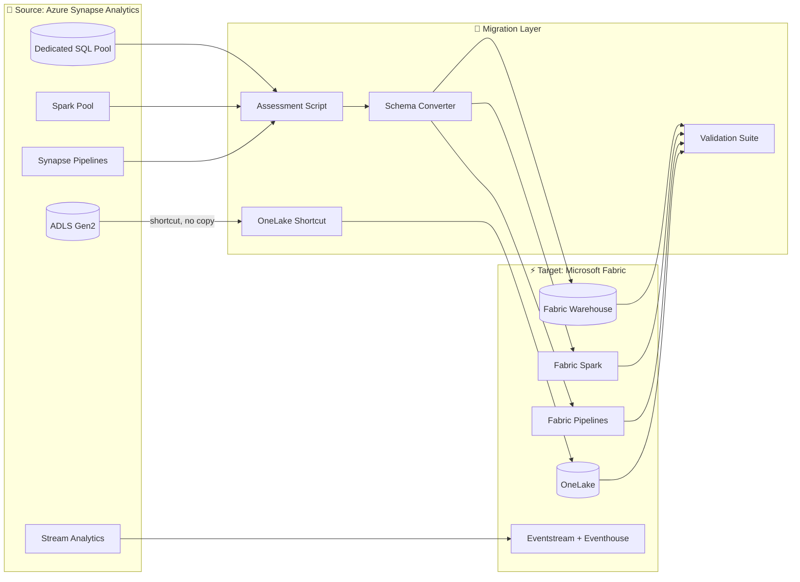

[Home](../../index.md) > [Tutorials](../) > Synapse Analytics to Fabric Migration

# 🔷 Tutorial 41: Azure Synapse Analytics → Microsoft Fabric Migration

> **Last Updated**: 2026-04-27 | **Phase**: 14 (Wave 4) | **Anchor for Wave 4 Migration Tutorials**
> **Status**: ✅ Final | **Maintainer**: Platform Team

<div align="center" markdown>


</div>

---

!!! note "Third-party references — publicly sourced, good-faith comparison"
    This page references non-Microsoft products and services. That information is drawn from each vendor's **publicly available documentation** and is offered for honest, good-faith comparison only. This is a personal project written from a Microsoft Fabric and Azure perspective; it does **not** claim expertise in, or authority over, any third-party product, and nothing here is an official statement by, or endorsed by, those vendors. Capabilities, pricing, and features change often — always verify against the vendor's current official documentation. Where a third-party offering is the stronger choice, we say so plainly.

---

## 🔷 Tutorial 41: Azure Synapse Analytics → Microsoft Fabric Migration

| | |
|---|---|
| **Difficulty** | ⭐⭐⭐ Advanced |
| **Time** | ⏱️ 180-240 minutes |
| **Focus** | Most-asked enterprise migration: Synapse Dedicated SQL pool, Spark pool, ADLS Gen2, Synapse Pipelines → Fabric Warehouse, Fabric Spark, OneLake, Fabric Data Pipelines |

---

## 📊 Progress Tracker

| Tutorial | Status |
|----------|:------:|
| 00 — Environment Setup → 38 — DOJ Justice | ✅ Complete (Phases 1-13) |
| **41 — Synapse → Fabric (this tutorial)** | 🔵 **YOU ARE HERE** |
| 42 — Databricks → Fabric | ⬜ |
| 43 — Redshift → Fabric | ⬜ |
| 44 — BigQuery → Fabric | ⬜ |
| 45 — On-Prem SSAS/SSIS/SSRS → Fabric | ⬜ |

| Navigation | |
|---|---|
| ⬅️ **Previous** | [40 — RAG Production](../40-rag-production/README.md) |
| ➡️ **Next** | [42 — Databricks → Fabric](../42-databricks-to-fabric/README.md) |

---

## 📖 Overview

Azure Synapse Analytics → Fabric is the **most-asked migration** because Synapse and Fabric share Microsoft DNA — but the architectural differences are real. This tutorial walks through migrating each Synapse workload type into its Fabric equivalent, with assessment scripts, schema-conversion tools, and validation patterns.

### Why Migrate from Synapse to Fabric?

| Concern | Synapse Behavior | Fabric Behavior |
|---------|------------------|-----------------|
| **Compute model** | DWU per workload, fixed pools | CU pool shared across all workloads |
| **Storage** | ADLS Gen2 separate from compute | OneLake unified, no copy needed |
| **Spark + SQL together** | Two separate engines, separate billing | Unified, V-Order Delta works for both |
| **BI integration** | Power BI Premium connector or DirectQuery | Direct Lake (no copy, no refresh) |
| **Real-time** | Add-on Stream Analytics, Event Hubs | Eventstream + Eventhouse native |
| **Lifecycle** | Microsoft is investing in Fabric, not Synapse | Synapse SQL pools enter sustaining mode |

### What This Tutorial Covers

1. Inventory + complexity scoring of your Synapse workspace
2. T-SQL schema conversion (Synapse → Fabric Warehouse)
3. ADLS Gen2 → OneLake shortcut migration (no data copy)
4. Spark pool → Fabric Spark notebook migration
5. Synapse Pipeline → Fabric Data Pipeline conversion
6. DWU → CU sizing
7. Validation: row counts, hashes, query parity, performance benchmarks
8. Coexistence pattern (Synapse + Fabric in parallel until cutover)
9. Cutover playbook
10. Decommissioning checklist

---

## 🎯 Learning Objectives

By the end of this tutorial, you will be able to:

- [ ] Run a comprehensive Synapse workspace inventory and complexity score
- [ ] Translate Synapse Dedicated SQL pool DDL to Fabric Warehouse DDL (and identify what won't translate)
- [ ] Migrate ADLS Gen2 storage to OneLake using shortcuts (no data movement)
- [ ] Convert Synapse Spark notebooks to Fabric notebooks
- [ ] Convert Synapse Pipelines to Fabric Data Pipelines
- [ ] Size F-SKU capacity from existing DWU + Spark pool consumption
- [ ] Validate migrated workloads via row count + hash + query parity
- [ ] Establish a coexistence period for risk-free cutover
- [ ] Decommission Synapse safely without data loss

---

## 🏗️ Reference Architecture



### Component Mapping (the canonical reference)

| Synapse Component | Fabric Equivalent | Migration Approach |
|-------------------|-------------------|--------------------|
| Dedicated SQL pool (DWUs) | Fabric Warehouse (CUs) | DDL conversion + CTAS bulk load |
| Serverless SQL pool | Fabric SQL endpoint over Lakehouse | Often direct (T-SQL → Lakehouse SQL) |
| Spark pool | Fabric Spark + notebooks | Notebook code mostly portable |
| Synapse Pipelines | Fabric Data Pipelines | Activities mostly compatible (some renamed) |
| Mapping Data Flows | Fabric Dataflow Gen2 | Manual recreation in Power Query |
| ADLS Gen2 (linked) | OneLake shortcut | **No data movement needed** |
| Synapse Studio notebooks | Fabric notebooks | Minor API tweaks (`mssparkutils` shim) |
| Spark Job Definitions | Fabric Spark Job Definitions | Direct port |
| Synapse Link for Cosmos DB | Fabric Mirroring for Cosmos DB | Re-configure mirror |
| Linked services | Connections | Recreate; secrets to Key Vault |
| Stream Analytics | Eventstream + Eventhouse | Re-author logic |
| Synapse Pipeline triggers | Fabric Pipeline schedules | Direct |

---

## 📋 Prerequisites

- [ ] Tutorial 00 (Environment Setup) complete
- [ ] Tutorials 01-03 (Bronze/Silver/Gold medallion) understood
- [ ] Tutorial 12 (CI/CD) for fabric-cicd
- [ ] Tutorial 13 (Migration Planning) for governance overview
- [ ] **Source**: Existing Azure Synapse Analytics workspace (read access at minimum)
- [ ] **Target**: Fabric F64+ capacity provisioned
- [ ] Service Principal with `Synapse Administrator` on source + `Workspace Admin` on target
- [ ] Azure CLI ≥ 2.60 with `synapse` extension
- [ ] PowerShell 7.x with `Az.Synapse` and `Az.Fabric` modules
- [ ] Estimated 2-4 hours active time + multi-day coexistence period

---

## 🚀 Step-by-Step

### Step 1 — Assess Your Synapse Workspace

Run the assessment script to inventory tables, pipelines, notebooks, and complexity.

```bash
cd tutorials/41-synapse-to-fabric/
python 01_assessment.py \
    --synapse-workspace "syn-prod-ws01" \
    --resource-group "rg-analytics-prod" \
    --output-dir "./assessment-output"
```

> ✅ **Verification**: Output directory contains:
> - `inventory.csv` — every table, pipeline, notebook with size + last-used + dependency count
> - `complexity_scores.csv` — per-workload "Easy / Medium / Hard / Very Hard" classification
> - `dependency_graph.json` — what depends on what (used for migration ordering)
> - `unsupported_features.md` — Synapse features that don't have a 1:1 Fabric equivalent

> 💡 **Tip**: Run assessment **monthly** during the migration project. New tables, new dependencies, and dropped objects all show up here.

### Step 2 — Plan Migration Wave Order

Use the dependency graph to plan migration waves. Migrate leaves first, roots last.

```bash
python 01_assessment.py --command wave-plan \
    --inventory ./assessment-output/inventory.csv \
    --max-wave-effort-days 10
```

The tool produces `migration-waves.md` with:
- Wave 1: Independent reference tables, no consumers
- Wave 2: Bronze tables (Synapse staging → Fabric Bronze)
- Wave 3: Silver / dimension tables
- Wave 4: Gold / fact tables
- Wave 5: BI semantic models, Power BI rebinding
- Wave 6: Decommission Synapse

> ⚠️ **Gotcha**: If your Synapse has cross-database queries (linked Synapse SQL pools), those become **cross-Lakehouse / cross-Warehouse queries** in Fabric. Plan to migrate the database boundary together to avoid mid-migration latency spikes.

### Step 3 — Convert Schemas (Dedicated SQL Pool → Fabric Warehouse)

```bash
python 02_schema_conversion.py \
    --source-conn "Server=tcp:syn-prod-ws01.sql.azuresynapse.net;..." \
    --target-warehouse "wh-analytics-prod" \
    --target-workspace "ws-analytics-prod" \
    --output-ddl ./output-ddl/
```

The script:
1. Reads source schema via `INFORMATION_SCHEMA` queries
2. Translates types (most are direct; flags incompatibilities)
3. Removes Synapse-specific clauses (`DISTRIBUTION = HASH(...)`, `CLUSTERED COLUMNSTORE INDEX`) — Fabric Warehouse handles these automatically
4. Generates Fabric Warehouse DDL with comments noting changes
5. Writes per-table `CREATE TABLE` to `output-ddl/{schema}.{table}.sql`

#### Type Conversion Table

| Synapse Type | Fabric Warehouse Type | Notes |
|--------------|----------------------|-------|
| `bigint` | `bigint` | Direct |
| `int` | `int` | Direct |
| `decimal(p,s)` | `decimal(p,s)` | Direct |
| `nvarchar(n)` | `varchar(n)` | UTF-8 default in Fabric |
| `nvarchar(max)` | `varchar(max)` | Direct |
| `datetime` | `datetime2(6)` | Recommended upgrade |
| `time(n)` | `time(6)` | Direct |
| `uniqueidentifier` | `uniqueidentifier` | Direct |
| `binary(n)` | `varbinary(n)` | Recommended |
| `image` / `text` | `varchar(max)` / `varbinary(max)` | Deprecated — replace |
| `xml` | NOT SUPPORTED | Convert to `varchar(max)` + JSON |
| `geography`, `geometry` | NOT SUPPORTED in Warehouse | Use Lakehouse + `sedona` |
| `hierarchyid` | NOT SUPPORTED | Convert to materialized path string |
| `sql_variant` | NOT SUPPORTED | Convert to `varchar(max)` + type column |

#### Synapse-Specific Features to Remove

| Synapse Feature | Action |
|-----------------|--------|
| `DISTRIBUTION = HASH/REPLICATE/ROUND_ROBIN` | Remove — Fabric handles automatically |
| `CLUSTERED COLUMNSTORE INDEX` | Remove — Fabric uses Delta + V-Order |
| `WITH (HEAP)` / `CLUSTERED INDEX` | Remove |
| `EXTERNAL TABLE` over PolyBase | Convert to OneLake shortcut + Lakehouse table |
| `MASTER KEY` / column encryption | Migrate to OneLake Security + sensitivity labels |
| `WORKLOAD GROUP` / Resource governor | Use Fabric workspace + capacity assignment |

> ✅ **Verification**:
> ```sql
> -- Run in Fabric Warehouse SQL endpoint
> SELECT COUNT(*) FROM INFORMATION_SCHEMA.TABLES WHERE TABLE_TYPE = 'BASE TABLE';
> -- Should equal source Synapse table count (excluding NOT SUPPORTED rows)
> ```

> 💡 **Tip**: Synapse-specific `OPTION` hints (`HASH JOIN`, `LABEL`, etc.) almost never need to be kept. Fabric optimizer is different.

### Step 4 — Migrate Storage (ADLS Gen2 → OneLake)

This is the **biggest win** in the migration. Don't copy data. Use OneLake shortcuts.

```bash
# Create a shortcut from your existing ADLS Gen2 path
az fabric onelake-shortcut create \
    --workspace-id "$WS_ID" \
    --lakehouse-id "$LH_ID" \
    --name "synapse-data-lake" \
    --path "Tables/synapse_data_lake" \
    --target-adls-uri "abfss://container@account.dfs.core.windows.net/path/"
```

Or via Bicep:

```bicep
resource shortcut 'Microsoft.Fabric/workspaces/items/shortcuts@2024-01-01' = {
  name: 'synapse-data-lake'
  properties: {
    target: {
      adlsGen2: {
        location: 'https://${storageAccount}.dfs.core.windows.net/'
        path: '/${container}/${path}'
        subpath: '/'
      }
    }
  }
}
```

**Why this is huge:**
- Petabyte-scale data is *not* copied
- Source ADLS retains full backup
- Fabric reads in place at OneLake performance
- Zero downtime
- Bidirectional during coexistence (Synapse and Fabric both read same data)

> ✅ **Verification**: Query a sample table in Fabric and compare row count to Synapse.
> ```python
> # Fabric notebook
> df = spark.read.format("delta").load("Tables/synapse-data-lake/customer")
> print(df.count())
> ```

> ⚠️ **Gotcha**: If Synapse stored data as Parquet (not Delta), you'll need to **convert to Delta** when reading into Fabric Lakehouse Tables. Convert via `CONVERT TO DELTA` SQL or rewrite via PySpark.

### Step 5 — Migrate Synapse Spark Notebooks

Synapse and Fabric Spark are very similar. Most notebooks port with minor changes.

#### Conversion Checklist

| Synapse Pattern | Fabric Pattern |
|-----------------|----------------|
| `mssparkutils` (Synapse) | `notebookutils.mssparkutils` (Fabric) — same API mostly |
| `linkedService = "..."` | `notebookutils.credentials.getToken(...)` |
| Spark config via Synapse Studio | Environment file + Variable Library |
| `%%spark` magic | `%%spark` (works) |
| Notebook → Pipeline activity | Same — just point to new notebook |

```python
# Synapse:
data = mssparkutils.fs.ls("abfss://...")

# Fabric:
from notebookutils import mssparkutils
data = mssparkutils.fs.ls("abfss://...")
```

> ✅ **Verification**: Run the migrated notebook end-to-end. Output should match Synapse output (within floating-point tolerance for aggregations).

> 💡 **Tip**: Use Fabric's notebook **environment files** (Wave 7 doc landing soon) to pin library versions for reproducibility.

### Step 6 — Migrate Synapse Pipelines → Fabric Data Pipelines

Most activities have direct Fabric equivalents. The conversion script handles the JSON translation.

```bash
python 03_pipeline_migration.py \
    --source-pipeline-folder ./synapse-pipelines/ \
    --target-workspace "$FABRIC_WS_ID" \
    --output-dir ./fabric-pipelines/
```

#### Activity Compatibility

| Synapse Activity | Fabric Activity | Notes |
|------------------|-----------------|-------|
| Copy data | Copy data | Direct |
| Notebook (Synapse) | Notebook (Fabric) | Re-point reference |
| Stored procedure | Stored procedure | Direct (after schema migration) |
| Lookup | Lookup | Direct |
| ForEach / Until / If | ForEach / Until / If | Direct |
| Web | Web | Direct |
| Wait | Wait | Direct |
| Execute Pipeline | Execute Pipeline | Direct |
| Mapping Data Flow | Dataflow Gen2 | **Manual recreation** in Power Query |
| Spark job definition | Spark job definition | Direct |
| Set variable | Set variable | Direct |
| Switch | Switch | Direct |

> ⚠️ **Gotcha**: **Mapping Data Flows** are the hardest part. Plan to recreate them as Dataflow Gen2 in Power Query. Budget 4-8 hours per non-trivial Data Flow.

> 💡 **Tip**: Pipeline parameters become **Variable Library** entries in Fabric — a cleaner pattern. Cleanup opportunity during migration.

### Step 7 — Size Fabric Capacity from Synapse Consumption

```bash
python 01_assessment.py --command capacity-recommendation \
    --inventory ./assessment-output/inventory.csv \
    --dwu-baseline 5000 \
    --spark-pool-vcores 200 \
    --query-history-csv ./synapse-query-history.csv
```

Output: F-SKU recommendation with rationale.

#### DWU → CU Rough Sizing (Starting Point — Validate Empirically)

| Synapse Workload | Approximate Fabric F-SKU |
|------------------|--------------------------|
| DW100c | F8 |
| DW500c | F32 |
| DW1000c | F64 |
| DW3000c | F128 |
| DW6000c | F256 |
| DW7500c | F512 |
| DW15000c | F1024 |
| DW30000c | F2048 |

> ⚠️ **Gotcha**: This is a starting point only. Spark pool consumption + Power BI usage + real-time workloads all draw from the same CU pool in Fabric. Always run a parallel measurement during coexistence.

### Step 8 — Validate Migration

Validation runs three categories of checks: row counts, content hashes, and query parity.

```bash
python 04_validation_suite.py \
    --source-conn "$SYN_CONN" \
    --target-warehouse "$FAB_WH_ID" \
    --tables-yaml ./tables-to-validate.yaml \
    --output-report ./validation-report.html
```

#### Three-Tier Validation

```
   Tier 1: ROW COUNT     ─────▶  count(*) match per table
   Tier 2: CONTENT HASH  ─────▶  hashbytes('SHA2_256', concat_ws('|', columns)) match per row
   Tier 3: QUERY PARITY  ─────▶  representative aggregations match within tolerance
```

| Check | Pass Threshold | Action on Fail |
|-------|----------------|----------------|
| Row count | exact match | Re-run incremental load, check filter predicates |
| Content hash | 100% match | Investigate type conversion or NULL handling |
| Aggregation parity | within 0.001% (floating point) | Type precision review |
| Query latency | within 2× source p95 | Tune V-Order, partition strategy, query plan |

> ✅ **Verification**: All three tiers pass for ≥ 95% of in-scope tables before declaring migration complete.

### Step 9 — Coexistence Period (Run Both for 2-4 Weeks)

During coexistence:
- Both Synapse and Fabric read the same OneLake-shortcut data
- Writes go to **both** systems (idempotent design helps; or use Fabric as truth, replicate to Synapse one-way)
- BI reports point to Fabric; Synapse only used for legacy edge cases
- Daily validation report confirms parity

> 💡 **Tip**: Use Action Groups (Wave 1 Bicep module) to alert on validation failures during coexistence.

### Step 10 — Cutover

When validation has been green for 7 consecutive days:

1. **Freeze Synapse** — pause pipelines, set DBs to read-only
2. **Final delta sync** — capture last incremental changes
3. **Switch BI** — repoint Power BI workspace to Fabric semantic model
4. **Switch consumers** — apps, APIs, integrations to Fabric endpoints
5. **Monitor for 48 hours** — close on-call bridge after no incidents
6. **Decommission** (Step 11)

### Step 11 — Decommission Synapse

```bash
# After 30-day grace period with all validation green:

# 1. Pause Dedicated SQL Pool (no compute charges, data retained)
az synapse sql pool pause --workspace-name $SYN_WS --name $POOL

# 2. Backup metadata for audit
python 05_backup_synapse_metadata.py --workspace $SYN_WS --output ./synapse-backup/

# 3. After 90 more days, delete pool (data is in OneLake/ADLS, not lost)
az synapse sql pool delete --workspace-name $SYN_WS --name $POOL --yes

# 4. After 180 days total, delete workspace if no other workloads
```

> ⚠️ **Gotcha**: ADLS Gen2 data referenced by OneLake shortcuts is NOT decommissioned — Fabric reads in place. Only the Synapse compute layer is removed.

---

## ✅ Verification (Final Checklist)

- [ ] All in-scope Synapse tables have Fabric Warehouse / Lakehouse equivalents
- [ ] Three-tier validation green for 7+ consecutive days
- [ ] OneLake shortcuts to ADLS Gen2 working at performance parity
- [ ] All Synapse Spark notebooks ported and producing identical output
- [ ] All Synapse Pipelines converted; Mapping Data Flows recreated in Dataflow Gen2
- [ ] Power BI semantic models repointed to Fabric (Direct Lake)
- [ ] Apps, APIs, integrations cut over
- [ ] F-SKU sized correctly (CU usage in steady-state band, see [SLO/SLI doc](../../best-practices/operations/slo-sli-fabric.md))
- [ ] Synapse paused (or deleted post-grace-period)
- [ ] Cutover postmortem published
- [ ] Cost reduction realized vs prior Synapse + ADLS bill

---

## 🧹 Cleanup

This tutorial creates assessment artifacts in `./assessment-output/` and conversion artifacts in `./output-ddl/`. Retain for audit; archive to long-term storage.

If your assessment ran against a real Synapse workspace, the read-only queries leave no trace. No rollback needed.

---

## 🚦 Next Steps

- **[Tutorial 42 — Databricks → Fabric](../42-databricks-to-fabric/README.md)** — for shops with Databricks alongside Synapse
- **[Tutorial 45 — On-Prem SSAS/SSIS/SSRS → Fabric](../45-onprem-ssas-ssis-ssrs/README.md)** — for legacy SQL Server BI stacks
- **[Migration Patterns Best Practices](../../best-practices/migration-patterns.md)** — cross-source patterns
- **[fabric-cicd Deployment](../../best-practices/fabric-cicd-deployment.md)** — automate the deployment of migrated artifacts
- **[SLO/SLI for Fabric](../../best-practices/operations/slo-sli-fabric.md)** — set service objectives for the new workloads

---

## 🛠️ Troubleshooting

| Issue | Cause | Resolution |
|-------|-------|------------|
| `Type 'xml' is not supported` during DDL apply | Synapse-specific type | Convert column to `varchar(max)` + parse to JSON in Silver layer |
| Row counts mismatch by ~1% | Different default `NULL` handling | Inspect type conversions; CDC catch-up may be in flight |
| Spark notebook fails on `mssparkutils` import | Synapse-specific module path | Replace with `from notebookutils import mssparkutils` |
| OneLake shortcut shows 0 rows | Permissions on ADLS Gen2 | Grant Storage Blob Data Reader to Workspace Identity |
| Pipeline activity "not supported" | Mapping Data Flow | Recreate as Dataflow Gen2 in Power Query |
| Aggregation off by 0.01% | float vs decimal precision | Cast aggregation column to decimal explicitly |
| F-SKU throttles after migration | Workload concurrency higher than Synapse | Scale F-SKU; use [capacity-throttling runbook](../../runbooks/capacity-throttling-response.md) |
| Power BI Direct Lake fails to refresh | Schema drift in Warehouse | Refresh metadata; see workspace monitoring |

---

## 📁 Key Files Referenced

| Step | File |
|------|------|
| 1, 2, 7 | `tutorials/41-synapse-to-fabric/01_assessment.py` |
| 3 | `tutorials/41-synapse-to-fabric/02_schema_conversion.py` |
| 6 | `tutorials/41-synapse-to-fabric/03_pipeline_migration.md` |
| 8 | `tutorials/41-synapse-to-fabric/04_validation_suite.py` (planned in Wave 9) |
| 11 | `tutorials/41-synapse-to-fabric/05_backup_synapse_metadata.py` (planned) |
| All | `data_generation/generators/migration/synapse_workload_inventory.py` |

---

## 📚 References

### Microsoft Documentation
- [Synapse to Fabric migration guide](https://learn.microsoft.com/fabric/migrate/synapse)
- [Fabric Warehouse T-SQL surface area](https://learn.microsoft.com/fabric/data-warehouse/data-warehousing)
- [OneLake shortcuts](https://learn.microsoft.com/fabric/onelake/onelake-shortcuts)
- [Fabric Pipelines vs Synapse Pipelines](https://learn.microsoft.com/fabric/data-factory/)

### Related Tutorials & Docs
- [Tutorial 24 — Snowflake → Fabric](../24-snowflake-to-fabric/README.md) (existing)
- [Tutorial 10 — Teradata → Fabric](../10-teradata-migration/README.md) (existing)
- [Tutorial 42 — Databricks → Fabric](../42-databricks-to-fabric/README.md) (Wave 4)
- [Migration Patterns](../../best-practices/migration-patterns.md)
- [fabric-cicd Deployment](../../best-practices/fabric-cicd-deployment.md)
- [Capacity Planning](../../best-practices/capacity-planning-cost-optimization.md)

---

[⬆️ Back to Top](#-tutorial-41-azure-synapse-analytics--microsoft-fabric-migration) | [📚 Tutorial Index](../index.md) | [🏠 Home](../../index.md)
