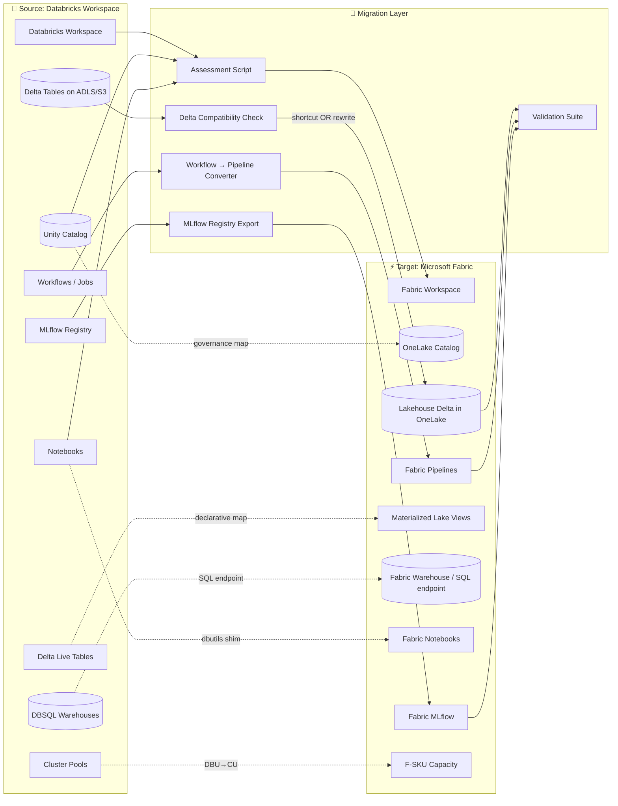

[Home](../../docs/index.md) > [Tutorials](../) > Databricks to Fabric Migration

# 🧱 Tutorial 42: Databricks → Microsoft Fabric Migration

> **Last Updated**: 2026-04-27 | **Phase**: 14 (Wave 4) | **Companion to Tutorial 41 (Synapse)**
> **Status**: ✅ Final | **Maintainer**: Platform Team

<div align="center">


</div>

---

## 🧱 Tutorial 42: Databricks → Microsoft Fabric Migration

| | |
|---|---|
| **Difficulty** | ⭐⭐⭐ Advanced |
| **Time** | ⏱️ 200-260 minutes |
| **Focus** | Workspace + Unity Catalog + Delta tables + Workflows + MLflow + DBSQL → Fabric Workspace, OneLake Catalog, Lakehouse Delta, Fabric Pipelines, Fabric MLflow, Fabric Warehouse SQL endpoint |

---

## 📊 Progress Tracker

| Tutorial | Status |
|----------|:------:|
| 00 — Environment Setup → 38 — DOJ Justice | ✅ Complete (Phases 1-13) |
| 41 — Synapse → Fabric | ✅ Complete |
| **42 — Databricks → Fabric (this tutorial)** | 🔵 **YOU ARE HERE** |
| 43 — Redshift → Fabric | ⬜ |
| 44 — BigQuery → Fabric | ⬜ |
| 45 — On-Prem SSAS/SSIS/SSRS → Fabric | ⬜ |

| Navigation | |
|---|---|
| ⬅️ **Previous** | [41 — Synapse → Fabric](../41-synapse-to-fabric/README.md) |
| ➡️ **Next** | [43 — Redshift → Fabric](../43-redshift-to-fabric/README.md) |

---

## 📖 Overview

Databricks → Fabric is the **smoothest cloud-to-cloud migration** because both platforms speak Delta Lake natively. The technical lift is small; the strategic question is bigger — moving onto a Microsoft platform that bundles BI, real-time, governance, and ML alongside Spark, with a single capacity-based commercial model and tighter Microsoft 365 integration.

### Why Migrate from Databricks to Fabric?

| Concern | Databricks Behavior | Fabric Behavior |
|---------|---------------------|-----------------|
| **Compute model** | DBUs per cluster, separate billing per workspace | Capacity Units (CUs) shared across Spark, SQL, Power BI, RTI, ML |
| **Storage** | Customer-managed ADLS / S3 / GCS | OneLake unified, but ADLS shortcuts work too (no copy) |
| **BI integration** | Power BI via DBSQL connector or DirectQuery | Direct Lake (no copy, no refresh) on Delta — read-from-OneLake |
| **Real-time** | Structured Streaming + DLT (Delta Live Tables) | Eventstream + Eventhouse + Materialized Lake Views |
| **Governance** | Unity Catalog (Databricks-native) | OneLake Catalog + Microsoft Purview (org-wide) |
| **MLOps** | MLflow (managed) + Model Serving | Fabric MLflow + AutoML + Real-Time Endpoints |
| **DBSQL Warehouses** | Photon-accelerated SQL warehouses (separate billing) | Fabric Warehouse + SQL endpoint over Lakehouse |
| **Notebook UX** | Databricks notebooks | Fabric notebooks (similar; `mssparkutils` API differences) |
| **Workflows** | Databricks Workflows / Jobs | Fabric Data Pipelines |
| **DLT (Declarative)** | Delta Live Tables | Materialized Lake Views (Wave 9) |
| **Cost predictability** | Variable (per-DBU + storage + serverless DBSQL surcharge) | Predictable monthly F-SKU |
| **Microsoft estate fit** | Bring your own M365 / Power BI / Purview | Native, single tenant, single bill |

### What This Tutorial Covers

1. Inventory + complexity scoring of your Databricks workspace
2. Mapping Unity Catalog → OneLake Catalog (governance migration)
3. Moving Delta tables to OneLake (in-place via shortcut, OR rewrite for V-Order)
4. Notebook conversion: `dbutils` → `mssparkutils`, magic command parity, library management
5. Databricks Workflows → Fabric Data Pipelines
6. Delta Live Tables → Materialized Lake Views (or scheduled notebooks)
7. MLflow registry export + import to Fabric MLflow
8. DBSQL → Fabric Warehouse SQL endpoint
9. DBU → CU sizing
10. Three-tier validation (row count + hash + ML model parity)
11. Coexistence pattern (both platforms read same OneLake/ADLS Delta)
12. Cutover + decommission

---

## 🎯 Learning Objectives

By the end of this tutorial, you will be able to:

- [ ] Run a comprehensive Databricks workspace inventory (notebooks, jobs, clusters, tables, models)
- [ ] Map Unity Catalog three-level namespace to OneLake Catalog
- [ ] Migrate Delta tables to OneLake using shortcuts (zero-copy) or rewrite (V-Order optimized)
- [ ] Convert Databricks notebooks to Fabric notebooks with mssparkutils shim
- [ ] Translate Databricks Workflows into Fabric Data Pipelines
- [ ] Map Delta Live Tables to Materialized Lake Views or scheduled notebooks
- [ ] Export an MLflow model registry from Databricks and import into Fabric MLflow
- [ ] Migrate DBSQL warehouses to Fabric Warehouse / SQL endpoint
- [ ] Size F-SKU capacity from existing DBU consumption
- [ ] Validate parity via row counts, content hashes, query parity, and ML prediction parity
- [ ] Run Databricks and Fabric in coexistence over the same OneLake-shortcut data
- [ ] Decommission Databricks workspace safely without data loss

---

## 🏗️ Reference Architecture



### Component Mapping (the canonical reference)

| Databricks Component | Fabric Equivalent | Migration Approach |
|----------------------|-------------------|--------------------|
| Databricks Workspace | Fabric Workspace | New workspace per source workspace; preserve naming |
| Unity Catalog (catalog.schema.table) | OneLake Catalog + Lakehouse schemas | Direct map — three-part name preserved |
| Hive Metastore (legacy) | Lakehouse default schema | Bulk register tables to Lakehouse |
| Delta tables on ADLS Gen2 | Delta in OneLake | **Shortcut (zero-copy)** OR rewrite for V-Order |
| Delta tables on S3 / GCS | Delta in OneLake | OneLake S3/GCS shortcut OR copy |
| Iceberg tables (UniForm) | OneLake Iceberg shortcut | Direct — see [Iceberg Interop](../../docs/features/onelake-iceberg-interop.md) |
| Databricks Notebooks | Fabric Notebooks | Port code; `dbutils` → `mssparkutils` shim |
| Databricks Workflows / Jobs | Fabric Data Pipelines | Activity translation (see Step 5) |
| Delta Live Tables (DLT) | Materialized Lake Views | Declarative SQL maps directly; Python DLT rewrites |
| DBR Runtime (e.g., 14.3 LTS) | Fabric Spark Runtime 1.3 / 2.0 | Most code portable; see [runtime migration](../../docs/best-practices/spark-runtime-migration.md) |
| Cluster pools | Fabric Spark capacity (CUs) | No 1:1 — Fabric autoscales within F-SKU |
| Photon engine | Fabric V-Order + Native Execution Engine | Different code path, similar perf for BI workloads |
| MLflow Tracking Server | Fabric MLflow (built-in) | Re-point experiments; export-import models |
| MLflow Model Registry | Fabric Model Registry | `mlflow export-import` tool (Step 7) |
| Model Serving | Fabric Real-Time Endpoints | Re-deploy registered model |
| DBSQL Warehouses | Fabric Warehouse + SQL endpoint | DDL conversion + V-Order; Power BI repoints |
| Unity Catalog Volumes | Lakehouse Files section | Copy non-tabular files |
| Secret Scopes | Azure Key Vault + Workspace Identity | Recreate; reference via [OAP](../../docs/best-practices/outbound-access-protection.md) |
| Cluster init scripts | Fabric Environment files | Repackage as conda/pip env |
| Repos (Git folders) | Fabric Git Integration | Connect workspace to same repo |

---

## 📋 Prerequisites

- [ ] Tutorial 00 (Environment Setup) complete
- [ ] Tutorials 01-03 (Bronze/Silver/Gold medallion) understood
- [ ] Tutorial 12 (CI/CD) for fabric-cicd workflow
- [ ] Tutorial 13 (Migration Planning) for governance overview
- [ ] Tutorial 41 (Synapse → Fabric) recommended for shared assessment patterns
- [ ] **Source**: Existing Databricks workspace (workspace admin or `account_admin` for Unity Catalog inventory)
- [ ] **Target**: Fabric F64+ capacity provisioned, workspace created
- [ ] Databricks PAT (Personal Access Token) with `workspace.access` + `metastore.read`
- [ ] Service Principal with `Workspace Admin` on Fabric target
- [ ] Databricks CLI ≥ 0.220 (`databricks --version`)
- [ ] Python 3.11 with `databricks-sdk`, `mlflow`, `azure-identity`
- [ ] Network path between Databricks ADLS Gen2 (or S3) and Fabric (Workspace Identity granted Storage Blob Data Reader)
- [ ] Estimated 3-5 hours active time + 2-4 weeks coexistence period

---

## 🚀 Step-by-Step

### Step 1 — Assess Your Databricks Workspace

Inventory notebooks, jobs, clusters, Unity Catalog tables, and MLflow models.

```bash
cd tutorials/42-databricks-to-fabric/
python 01_assessment.py \
    --databricks-host "https://adb-1234567890123456.1.azuredatabricks.net" \
    --databricks-token "$DATABRICKS_TOKEN" \
    --output-dir "./assessment-output"
```

> ✅ **Verification**: Output directory contains:
> - `notebooks_inventory.csv` — every notebook with size, last-run, language, dependencies
> - `jobs_inventory.csv` — Workflows, schedules, cluster config, last-run status
> - `clusters_inventory.csv` — interactive + job clusters with DBR runtime, node type, autoscale ranges
> - `unity_catalog_inventory.csv` — every table with catalog.schema.table, format (Delta/Iceberg/Parquet), size, last-modified
> - `mlflow_models_inventory.csv` — every registered model + production-stage version
> - `dlt_pipelines_inventory.csv` — Delta Live Tables pipelines with mode (triggered/continuous)
> - `dbsql_warehouses_inventory.csv` — DBSQL warehouses with t-shirt size + Photon flag
> - `dbu_consumption_30d.csv` — last 30 days DBU usage by workspace + workload type
> - `complexity_scores.csv` — per-asset Easy/Medium/Hard/VeryHard rating
> - `unsupported_features.md` — items with no 1:1 Fabric equivalent (Photon-only SQL functions, Workflows-only triggers, etc.)

> 💡 **Tip**: Run assessment **monthly** during the migration project. New tables, dropped models, and shifting cluster usage all surface here.

> ⚠️ **Gotcha**: If your Databricks workspace was created before Unity Catalog (legacy `hive_metastore`), the assessment will report tables under `hive_metastore.<schema>.<table>`. These need explicit promotion to a UC catalog first **or** direct Lakehouse registration. Don't skip this — Hive metastore tables can have weaker schema enforcement.

### Step 2 — Plan Migration Wave Order

Use the dependency graph to plan migration waves. Migrate leaves (no consumers) first, roots (most-consumed) last.

```bash
python 01_assessment.py --command wave-plan \
    --inventory ./assessment-output/ \
    --max-wave-effort-days 10
```

The tool produces `migration-waves.md` with:

- **Wave 1** — Independent reference tables (dimensions with no consumers)
- **Wave 2** — Bronze tables (raw ingestion → Fabric Bronze Lakehouse)
- **Wave 3** — Silver / cleansed dimension tables
- **Wave 4** — Gold / fact tables + aggregations
- **Wave 5** — DLT pipelines → Materialized Lake Views
- **Wave 6** — MLflow models + serving endpoints
- **Wave 7** — DBSQL workloads + Power BI rebinding
- **Wave 8** — Decommission Databricks workspace

> ⚠️ **Gotcha**: Cross-workspace Delta Sharing creates hidden dependencies. If Workspace A consumes a share from Workspace B, migrate the producer first, then the consumer. The assessment script checks for `system.information_schema.shares` and surfaces these.

### Step 3 — Migrate Delta Tables to OneLake

This is the easiest part of the migration. Both Databricks and Fabric speak Delta Lake natively. You have two options:

#### Option A — OneLake Shortcut (zero-copy, recommended)

If your Databricks Delta tables live on ADLS Gen2 (Azure) or S3 (AWS), create a OneLake shortcut. **No data movement.**

```bash
# ADLS Gen2 shortcut
az fabric onelake-shortcut create \
    --workspace-id "$WS_ID" \
    --lakehouse-id "$LH_ID" \
    --name "databricks-bronze" \
    --path "Tables/databricks_bronze" \
    --target-adls-uri "abfss://databricks-data@adlsgendb01.dfs.core.windows.net/bronze/"
```

Or via Bicep:

```bicep
resource shortcut 'Microsoft.Fabric/workspaces/items/shortcuts@2024-01-01' = {
  name: 'databricks-bronze'
  properties: {
    target: {
      adlsGen2: {
        location: 'https://${storageAccount}.dfs.core.windows.net/'
        path: '/databricks-data/bronze'
        subpath: '/'
      }
    }
  }
}
```

**Why shortcuts are huge here:**
- Petabyte-scale Delta tables are **not copied**
- Source ADLS / S3 retains full history
- Both Databricks and Fabric read the same Delta files in place
- Zero downtime, true bidirectional during coexistence

#### Option B — Rewrite for V-Order

If your top BI tables benefit from V-Order (Power BI Direct Lake), rewrite them through Fabric Spark with `delta.parquet.vorder.default=true`:

```python
# In a Fabric notebook
from delta.tables import DeltaTable

source_path = "abfss://databricks-data@adlsgendb01.dfs.core.windows.net/gold/fact_slot_revenue"
target_table = "lh_gold.fact_slot_revenue"

(spark.read.format("delta").load(source_path)
    .write
    .format("delta")
    .mode("overwrite")
    .option("delta.parquet.vorder.default", "true")
    .saveAsTable(target_table))

# Then OPTIMIZE for full V-Order benefit
spark.sql(f"OPTIMIZE {target_table} VORDER")
```

#### OPTIMIZE / Z-ORDER Differences

| Databricks | Fabric |
|-----------|--------|
| `OPTIMIZE table ZORDER BY (col)` | `OPTIMIZE table ZORDER BY (col)` (supported) |
| `OPTIMIZE table` (file compaction only) | `OPTIMIZE table VORDER` (V-Order + compaction) |
| `VACUUM table RETAIN N HOURS` | `VACUUM table RETAIN N HOURS` (same syntax) |
| Liquid clustering (`CLUSTER BY`) | Liquid clustering supported in Fabric Runtime 1.3+ |
| Photon-only functions | NEE-supported subset; check assessment output |

> ✅ **Verification**:
> ```python
> # In Fabric notebook
> df = spark.read.format("delta").load("Tables/databricks-bronze/fact_slot_revenue")
> print(f"Row count: {df.count()}")
>
> # Compare against Databricks notebook output
> # Row count must match exactly
> ```

> 💡 **Tip**: Don't blindly rewrite every table. Shortcut first; only rewrite the top 10-20 BI hot paths where V-Order pays for itself in CU savings.

> ⚠️ **Gotcha**: Databricks-managed Delta tables (no explicit `LOCATION`) live in DBFS root, which is **not** accessible to Fabric shortcuts. You must `ALTER TABLE ... SET LOCATION` to ADLS first, or copy via Spark.

### Step 4 — Convert Databricks Notebooks

Databricks and Fabric notebooks are very similar. Most port with mechanical changes.

#### Conversion Checklist

| Databricks Pattern | Fabric Pattern |
|--------------------|----------------|
| `dbutils.fs.ls(...)` | `mssparkutils.fs.ls(...)` |
| `dbutils.fs.cp(...)` | `mssparkutils.fs.cp(...)` |
| `dbutils.secrets.get(scope=..., key=...)` | `mssparkutils.credentials.getSecret(akv_uri, secret_name)` |
| `dbutils.notebook.run(...)` | `mssparkutils.notebook.run(...)` (same API) |
| `dbutils.widgets.text(...)` | `mssparkutils.notebook.exit(...)` + Pipeline parameters |
| `%pip install pkg` | `%pip install pkg` (works) — prefer Environment file |
| `%conda install pkg` | Environment file conda_dependencies block |
| `%sql` magic | `%%sql` magic (note double percent) |
| `%md` magic | `%%md` magic (double percent) |
| `%run ./other_notebook` | `%run ./other_notebook` (works) |
| `display(df)` | `display(df)` (works in Fabric) |
| `spark.conf.set("spark.databricks.delta...")` | Map to `spark.conf.set("spark.microsoft.delta...")` where applicable |
| Cluster init script | Environment custom library or pip requirements |
| `/Workspace/Repos/...` paths | Fabric Git Integration paths |
| `/dbfs/...` paths | OneLake `Files/` paths |

#### Code-Level Shim

Add this small shim at the top of each migrated notebook for backwards-compatible code that uses `dbutils`:

```python
# Fabric notebook compatibility shim
try:
    dbutils  # Already defined in Databricks
except NameError:
    from notebookutils import mssparkutils
    # Lightweight dbutils proxy
    class _DBUtilsShim:
        fs = mssparkutils.fs
        notebook = mssparkutils.notebook
        secrets = mssparkutils.credentials  # API differences — see migration script
    dbutils = _DBUtilsShim()
```

> ✅ **Verification**: Run the migrated notebook end-to-end. Output must match Databricks output (row counts exact; aggregations within float tolerance).

> 💡 **Tip**: Run the conversion script in batch mode. It rewrites known patterns automatically and produces a list of manual-review hotspots:
> ```bash
> python 02_notebook_migration.py \
>     --source-export ./databricks-export/Workspace/ \
>     --target-dir ./fabric-notebooks/ \
>     --apply-shim
> ```

> ⚠️ **Gotcha**: `dbutils.widgets` and Fabric notebook parameters are not 1:1. Fabric uses notebook **parameter cells** (tagged with `parameters`) and pipeline activity parameters. The conversion script flags every widget and recommends a parameter-cell rewrite.

### Step 5 — Migrate Databricks Workflows → Fabric Data Pipelines

Workflows JSON definitions translate to Fabric Pipeline JSON via the conversion script. Most task types have direct Fabric activity equivalents.

```bash
python 03_workflow_migration.py \
    --source-jobs-folder ./databricks-export/Jobs/ \
    --target-workspace "$FABRIC_WS_ID" \
    --output-dir ./fabric-pipelines/
```

#### Task / Activity Compatibility

| Databricks Task Type | Fabric Activity | Notes |
|----------------------|-----------------|-------|
| `notebook_task` | Notebook | Re-point notebook reference |
| `python_wheel_task` | Spark Job Definition | Repackage wheel |
| `spark_jar_task` | Spark Job Definition | Repackage JAR |
| `spark_submit_task` | Spark Job Definition | Translate args |
| `sql_task` (DBSQL query) | Script (T-SQL) or Lookup | Re-point to Fabric Warehouse / SQL endpoint |
| `pipeline_task` (DLT) | Materialized Lake Views or chained notebooks | Manual rewrite (Step 6) |
| `dbt_task` | Notebook with `dbt-fabric` | See [dbt integration](../../docs/features/dbt-fabric-integration.md) |
| `run_job_task` | Invoke Pipeline | Direct map |
| `condition_task` (If/Else) | If Condition | Direct map |
| `for_each_task` | ForEach | Direct map |
| Job parameters | Pipeline parameters / Variable Library | Promote to Variable Library where reused |
| Job triggers (cron) | Pipeline schedule trigger | Direct map |
| Job triggers (file arrival) | Storage event trigger / Eventstream | Re-author |
| Job clusters | Fabric Spark capacity (autoscale) | No explicit cluster — Fabric manages |

> ⚠️ **Gotcha**: **Continuous job triggers** in Databricks (always-on streaming jobs) become **Fabric streaming jobs** running against Eventstream — not Pipelines. The conversion script flags these and points to Tutorial 04 (Real-Time Analytics) for re-authoring.

> 💡 **Tip**: Promote any parameter referenced by ≥ 3 jobs to the **Variable Library**. Cleanup opportunity during migration.

### Step 6 — Migrate Delta Live Tables → Materialized Lake Views

DLT pipelines are declarative. Pure-SQL DLT maps cleanly to **Materialized Lake Views** (MLV — Wave 9 feature). Python DLT pipelines need rewrite.

#### SQL DLT → Materialized Lake View

```sql
-- Databricks DLT (Python or SQL):
CREATE OR REFRESH STREAMING TABLE bronze_slot_telemetry
AS SELECT * FROM cloud_files("/mnt/raw/slots/", "json");

CREATE OR REFRESH LIVE TABLE silver_slot_telemetry
COMMENT "Cleansed slot telemetry"
AS SELECT
    machine_id,
    CAST(event_time AS TIMESTAMP) AS event_time,
    coin_in,
    coin_out
FROM LIVE.bronze_slot_telemetry
WHERE coin_in IS NOT NULL;

-- Fabric Materialized Lake View:
CREATE MATERIALIZED LAKE VIEW silver_slot_telemetry
AS SELECT
    machine_id,
    CAST(event_time AS TIMESTAMP) AS event_time,
    coin_in,
    coin_out
FROM bronze_slot_telemetry
WHERE coin_in IS NOT NULL;
```

#### Python DLT → Scheduled Notebook

If the DLT pipeline uses `@dlt.table` decorators with custom Python logic, rewrite as a scheduled Fabric notebook with explicit `MERGE INTO`:

```python
# Databricks DLT:
# import dlt
# @dlt.table
# @dlt.expect_or_drop("valid_amount", "coin_in > 0")
# def silver_slot_telemetry():
#     return dlt.read_stream("bronze_slot_telemetry")...

# Fabric scheduled notebook with quality enforcement:
df = (spark.readStream.format("delta")
      .table("lh_bronze.bronze_slot_telemetry")
      .filter("coin_in > 0"))  # equivalent to expect_or_drop

(df.writeStream
   .format("delta")
   .outputMode("append")
   .option("checkpointLocation", "Files/checkpoints/silver_slot_telemetry")
   .trigger(availableNow=True)
   .toTable("lh_silver.silver_slot_telemetry"))
```

> ✅ **Verification**: Compare last 7 days of output between DLT pipeline and the migrated MLV / notebook. Row counts and aggregations must match.

> ⚠️ **Gotcha**: DLT **Expectations** with `expect_or_fail` action have no direct MLV equivalent. Migrate as Great Expectations checks in the upstream notebook, or as a `CHECK` constraint when the table is rewritten.

### Step 7 — Migrate MLflow Models

Databricks MLflow → Fabric MLflow is a registry export-import.

```bash
# Step 7a: Export from Databricks
pip install mlflow-export-import

mlflow-export-import export-models \
    --output-dir ./mlflow-export/ \
    --models "fraud_detection,player_ltv,slot_anomaly" \
    --stages "Production,Staging" \
    --notebook-formats SOURCE \
    --databricks-host "$DATABRICKS_HOST" \
    --databricks-token "$DATABRICKS_TOKEN"

# Step 7b: Import to Fabric MLflow
mlflow-export-import import-models \
    --input-dir ./mlflow-export/ \
    --tracking-uri "$FABRIC_MLFLOW_URI" \
    --experiment-name-prefix "migrated_"
```

| Item | Databricks | Fabric | Migration |
|------|-----------|--------|-----------|
| Tracking server | Managed MLflow | Fabric MLflow (per workspace) | Re-point `MLFLOW_TRACKING_URI` |
| Registered models | UC `models` schema | Fabric Model Registry | `mlflow-export-import` |
| Model versions | Stages (Staging, Production, Archived) | Stages (preserved) | Stages map directly |
| Run artifacts | DBFS / UC Volumes | OneLake `Files/mlflow-artifacts/` | Bulk copy during export |
| Model Serving endpoints | Databricks Model Serving | Fabric Real-Time Endpoints | Re-deploy registered model |
| Feature Store | UC Feature Store | Fabric Lakehouse + Semantic Link | Republish features |

#### ML Model Parity Validation

Score the same hold-out dataset on both platforms; predictions must match within tolerance.

```python
# Validate model parity
import mlflow

src_model = mlflow.pyfunc.load_model("models:/fraud_detection/Production",
                                     tracking_uri=DATABRICKS_TRACKING_URI)
tgt_model = mlflow.pyfunc.load_model("models:/migrated_fraud_detection/Production",
                                     tracking_uri=FABRIC_TRACKING_URI)

src_pred = src_model.predict(holdout_df)
tgt_pred = tgt_model.predict(holdout_df)

# Classification: exact match expected
assert (src_pred == tgt_pred).all(), "Prediction mismatch!"
# Regression: within 1e-6 tolerance
# np.allclose(src_pred, tgt_pred, atol=1e-6)
```

> ⚠️ **Gotcha**: Models trained on **Photon-specific UDFs** may produce slightly different predictions in Fabric Spark due to floating-point operation ordering. Tolerance ≤ 1e-6 is normal; > 1e-3 is a red flag — investigate.

### Step 8 — Migrate DBSQL → Fabric Warehouse / SQL Endpoint

Two paths depending on workload:

| DBSQL Workload | Recommended Target | Why |
|----------------|--------------------|-----|
| Read-only BI queries on Delta tables | **Fabric SQL endpoint over Lakehouse** | Zero ETL — just query the same Delta |
| Heavy stored procedures, multi-statement transactions | **Fabric Warehouse** | Full T-SQL DDL + DML |
| Power BI Direct Query | **Direct Lake** (preferred) | Read-from-OneLake, no refresh |
| Tabular semantic models | **Fabric semantic model** | Re-author or use Power BI desktop migrate |

DDL conversion via the helper:

```bash
python 04_dbsql_ddl_conversion.py \
    --source-host "$DBSQL_HOST" \
    --target-warehouse "wh-analytics-prod" \
    --target-workspace "$FABRIC_WS_ID" \
    --output-ddl ./output-ddl/
```

| DBSQL Type | Fabric Warehouse Type | Notes |
|-----------|----------------------|-------|
| `BIGINT` | `BIGINT` | Direct |
| `INT` | `INT` | Direct |
| `DECIMAL(p,s)` | `DECIMAL(p,s)` | Direct |
| `STRING` | `VARCHAR(8000)` (sized) | Choose explicit length; `VARCHAR(MAX)` for unbounded |
| `BOOLEAN` | `BIT` | Direct |
| `TIMESTAMP` | `DATETIME2(6)` | Recommended |
| `DATE` | `DATE` | Direct |
| `BINARY` | `VARBINARY(MAX)` | Direct |
| `ARRAY<T>` | NOT SUPPORTED in Warehouse | Move to Lakehouse + Spark; or normalize |
| `MAP<K,V>` | NOT SUPPORTED | Convert to JSON `VARCHAR(MAX)` |
| `STRUCT<...>` | NOT SUPPORTED | Convert to JSON `VARCHAR(MAX)` |

> 💡 **Tip**: Most BI dashboards backed by DBSQL don't need a Warehouse — point them at the **Lakehouse SQL endpoint** instead. Same Delta tables, no ETL.

### Step 9 — Iceberg Interoperability (UniForm Tables)

If your Databricks tables use **Delta UniForm** (write Delta, expose as Iceberg), Fabric reads them directly via [OneLake Iceberg shortcuts](../../docs/features/onelake-iceberg-interop.md). No conversion required.

```bash
# Create an Iceberg shortcut
az fabric onelake-shortcut create \
    --workspace-id "$WS_ID" \
    --lakehouse-id "$LH_ID" \
    --name "databricks-iceberg" \
    --type "iceberg" \
    --path "Tables/databricks_iceberg" \
    --target-uri "abfss://uniform@adlsdb01.dfs.core.windows.net/iceberg-tables/"
```

> ✅ **Verification**:
> ```python
> df = spark.read.format("iceberg").load("Tables/databricks-iceberg/fact_table")
> print(df.count())  # Match Databricks Iceberg query
> ```

> 💡 **Tip**: For read-only consumption from Snowflake, BigQuery, or Trino in parallel, UniForm + Iceberg shortcut means **one copy of data, three engines**.

### Step 10 — Photon vs Fabric Spark — Performance Considerations

| Concern | Databricks Photon | Fabric Spark |
|---------|-------------------|--------------|
| Vectorized engine | Photon (C++ runtime) | Native Execution Engine (NEE) |
| Format optimization | Delta + Photon-aware caching | Delta + V-Order + NEE caching |
| BI workload latency | Sub-second on hot cache | Sub-second on Direct Lake (no cache needed) |
| Function coverage | Wide; some Photon-only | Growing; check NEE coverage matrix |
| Separate billing | Photon cluster surcharge | None — included in F-SKU |

> ⚠️ **Gotcha**: Some Photon-accelerated SQL functions (e.g., `regexp_extract_all`) may run on **JVM Spark** in Fabric (not NEE) — slower for big datasets. Assessment script flags Photon-heavy workloads. For these, plan an extra perf-tuning pass post-migration.

### Step 11 — Unity Catalog → OneLake Catalog (Governance Migration)

Unity Catalog organizes objects as `catalog.schema.table` with grants and lineage. OneLake Catalog provides equivalent capability inside Fabric, with Microsoft Purview for org-wide governance.

| Unity Catalog Concept | Fabric Equivalent | Migration Approach |
|-----------------------|-------------------|--------------------|
| `catalog` | Fabric domain or workspace | Map 1:1 (domain for orgs; workspace for teams) |
| `schema` | Lakehouse / Warehouse | Direct map |
| `table` | Delta table | Direct map |
| `view` | View (T-SQL or Spark) | DDL conversion |
| `volume` | Lakehouse Files section | Copy non-tabular files |
| `function` | Spark UDF / T-SQL function | Re-register |
| `model` | MLflow model | See Step 7 |
| GRANT `SELECT` ON TABLE | OneLake Security row/column policies | Re-author |
| GRANT `MODIFY` | Workspace role (Contributor) | Map principals to roles |
| Lineage | Microsoft Purview lineage | Auto-captured once Purview connected |
| Tags / labels | Sensitivity labels (M365) | Re-apply via Purview |

```bash
python 05_unity_catalog_export.py \
    --metastore-id "$UC_METASTORE_ID" \
    --output-dir ./uc-export/

# Outputs:
#   uc-export/catalogs.json
#   uc-export/schemas.json
#   uc-export/tables.json
#   uc-export/grants.json   ← critical for security migration
#   uc-export/lineage.json  ← reference for Purview re-bootstrap
```

> 💡 **Tip**: Connect Microsoft Purview to the Fabric tenant **before** migration. Lineage captures from day one and you don't have to backfill.

### Step 12 — Size Fabric Capacity from DBU Consumption

```bash
python 01_assessment.py --command capacity-recommendation \
    --inventory ./assessment-output/ \
    --dbu-30d ./assessment-output/dbu_consumption_30d.csv
```

Output: F-SKU recommendation with rationale.

#### DBU → CU Rough Sizing (Starting Point — Validate Empirically)

| Databricks Workload (avg active DBU/hr) | Approximate Fabric F-SKU | Notes |
|-----------------------------------------|--------------------------|-------|
| ~1 DBU/hr (small dev) | F8 | One small team |
| ~4 DBU/hr | F16 | Single project, light Power BI |
| ~10 DBU/hr | F32 | Mid-size team, Bronze/Silver/Gold |
| ~25 DBU/hr | F64 | **POC/production baseline** |
| ~50 DBU/hr | F128 | Multi-team, RTI workloads |
| ~100 DBU/hr | F256 | Enterprise scale |
| ~200 DBU/hr | F512 | Multi-LOB |
| ~400 DBU/hr | F1024 | Federation / very large estate |
| ~800 DBU/hr | F2048 | Top-tier enterprise |

> ⚠️ **Gotcha**: This table is a **starting point only**. Photon-DBU and serverless-SQL-DBU consume different ratios in Databricks; in Fabric all draw from the same CU pool plus Power BI users. **Always measure during coexistence and adjust before cutover.**

> 💡 **Tip**: Use [capacity planning best practices](../../docs/best-practices/capacity-planning-cost-optimization.md) for the full sizing methodology and CU smoothing patterns.

### Step 13 — Validate Migration

Validation runs four categories of checks: row counts, content hashes, query parity, and ML model parity.

```bash
python 06_validation_suite.py \
    --source-databricks-host "$DATABRICKS_HOST" \
    --source-databricks-token "$DATABRICKS_TOKEN" \
    --target-workspace "$FABRIC_WS_ID" \
    --tables-yaml ./tables-to-validate.yaml \
    --models-yaml ./models-to-validate.yaml \
    --output-report ./validation-report.html
```

#### Four-Tier Validation

```
Tier 1: ROW COUNT       ──▶  count(*) match per table
Tier 2: CONTENT HASH    ──▶  sha2(concat_ws('|', columns)) match per row
Tier 3: QUERY PARITY    ──▶  representative aggregations match within tolerance
Tier 4: MODEL PARITY    ──▶  predictions on hold-out match within tolerance
```

| Check | Pass Threshold | Action on Fail |
|-------|----------------|----------------|
| Row count | exact match | Re-run incremental load, check filter predicates |
| Content hash | 100% match | Investigate type conversion / NULL handling / collation |
| Aggregation parity | within 0.001% | Type precision review |
| Query latency | within 2× source p95 | Tune V-Order, partitioning, NEE-eligible rewrites |
| Model prediction parity (classification) | exact match | Investigate Photon-only function in featurization |
| Model prediction parity (regression) | within 1e-6 | Check float ordering; usually safe |

> ✅ **Verification**: All four tiers pass for ≥ 95% of in-scope assets before declaring migration complete.

### Step 14 — Coexistence Period (2-4 Weeks)

During coexistence:
- Both Databricks and Fabric read the same OneLake-shortcut Delta tables
- Writes go to **one truth** — pick Fabric early; replicate read-only mirror to Databricks if needed
- BI repoints to Fabric (Direct Lake); Databricks SQL warehouses suspended for cost savings
- Daily validation report confirms parity

> 💡 **Tip**: Pause expensive Databricks job clusters and DBSQL warehouses during coexistence to halve coexistence-period cost. They're not running production traffic — Fabric is.

### Step 15 — Cutover

When validation has been green for 7 consecutive days:

1. **Freeze Databricks** — pause Workflows, set Unity Catalog tables to read-only
2. **Final delta sync** — capture last incremental changes
3. **Switch BI** — repoint Power BI workspaces to Fabric semantic models / Direct Lake
4. **Switch consumers** — apps, APIs, dbt projects to Fabric endpoints
5. **Switch ML serving** — re-route inference traffic to Fabric Real-Time Endpoints
6. **Monitor for 48 hours** — close on-call bridge after no incidents
7. **Decommission** (Step 16)

### Step 16 — Decommission Databricks

```bash
# After 30-day grace period with all validation green:

# 1. Disable all Workflows
databricks jobs list --output JSON | jq -r '.jobs[].job_id' \
  | xargs -I {} databricks jobs delete --job-id {}

# 2. Stop and pin DBSQL warehouses (no auto-restart)
databricks warehouses list --output JSON | jq -r '.warehouses[].id' \
  | xargs -I {} databricks warehouses stop --id {}

# 3. Backup workspace metadata for audit
python 07_backup_databricks_metadata.py \
    --databricks-host "$DATABRICKS_HOST" \
    --databricks-token "$DATABRICKS_TOKEN" \
    --output ./databricks-backup/

# 4. After 90 more days, delete clusters + DBSQL warehouses
# 5. After 180 days total, delete workspace if no other workloads remain
```

> ⚠️ **Gotcha**: ADLS Gen2 / S3 storage referenced by OneLake shortcuts is **NOT decommissioned** — Fabric reads in place. Only the Databricks compute + control plane is removed. If you also want to retire the storage account, copy data to OneLake first via Step 3 Option B.

---

## ✅ Verification (Final Checklist)

- [ ] All in-scope Databricks Delta tables accessible via Fabric Lakehouse / Warehouse
- [ ] Four-tier validation (row count + hash + query + model) green for 7+ consecutive days
- [ ] OneLake shortcuts to ADLS Gen2 / S3 reading at performance parity
- [ ] All Databricks notebooks ported, `dbutils` replaced with `mssparkutils`
- [ ] All Databricks Workflows converted to Fabric Pipelines
- [ ] All DLT pipelines mapped to Materialized Lake Views or scheduled notebooks
- [ ] MLflow registry exported from Databricks and imported to Fabric MLflow
- [ ] Model serving endpoints redeployed as Fabric Real-Time Endpoints
- [ ] DBSQL workloads on Fabric Warehouse / SQL endpoint with Power BI repointed
- [ ] Unity Catalog grants re-authored as OneLake Security policies
- [ ] Microsoft Purview connected; lineage captured
- [ ] F-SKU sized correctly (CU usage in steady-state band — see [SLO/SLI doc](../../docs/best-practices/operations/slo-sli-fabric.md))
- [ ] Databricks Workflows disabled, DBSQL warehouses stopped
- [ ] Cutover postmortem published
- [ ] DBU spend → CU spend cost reduction realized

---

## 🧹 Cleanup

This tutorial creates assessment artifacts in `./assessment-output/`, conversion artifacts in `./fabric-notebooks/` and `./fabric-pipelines/`, and a metadata backup in `./databricks-backup/`. Retain for audit; archive to long-term storage.

If your assessment ran against a real Databricks workspace, the read-only API calls leave no trace. No rollback needed.

---

## 🚦 Next Steps

- **[Tutorial 43 — Redshift → Fabric](../43-redshift-to-fabric/README.md)** — for shops also retiring AWS Redshift
- **[Tutorial 44 — BigQuery → Fabric](../44-bigquery-to-fabric/README.md)** — for GCP exits
- **[Migration Patterns Best Practices](../../docs/best-practices/migration-patterns.md)** — cross-source patterns
- **[Spark Runtime Migration](../../docs/best-practices/spark-runtime-migration.md)** — DBR → Fabric Spark Runtime details
- **[OneLake Iceberg Interop](../../docs/features/onelake-iceberg-interop.md)** — UniForm and cross-engine reads
- **[dbt Fabric Integration](../../docs/features/dbt-fabric-integration.md)** — for shops migrating dbt projects
- **[fabric-cicd Deployment](../../docs/best-practices/fabric-cicd-deployment.md)** — automate the deployment of migrated artifacts

---

## 🛠️ Troubleshooting

| Issue | Cause | Resolution |
|-------|-------|------------|
| OneLake shortcut shows 0 rows from ADLS | Workspace Identity lacks Storage Blob Data Reader | Grant role on storage account or container |
| `dbutils` is undefined in Fabric notebook | Databricks-specific module | Apply shim from Step 4 OR replace with `mssparkutils` |
| `%conda install` fails in Fabric | `%conda` not supported | Use Environment file conda dependencies, or `%pip install` |
| Photon-only function fails on Fabric | Function not in NEE coverage | Rewrite using portable Spark SQL; flag in assessment |
| MLflow import errors on `models/<n>/MLmodel` | Stage encoding differences across MLflow versions | Pin `mlflow-export-import` to same major MLflow version on both sides |
| DLT `expect_or_fail` has no equivalent | DLT-specific quality control | Add Great Expectations checkpoint upstream; or `CHECK` constraint |
| Row counts off by ~1% post-migration | Time-zone drift on partitioned timestamps | Cast partition columns to `TIMESTAMP_NTZ` explicitly |
| Direct Lake fallback to DirectQuery | Schema not V-Ordered or unsupported types | Run `OPTIMIZE table VORDER`; check VARCHAR(MAX) usage |
| Cluster init script broke on migration | Init scripts not portable | Repackage as Fabric Environment custom library |
| F-SKU throttles after cutover | Concurrent BI users + Spark + ML draw same CU pool | Scale F-SKU; review [throttling runbook](../../docs/runbooks/capacity-throttling-response.md) |

---

## 📁 Key Files Referenced

| Step | File |
|------|------|
| 1, 2, 12 | `tutorials/42-databricks-to-fabric/01_assessment.py` (planned, batch 4b) |
| 3 | `tutorials/42-databricks-to-fabric/01_delta_compatibility.py` (planned, batch 4b) |
| 4 | `tutorials/42-databricks-to-fabric/02_notebook_migration.py` (planned, batch 4b) |
| 5 | `tutorials/42-databricks-to-fabric/02_workflow_migration.md` (planned, batch 4b) |
| 7 | `tutorials/42-databricks-to-fabric/03_mlflow_migration.py` (planned, batch 4b) |
| 8 | `tutorials/42-databricks-to-fabric/04_dbsql_ddl_conversion.py` (planned, batch 4b) |
| 11 | `tutorials/42-databricks-to-fabric/05_unity_catalog_export.py` (planned, batch 4b) |
| 13 | `tutorials/42-databricks-to-fabric/06_validation_suite.py` (planned, batch 4b) |
| 16 | `tutorials/42-databricks-to-fabric/07_backup_databricks_metadata.py` (planned, batch 4b) |
| All | `data_generation/generators/migration/databricks_workload_inventory.py` (planned) |

---

## 📚 References

### Databricks Documentation
- [Databricks REST API reference](https://docs.databricks.com/api/)
- [Unity Catalog overview](https://docs.databricks.com/data-governance/unity-catalog/index.html)
- [Delta Live Tables](https://docs.databricks.com/delta-live-tables/index.html)
- [MLflow on Databricks](https://docs.databricks.com/mlflow/index.html)

### Microsoft Documentation
- [Fabric migration guide (Databricks)](https://learn.microsoft.com/fabric/migrate/)
- [OneLake shortcuts](https://learn.microsoft.com/fabric/onelake/onelake-shortcuts)
- [Fabric Spark runtime](https://learn.microsoft.com/fabric/data-engineering/runtime)
- [Fabric MLflow](https://learn.microsoft.com/fabric/data-science/mlflow-autologging)
- [Materialized Lake Views](https://learn.microsoft.com/fabric/data-engineering/materialized-lake-views)

### Related Tutorials & Docs
- [Tutorial 41 — Synapse → Fabric](../41-synapse-to-fabric/README.md) (Wave 4 anchor)
- [Tutorial 24 — Snowflake → Fabric](../24-snowflake-to-fabric/README.md)
- [Tutorial 10 — Teradata → Fabric](../10-teradata-migration/README.md)
- [Migration Patterns](../../docs/best-practices/migration-patterns.md)
- [Spark Runtime Migration](../../docs/best-practices/spark-runtime-migration.md)
- [OneLake Iceberg Interop](../../docs/features/onelake-iceberg-interop.md)
- [dbt Fabric Integration](../../docs/features/dbt-fabric-integration.md)
- [Capacity Planning](../../docs/best-practices/capacity-planning-cost-optimization.md)
- [fabric-cicd Deployment](../../docs/best-practices/fabric-cicd-deployment.md)

---

[⬆️ Back to Top](#-tutorial-42-databricks--microsoft-fabric-migration) | [📚 Tutorial Index](../README.md) | [🏠 Home](../../docs/index.md)
