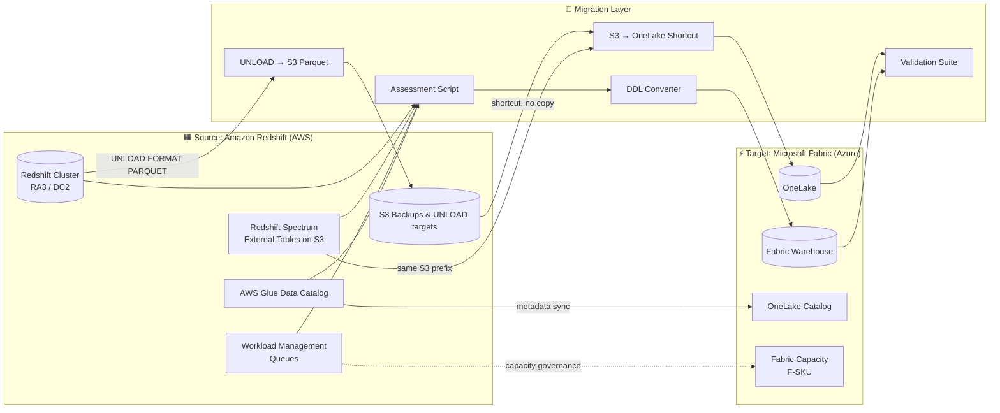

[Home](../../index.md) > [Tutorials](../) > Amazon Redshift to Fabric Migration

# 🟧 Tutorial 43: Amazon Redshift → Microsoft Fabric Migration

> **Last Updated**: 2026-04-27 | **Phase**: 14 (Wave 4) | **Multi-Cloud Migration**
> **Status**: ✅ Final | **Maintainer**: Platform Team

<div align="center" markdown>


</div>

---

!!! info "Third-party references — publicly sourced, good-faith comparison"
    This page references non-Microsoft products and services. That information is drawn from each vendor's **publicly available documentation** and is offered for honest, good-faith comparison only. This is a personal project written from a Microsoft Fabric and Azure perspective; it does **not** claim expertise in, or authority over, any third-party product, and nothing here is an official statement by, or endorsed by, those vendors. Capabilities, pricing, and features change often — always verify against the vendor's current official documentation. Where a third-party offering is the stronger choice, we say so plainly.

## 🟧 Tutorial 43: Amazon Redshift → Microsoft Fabric Migration

| | |
|---|---|
| **Difficulty** | ⭐⭐⭐ Advanced |
| **Time** | ⏱️ 180-240 minutes |
| **Focus** | Multi-cloud migration: Redshift cluster (RA3/DC2), S3 backups, Spectrum external tables, Glue catalog, AWS WLM → Fabric Warehouse, OneLake (S3 shortcuts), OneLake Catalog, Fabric capacity governance |

---

## 📊 Progress Tracker

| Tutorial | Status |
|----------|:------:|
| 00 — Environment Setup → 38 — DOJ Justice | ✅ Complete (Phases 1-13) |
| 41 — Synapse → Fabric | ✅ |
| 42 — Databricks → Fabric | ✅ |
| **43 — Redshift → Fabric (this tutorial)** | 🔵 **YOU ARE HERE** |
| 44 — BigQuery → Fabric | ⬜ |
| 45 — On-Prem SSAS/SSIS/SSRS → Fabric | ⬜ |

| Navigation | |
|---|---|
| ⬅️ **Previous** | [42 — Databricks → Fabric](../42-databricks-to-fabric/README.md) |
| ➡️ **Next** | [44 — BigQuery → Fabric](../44-bigquery-to-fabric/README.md) |

---

## 📖 Overview

Amazon Redshift → Fabric is a **multi-cloud migration** — a path some enterprises take to consolidate analytics estates onto Microsoft Fabric while keeping operational workloads in AWS. Redshift is a strong, widely-deployed cloud data warehouse with deep AWS-ecosystem integration; this playbook is not an argument that one platform is universally better, but a practical guide for teams that have already decided to move. It walks through extracting Redshift workloads via `UNLOAD` to S3, bringing the data into OneLake (via S3 shortcut or copy), converting Redshift PostgreSQL-flavored DDL into Fabric Warehouse T-SQL, and rationalizing distribution/sort keys, RA3 nodes, and WLM rules into the Fabric capacity model.

### Comparing Redshift and Fabric

The table below summarizes differences based on each vendor's publicly available documentation (as of this doc's date). It is descriptive, not a scorecard — Redshift's per-table tuning controls, for example, are a strength for teams that want fine-grained physical control, whereas Fabric favors automatic optimization.

| Concern | Redshift Behavior | Fabric Behavior |
|---------|-------------------|-----------------|
| **Compute model** | RA3/DC2 nodes, fixed cluster size or Concurrency Scaling | CU pool shared across all workloads (warehouse, Spark, BI, real-time) |
| **Storage** | Managed storage on RA3 + S3 (Spectrum) | OneLake unified; S3 readable in place via shortcut |
| **Performance tuning** | DISTKEY / SORTKEY / encoding give explicit per-table control | V-Order applies automatically; no DISTKEY/SORTKEY to maintain |
| **BI integration** | QuickSight or other BI tools via ODBC/connectors | Power BI Direct Lake (no copy, no refresh) |
| **Real-time** | Kinesis + Redshift Streaming Ingestion (separately billed) | Eventstream + Eventhouse native |
| **Multi-cloud reality** | Tightly integrated with AWS region/billing | Reads S3 from Azure via shortcut; supports M365 / Power BI integration |
| **Cost shape** | Node-hours + S3 + egress + concurrency scaling charges | Single F-SKU bundles compute, storage, BI, governance |

### What This Tutorial Covers

1. Inventory and complexity scoring of your Redshift cluster
2. Redshift PostgreSQL DDL → Fabric Warehouse T-SQL conversion
3. `UNLOAD` to S3 in Parquet format (largest workload mover)
4. S3 → OneLake via shortcut (no copy) **or** copy via Pipeline / fabric-cicd
5. Redshift Spectrum external tables → OneLake shortcuts
6. UDF (Python, SQL) and stored procedure conversion
7. WLM (Workload Management) rules → Fabric capacity governance
8. RA3 node-hour → F-SKU sizing
9. Validation: row counts, hashes, query parity
10. Coexistence (read-in-place during migration)
11. Cutover playbook and AWS decommission checklist
12. AWS egress cost minimization strategies

---

## 🎯 Learning Objectives

By the end of this tutorial, you will be able to:

- [ ] Run a comprehensive Redshift cluster inventory using `svv_*`, `pg_table_def`, and `STL_QUERY` views
- [ ] Translate Redshift PostgreSQL-flavored DDL to Fabric Warehouse T-SQL
- [ ] Strip Redshift-specific clauses (DISTKEY, SORTKEY, ENCODE) that V-Order replaces automatically
- [ ] `UNLOAD` Redshift data to S3 in Parquet/Snappy
- [ ] Bring S3 data into OneLake via shortcut (zero copy) or one-time copy via Fabric Pipeline
- [ ] Convert Redshift Spectrum external tables to OneLake shortcuts pointing at the same S3 prefix
- [ ] Migrate Redshift Python and SQL UDFs to T-SQL functions or Fabric notebooks
- [ ] Translate WLM queue rules into Fabric workspace + capacity governance
- [ ] Size F-SKU capacity from Redshift node-hour consumption
- [ ] Validate migrated tables via row count + hash + query parity
- [ ] Plan AWS egress cost mitigation (region pinning, S3 same-region, scheduled transfer)
- [ ] Decommission the Redshift cluster safely while retaining S3 data for OneLake

---

## 🏗️ Reference Architecture



### Component Mapping (the canonical reference)

| Redshift Component | Fabric Equivalent | Migration Approach |
|--------------------|-------------------|--------------------|
| Redshift cluster | Fabric Warehouse | DDL conversion + UNLOAD/COPY load |
| RA3 / DC2 nodes | Fabric Capacity (CU model) | Heuristic node → CU sizing table |
| `DISTKEY` / `DISTSTYLE` | V-Order automatic | Remove — Fabric optimizes automatically |
| `SORTKEY` (compound / interleaved) | V-Order automatic | Remove — Fabric maintains physical order |
| `ENCODE` (LZO, ZSTD, AZ64) | Delta + Parquet compression | Remove — Fabric handles automatically |
| WLM (Workload Management) queues | Workspace + capacity assignment | Map queues to workspaces; capacity governs concurrency |
| Concurrency Scaling | Fabric capacity bursting + Smoothing | Replace WLM auto-scale with capacity smoothing |
| User-defined types | Standard T-SQL types | Convert to standard types |
| Python UDFs (`CREATE FUNCTION ... LANGUAGE plpythonu`) | Fabric notebook function or T-SQL function | Manual port — most logic moves to PySpark |
| SQL UDFs (`CREATE FUNCTION ... LANGUAGE sql`) | T-SQL inline / scalar function | Mostly direct |
| Stored procedures (`LANGUAGE plpgsql`) | T-SQL stored procedures | Mostly compatible — syntax tweaks |
| Materialized views | Materialized Lake Views (Wave 9) | Recreate in Fabric MLV |
| Redshift Spectrum (S3 external tables) | OneLake shortcut to S3 | **No copy** — same S3 prefix, read in place |
| Redshift Data Sharing | Fabric data sharing | Recreate share targets |
| AWS Glue Data Catalog | OneLake Catalog | Metadata sync; rebuild lineage in Purview |
| Federated queries (RDS / Aurora) | Fabric Mirroring + cross-DB queries | Replace federation with Mirroring |
| Identity (IAM users, roles) | Microsoft Entra ID | Map IAM roles → Entra groups |
| Backup/snapshot to S3 | OneLake retention + RA-GRS | Use OneLake retention policies |

---

## 📋 Prerequisites

- [ ] Tutorial 00 (Environment Setup) complete
- [ ] Tutorials 01-03 (Bronze/Silver/Gold medallion) understood
- [ ] Tutorial 12 (CI/CD) for fabric-cicd
- [ ] Tutorial 13 (Migration Planning) for governance overview
- [ ] Tutorial 41 (Synapse → Fabric) recommended as the migration anchor pattern
- [ ] **Source (AWS)**: Redshift cluster with `SELECT` and `UNLOAD` privileges; IAM role attached to cluster with `s3:PutObject` on a staging bucket
- [ ] **Target (Azure)**: Fabric F64+ capacity provisioned in an Azure region close to your S3 bucket region (egress mitigation)
- [ ] AWS account with `redshift:*` describe perms + S3 read on the staging/Spectrum buckets
- [ ] AWS CLI ≥ 2.15 with `redshift` and `s3` commands
- [ ] Azure CLI ≥ 2.60 with `fabric` extension
- [ ] PowerShell 7.x with `Az.Fabric` module
- [ ] Python 3.11+ with `psycopg2-binary`, `boto3`, `azure-storage-file-datalake`
- [ ] Cross-cloud network connectivity reviewed (public S3, S3 PrivateLink, or AWS Direct Connect → ExpressRoute)
- [ ] Estimated 2-4 hours active time + multi-day coexistence period

---

## 🚀 Step-by-Step

### Step 1 — Assess Your Redshift Cluster

Run the assessment script to inventory tables, distribution keys, sort keys, Spectrum externals, UDFs, and query history.

```bash
cd tutorials/43-redshift-to-fabric/
python 01_assessment.py \
    --redshift-host "prod-cluster.abc123.us-east-1.redshift.amazonaws.com" \
    --redshift-db "analytics" \
    --redshift-user "$REDSHIFT_USER" \
    --aws-region "us-east-1" \
    --output-dir "./assessment-output"
```

The script queries:

```sql
-- Tables, sizes, distribution / sort keys
SELECT "schema", "table", size, tbl_rows, diststyle, sortkey1, encoded
FROM svv_table_info
WHERE "schema" NOT IN ('information_schema', 'pg_catalog')
ORDER BY size DESC;

-- Column-level definitions
SELECT schemaname, tablename, "column", type, encoding, distkey, sortkey
FROM pg_table_def
WHERE schemaname NOT IN ('information_schema', 'pg_catalog');

-- External (Spectrum) tables
SELECT schemaname, tablename, location, input_format, output_format
FROM svv_external_tables;

-- UDFs and stored procedures
SELECT n.nspname, p.proname, l.lanname, p.prosrc
FROM pg_proc p
JOIN pg_namespace n ON n.oid = p.pronamespace
JOIN pg_language l ON l.oid = p.prolang
WHERE n.nspname NOT IN ('pg_catalog', 'information_schema');

-- Query history (last 30 days, top 100 by elapsed)
SELECT query, userid, starttime, endtime, aborted, elapsed
FROM stl_query
WHERE starttime > DATEADD(day, -30, GETDATE())
ORDER BY elapsed DESC
LIMIT 100;
```

> ✅ **Verification**: Output directory contains:
> - `inventory.csv` — every table, view, UDF, stored proc with size + row count + dependencies
> - `distkey_sortkey_report.csv` — per-table DISTKEY/SORTKEY/ENCODE that will be **removed** during conversion
> - `spectrum_externals.csv` — S3 prefixes that will become OneLake shortcuts
> - `complexity_scores.csv` — per-workload "Easy / Medium / Hard / Very Hard" classification
> - `wlm_queues.json` — current WLM rules for capacity-mapping
> - `unsupported_features.md` — Redshift features that don't have a 1:1 Fabric equivalent

> 💡 **Tip**: Re-run assessment **monthly**. Redshift `STL_*` views age out after a few days; use `STL_QUERY_METRICS` and `SVL_QLOG` for longer baselines.

### Step 2 — Plan Migration Wave Order

Use the dependency graph to plan migration waves. Migrate leaves first, roots last.

```bash
python 01_assessment.py --command wave-plan \
    --inventory ./assessment-output/inventory.csv \
    --max-wave-effort-days 10
```

The tool produces `migration-waves.md` with:
- **Wave 1**: Spectrum external tables (just shortcuts — fastest)
- **Wave 2**: Independent reference / dimension tables
- **Wave 3**: Bronze fact tables (UNLOAD then load)
- **Wave 4**: Silver / aggregate tables
- **Wave 5**: Gold / BI tables, materialized views → MLV
- **Wave 6**: BI semantic models, QuickSight rebind, decommission

> ⚠️ **Gotcha**: Redshift **late-binding views** (`WITH NO SCHEMA BINDING`) often hide cross-schema dependencies. Run `pg_get_viewdef()` on all views and parse the SQL — the assessment script does this for you, but spot-check before publishing the wave plan.

### Step 3 — Convert Schemas (Redshift PostgreSQL → Fabric Warehouse T-SQL)

```bash
python 02_schema_conversion.py \
    --source-host "prod-cluster.abc123.us-east-1.redshift.amazonaws.com" \
    --source-db "analytics" \
    --target-warehouse "wh-analytics-prod" \
    --target-workspace "ws-analytics-prod" \
    --output-ddl ./output-ddl/
```

The script:
1. Reads source schema via `pg_table_def` and `svv_columns`
2. Translates types (most are direct; flags incompatibilities)
3. **Removes** Redshift-specific physical clauses (`DISTSTYLE`, `DISTKEY`, `SORTKEY`, `ENCODE`, `INTERLEAVED SORTKEY`) — Fabric Warehouse handles these via V-Order automatically
4. Translates `IDENTITY(1,1)` → T-SQL `IDENTITY(1,1)` (direct)
5. Generates Fabric Warehouse DDL with comments noting changes
6. Writes per-table `CREATE TABLE` to `output-ddl/{schema}.{table}.sql`

#### Type Conversion Table (Redshift → Fabric Warehouse)

| Redshift Type | Fabric Warehouse Type | Notes |
|---------------|----------------------|-------|
| `SMALLINT` / `INT2` | `smallint` | Direct |
| `INTEGER` / `INT4` | `int` | Direct |
| `BIGINT` / `INT8` | `bigint` | Direct |
| `DECIMAL(p,s)` / `NUMERIC(p,s)` | `decimal(p,s)` | Direct |
| `REAL` / `FLOAT4` | `real` | Direct |
| `DOUBLE PRECISION` / `FLOAT8` | `float` | Direct |
| `BOOLEAN` | `bit` | T-SQL uses `bit` |
| `CHAR(n)` | `char(n)` | Direct |
| `VARCHAR(n)` | `varchar(n)` | Redshift is byte-length; T-SQL is char-length — see gotcha below |
| `VARCHAR(MAX)` (Redshift max 65535) | `varchar(8000)` or `varchar(max)` | Cap depends on row size |
| `DATE` | `date` | Direct |
| `TIMESTAMP` (without TZ) | `datetime2(6)` | Recommended upgrade |
| `TIMESTAMPTZ` | `datetimeoffset(6)` | Direct |
| `TIME` | `time(6)` | Direct |
| `GEOMETRY` / `GEOGRAPHY` | NOT SUPPORTED in Warehouse | Use Lakehouse + `sedona` (Tutorial 21) |
| `HLLSKETCH` | NOT SUPPORTED | Recompute via `APPROX_COUNT_DISTINCT` |
| `SUPER` (semi-structured) | `varchar(max)` + JSON | Parse to JSON in Silver layer |
| `VARBYTE` | `varbinary(n)` | Direct |
| `OID` | NOT SUPPORTED | Drop or convert to `bigint` |

> ⚠️ **Gotcha — VARCHAR length semantics**: Redshift `VARCHAR(n)` is **bytes**; Fabric T-SQL `varchar(n)` is **characters** (single-byte) — for UTF-8 multi-byte data you may need `varchar(n*2)` or larger. The conversion script flags suspect columns.

#### Redshift-Specific Features to Remove

| Redshift Feature | Action |
|------------------|--------|
| `DISTSTYLE EVEN/KEY/ALL` | Remove — Fabric auto-distributes |
| `DISTKEY (col)` | Remove — V-Order handles colocation |
| `SORTKEY (col1, col2)` | Remove — V-Order maintains physical order |
| `INTERLEAVED SORTKEY (...)` | Remove — V-Order replaces |
| `ENCODE LZO/ZSTD/AZ64/RAW` | Remove — Parquet compression is automatic |
| `WITH NO BACKUP` | Remove — OneLake handles persistence |
| `BACKUP YES/NO` | Remove |
| `DELETE/UPDATE` triggers via stored procs | Migrate proc; T-SQL is similar |

> ✅ **Verification**:
> ```sql
> -- Run in Fabric Warehouse SQL endpoint
> SELECT COUNT(*) FROM INFORMATION_SCHEMA.TABLES WHERE TABLE_TYPE = 'BASE TABLE';
> -- Should equal source Redshift table count (excluding NOT SUPPORTED rows)
> ```

> 💡 **Tip**: Run `EXPLAIN` on a representative query in Fabric vs Redshift after migration. Fabric's optimizer is different — but you should *not* be hand-tuning hints. If a query is slow, file it as a tuning issue rather than porting Redshift `OPTION` clauses.

### Step 4 — UNLOAD Data from Redshift to S3

`UNLOAD` is the fastest way to extract Redshift data. Use Parquet + Snappy for downstream Fabric efficiency.

```sql
-- Run in Redshift query editor
UNLOAD ('SELECT * FROM analytics.fact_player_session')
TO 's3://your-fabric-staging-bucket/redshift-export/fact_player_session/'
IAM_ROLE 'arn:aws:iam::123456789012:role/RedshiftUnloadRole'
FORMAT PARQUET
PARALLEL ON
MAXFILESIZE 256 MB
CLEANPATH;
```

Key flags explained:

| Flag | Why |
|------|-----|
| `FORMAT PARQUET` | Columnar format Fabric reads natively |
| `PARALLEL ON` | Multiple files = parallel slicing on read in Fabric |
| `MAXFILESIZE 256 MB` | Sweet spot for Spark partition reads |
| `CLEANPATH` | Removes prior export files at the prefix |
| `IAM_ROLE` | Cluster-attached IAM role — never use access keys |

For incremental UNLOAD, parameterize with a watermark:

```sql
UNLOAD ('SELECT * FROM analytics.fact_player_session
         WHERE event_ts > ''2026-04-01 00:00:00''
           AND event_ts <= ''2026-04-08 00:00:00''')
TO 's3://your-fabric-staging-bucket/redshift-export/fact_player_session/wave2/'
IAM_ROLE 'arn:aws:iam::123456789012:role/RedshiftUnloadRole'
FORMAT PARQUET
PARALLEL ON;
```

> ✅ **Verification**:
> ```bash
> aws s3 ls s3://your-fabric-staging-bucket/redshift-export/fact_player_session/ --recursive --summarize
> # Confirm file count and total size match Redshift svv_table_info row/byte estimate
> ```

> ⚠️ **Gotcha**: `UNLOAD` to a public S3 bucket counts as **internet egress** and incurs AWS data-transfer charges. See the [AWS Network Costs](#-aws-network-costs--egress-mitigation) section below for mitigation strategies.

### Step 5 — Bring S3 Data into OneLake

You have two paths. Pick based on the table's role.

#### Path A: OneLake Shortcut (zero copy — preferred)

Best for: Spectrum tables, large fact tables read once-or-rarely from Fabric, archive data.

```bash
# Create a OneLake shortcut to the S3 prefix
az fabric onelake-shortcut create \
    --workspace-id "$WS_ID" \
    --lakehouse-id "$LH_ID" \
    --name "redshift-fact_player_session" \
    --path "Files/redshift_export/fact_player_session" \
    --target-s3 "{ \"location\": \"https://s3.us-east-1.amazonaws.com\", \"bucket\": \"your-fabric-staging-bucket\", \"subpath\": \"/redshift-export/fact_player_session/\" }" \
    --connection-id "$S3_CONNECTION_ID"
```

Or via Bicep:

```bicep
resource shortcut 'Microsoft.Fabric/workspaces/items/shortcuts@2024-01-01' = {
  name: 'redshift-fact_player_session'
  properties: {
    target: {
      s3: {
        location: 'https://s3.${awsRegion}.amazonaws.com'
        bucket: 'your-fabric-staging-bucket'
        subpath: '/redshift-export/fact_player_session/'
      }
    }
    connectionId: s3ConnectionId
  }
}
```

**Why this is huge:**
- Petabyte-scale data is *not* copied across clouds (no Azure ingress, no AWS egress on every query)
- Source S3 retains full backup
- Fabric reads in place with caching
- Zero downtime — Redshift Spectrum and Fabric can both read the same prefix during coexistence

> ✅ **Verification**: Query a sample table in Fabric and compare row count to Redshift.
> ```python
> # Fabric notebook
> df = spark.read.parquet("Files/redshift_export/fact_player_session")
> print(df.count())
> ```

#### Path B: One-Time Copy via Fabric Pipeline (when shortcuts won't do)

Best for: tables you'll write to from Fabric, hot tables needing OneLake-native cache, regulatory data residency requirements.

```bash
python 03_pipeline_copy.py \
    --source-s3 "s3://your-fabric-staging-bucket/redshift-export/fact_player_session/" \
    --target-lakehouse "lh_bronze" \
    --target-table "bronze_player_session" \
    --workspace-id "$WS_ID" \
    --copy-mode "delta"
```

The pipeline:
1. Reads S3 Parquet via the AWS S3 connector
2. Writes Delta to OneLake Lakehouse Tables
3. Applies V-Order automatically
4. Records lineage in OneLake Catalog

> 💡 **Tip**: Choose Path A by default. Only use Path B when there's a concrete reason (residency, write workload, severe latency).

### Step 6 — Load Fabric Warehouse via CTAS or COPY INTO

Once the data is in OneLake (shortcut or copy), load Fabric Warehouse tables.

```sql
-- Run in Fabric Warehouse SQL endpoint

-- Option 1: COPY INTO (best for one-shot bulk load)
COPY INTO analytics.fact_player_session
FROM 'https://onelake.dfs.fabric.microsoft.com/{workspace}/{lakehouse}.Lakehouse/Files/redshift_export/fact_player_session/'
WITH (FILE_TYPE = 'PARQUET');

-- Option 2: CTAS from Lakehouse SQL endpoint (best for joining + reshaping during load)
CREATE TABLE analytics.fact_player_session AS
SELECT
    session_id,
    player_id,
    CAST(start_ts AS datetime2(6)) AS start_ts,
    end_ts,
    coin_in,
    coin_out,
    -- type-promote where the assessment flagged precision concerns
    CAST(net_revenue AS decimal(18,4)) AS net_revenue
FROM lh_bronze.bronze_player_session;
```

> ✅ **Verification**:
> ```sql
> SELECT COUNT(*) AS row_count, MIN(start_ts), MAX(start_ts)
> FROM analytics.fact_player_session;
> -- Compare to Redshift baseline
> ```

### Step 7 — Migrate Spectrum External Tables → OneLake Shortcuts

Redshift Spectrum tables already live as files on S3. The fastest possible migration is: **create a shortcut to the same S3 prefix**.

```bash
# For each Spectrum table:
python 04_spectrum_to_shortcut.py \
    --spectrum-inventory ./assessment-output/spectrum_externals.csv \
    --workspace-id "$WS_ID" \
    --lakehouse-id "$LH_ID" \
    --s3-connection-id "$S3_CONNECTION_ID"
```

The script:
1. Reads each `svv_external_tables` row
2. Creates a OneLake shortcut at `Files/spectrum/{schema}/{table}` pointing at the same S3 location
3. Generates a Lakehouse SQL `CREATE TABLE` so it appears as a queryable Delta/Parquet table

> ✅ **Verification**: Query a Spectrum-migrated table in Fabric and compare to the original Redshift Spectrum query.
> ```sql
> -- Fabric SQL endpoint
> SELECT COUNT(*) FROM lh_bronze.spectrum_clickstream_2026_q1;
> ```

> 💡 **Tip**: Spectrum tables migrated this way require **zero data movement and zero AWS egress** — they're the cheapest, fastest part of the migration.

### Step 8 — Convert UDFs and Stored Procedures

Redshift UDFs come in three flavors:

| Source Pattern | Fabric Target | Approach |
|----------------|---------------|----------|
| `LANGUAGE plpythonu` (Python UDF) | Fabric notebook function (PySpark) | Manual port — most logic moves to PySpark functions called from notebooks |
| `LANGUAGE sql` (SQL UDF) | T-SQL inline / scalar function | Mostly direct; rewrite `RETURNS TABLE` → T-SQL inline TVF |
| `LANGUAGE plpgsql` (stored proc) | T-SQL stored procedure | Largely compatible — `RAISE NOTICE` → `PRINT`; cursor syntax differs |

```python
# Run the UDF analyzer
python 05_udf_conversion.py \
    --inventory ./assessment-output/inventory.csv \
    --output-dir ./udf-conversions/
```

The script produces, per UDF:
- `{schema}.{name}.original.sql` — Redshift source
- `{schema}.{name}.fabric.sql` — best-effort T-SQL conversion
- `{schema}.{name}.notes.md` — manual review checklist

> ⚠️ **Gotcha**: Redshift Python UDFs have access to a sandbox stdlib that includes `pandas`, `numpy`, etc. In Fabric, the equivalent runs in a notebook, **not** inline in SQL. Plan to refactor calling SQL into a notebook step where the UDF is replaced by a PySpark UDF or vectorized operation.

### Step 9 — Convert WLM Rules → Fabric Capacity Governance

Redshift WLM (Workload Management) governs concurrency and memory per queue. Fabric uses **capacity + workspace assignment** for the same outcome.

| Redshift WLM Concept | Fabric Equivalent |
|----------------------|-------------------|
| Manual WLM queue | Workspace assigned to a Fabric capacity |
| Queue concurrency slots | F-SKU capacity unit pool (CU) |
| Queue memory percentage | CU smoothing across workloads |
| Query priority (Auto WLM) | Capacity throttling policy + workspace priority |
| Short Query Acceleration | Direct Lake (BI hot path) |
| Concurrency Scaling | Capacity bursting + reserved CU |

```bash
python 01_assessment.py --command wlm-mapping \
    --wlm-config ./assessment-output/wlm_queues.json \
    --output ./fabric-capacity-plan.md
```

Output: a recommended workspace + capacity assignment plan, e.g.:

| Redshift Queue | Workload | Recommended Fabric Workspace | Capacity |
|----------------|----------|------------------------------|----------|
| `etl_queue` | Nightly ETL | `ws-fabric-etl` | F64 (dedicated) |
| `bi_queue` | Power BI / QuickSight | `ws-fabric-bi` | Shared F64 |
| `adhoc_queue` | Analyst ad-hoc | `ws-fabric-analyst` | Shared F64 with throttle |

> 💡 **Tip**: Use [Action Groups + budget alerts](https://github.com/fgarofalo56/Suppercharge_Microsoft_Fabric/blob/main/infra/modules/monitoring/alerts-and-budgets.bicep) (Wave 1 Bicep module) to alert on CU saturation, the equivalent of Redshift WLM queue queueing time.

### Step 10 — Size Fabric Capacity from Redshift Node-Hours

```bash
python 01_assessment.py --command capacity-recommendation \
    --inventory ./assessment-output/inventory.csv \
    --node-type "ra3.4xlarge" \
    --node-count 8 \
    --concurrency-scaling-hours-per-month 120 \
    --query-history-csv ./assessment-output/query_history.csv
```

Output: F-SKU recommendation with rationale.

#### RA3 / DC2 → F-SKU Rough Sizing (Starting Point — Validate Empirically)

| Redshift Cluster | Approximate Fabric F-SKU |
|------------------|--------------------------|
| 2× `dc2.large` | F8 |
| 2× `ra3.xlplus` | F16 |
| 4× `ra3.xlplus` | F32 |
| 4× `ra3.4xlarge` | F64 |
| 8× `ra3.4xlarge` | F128 |
| 4× `ra3.16xlarge` | F256 |
| 8× `ra3.16xlarge` | F512 |
| 16× `ra3.16xlarge` | F1024 |
| 32× `ra3.16xlarge` | F2048 |

> ⚠️ **Gotcha — These numbers are heuristics only.** Redshift node sizing reflects historical RA3 storage decoupling; Fabric CU also serves Power BI, Eventstream, and Spark from the same pool. **Always run a parallel measurement period during coexistence (Step 12)** before downsizing.

> 💡 **Tip**: If your Redshift cluster used Concurrency Scaling for > 30% of hours, factor that into the F-SKU choice — Fabric capacity does not have a separate "burst tier" billing line.

### Step 11 — Validate Migration

Validation runs three categories of checks: row counts, content hashes, and query parity.

```bash
python 06_validation_suite.py \
    --redshift-host "$RS_HOST" \
    --redshift-db "$RS_DB" \
    --target-warehouse "$FAB_WH_ID" \
    --tables-yaml ./tables-to-validate.yaml \
    --output-report ./validation-report.html
```

#### Three-Tier Validation

```
   Tier 1: ROW COUNT     ─────▶  count(*) match per table
   Tier 2: CONTENT HASH  ─────▶  fnv_hash() vs HASHBYTES('SHA2_256', ...) match per row
   Tier 3: QUERY PARITY  ─────▶  representative aggregations match within tolerance
```

| Check | Pass Threshold | Action on Fail |
|-------|----------------|----------------|
| Row count | exact match | Re-run incremental UNLOAD; check filter predicates and watermark |
| Content hash | 100% match | Investigate type conversion (esp. VARCHAR byte-vs-char), NULL handling, timestamp precision |
| Aggregation parity | within 0.001% (floating point) | Type precision review; Redshift `FLOAT` vs Fabric `decimal` |
| Query latency | within 2× source p95 | Tune V-Order; review query plan; check if Spectrum-shortcut adds S3 read latency |

> ✅ **Verification**: All three tiers pass for ≥ 95% of in-scope tables before declaring migration complete.

> 💡 **Tip**: Redshift `FNV_HASH()` and Fabric `HASHBYTES('SHA2_256', ...)` produce different values — the validation suite normalizes by computing both hashes on a column-concatenated string row representation, not the source hash function.

### Step 12 — Coexistence Period (Run Both for 2-4 Weeks)

During coexistence:
- Both Redshift Spectrum and Fabric (via shortcut) read the same S3 data
- For copied tables: Fabric is the source of truth; Redshift continues to receive writes via dual-write or one-way replication back to Redshift
- BI reports point to Fabric (Direct Lake); Redshift only used for legacy edge cases
- Daily validation report confirms parity

> 💡 **Tip**: Use Action Groups (Wave 1 Bicep module) to alert on validation failures during coexistence.

### Step 13 — Cutover

When validation has been green for 7 consecutive days:

1. **Freeze Redshift writes** — pause ELT jobs; set databases to read-only
2. **Final delta UNLOAD** — capture the last incremental window
3. **Switch BI** — repoint Power BI / QuickSight to Fabric semantic model
4. **Switch consumers** — apps, APIs, integrations move to Fabric Warehouse endpoint
5. **Update Glue Catalog references** — repoint or retire entries; sync to OneLake Catalog
6. **Monitor for 48 hours** — close on-call bridge after no incidents
7. **Decommission** (Step 14)

### Step 14 — Decommission Redshift

```bash
# After 30-day grace period with all validation green:

# 1. Take a final manual snapshot (cheap insurance)
aws redshift create-cluster-snapshot \
    --cluster-identifier prod-cluster \
    --snapshot-identifier prod-cluster-final-pre-fabric

# 2. Backup metadata for audit
python 07_backup_redshift_metadata.py \
    --cluster prod-cluster \
    --output ./redshift-backup/

# 3. Pause the cluster (keep snapshots, no compute charges)
aws redshift pause-cluster --cluster-identifier prod-cluster

# 4. After 90 more days, delete the cluster (S3 data and snapshots remain)
aws redshift delete-cluster \
    --cluster-identifier prod-cluster \
    --final-cluster-snapshot-identifier prod-cluster-final-archive

# 5. After 180 days total, retire snapshots if no other AWS workloads need them
```

> ⚠️ **Gotcha**: S3 data referenced by OneLake shortcuts is **NOT decommissioned** — Fabric continues to read in place. Only the Redshift compute cluster is removed.

---

## 💸 AWS Network Costs — Egress Mitigation

Multi-cloud migration introduces AWS egress charges that single-cloud migrations don't have. Plan for them up front.

| Cost Source | Charge | Mitigation |
|-------------|--------|------------|
| `UNLOAD` Redshift → S3 (same region) | $0 (no transfer) | Always UNLOAD to a same-region S3 bucket |
| S3 → OneLake **shortcut read** | Per-GB read on every query | Enable OneLake **shortcut caching**; right-size F-SKU to keep working set hot |
| S3 → OneLake **one-time copy** | Egress per GB out of AWS region | Schedule copy in off-peak windows; compress aggressively |
| Cross-region Redshift → S3 | High per-GB | Move S3 staging bucket to the **same AWS region as the cluster** |
| AWS PrivateLink / Direct Connect | Hourly + per-GB | Worth it for > ~50 TB monthly transfer |

### Recommended Topology

1. **S3 staging bucket** in the same AWS region as the Redshift cluster (free intra-region UNLOAD)
2. **Fabric capacity** in the Azure region geographically closest to that AWS region (e.g., `us-east-1` ↔ `eastus2`)
3. **OneLake shortcut caching** enabled to minimize repeat reads
4. For large repeat workloads (> 50 TB/month), evaluate **AWS Direct Connect + Azure ExpressRoute** with a megaport interconnect

> 💡 **Tip**: For the largest archive tables, evaluate keeping them in S3 + shortcut indefinitely. Reading 100 TB once a quarter via shortcut may be cheaper than copying to OneLake.

---

## 🔡 SQL Dialect Differences (Redshift PostgreSQL → Fabric T-SQL)

Redshift speaks a PostgreSQL-flavored dialect. Fabric speaks T-SQL. Most production migrations spend more time on dialect translation than on data movement.

| Construct | Redshift | Fabric T-SQL |
|-----------|----------|--------------|
| String concat | `\|\|` or `CONCAT()` | `+` or `CONCAT()` |
| Limit | `LIMIT n` | `TOP n` or `OFFSET ... FETCH NEXT` |
| Date arithmetic | `DATEADD('day', 7, col)` | `DATEADD(day, 7, col)` (no quotes) |
| Date diff | `DATEDIFF('day', a, b)` | `DATEDIFF(day, a, b)` (no quotes) |
| Current timestamp | `GETDATE()` / `SYSDATE` / `CURRENT_TIMESTAMP` | `GETDATE()` / `SYSUTCDATETIME()` |
| String position | `POSITION(sub IN str)` or `STRPOS()` | `CHARINDEX(sub, str)` |
| Cast | `col::INT` (PG cast) | `CAST(col AS int)` |
| Boolean literal | `TRUE` / `FALSE` | `1` / `0` (T-SQL `bit`) |
| Regex | `~` operator, `REGEXP_SUBSTR()` | T-SQL has no native regex — use CLR or move to PySpark |
| `LISTAGG` | `LISTAGG(col, ',')` | `STRING_AGG(col, ',')` |
| `MEDIAN()` | Native | `PERCENTILE_CONT(0.5)` |
| `APPROXIMATE COUNT(DISTINCT col)` | Native (HLL-backed) | `APPROX_COUNT_DISTINCT(col)` |
| `UNLOAD` (export) | Native | `COPY INTO ... TO ...` (export) or notebook write |
| `COPY` (load from S3) | Redshift COPY | Fabric `COPY INTO` (different syntax) |
| Window without ORDER | Allowed | Required |
| `IDENTITY(seed, step)` | At column or `IDENTITY(1,1)` | Same syntax |

> 💡 **Tip**: The `02_schema_conversion.py` script's `--include-views` flag attempts dialect translation on view bodies. Manually review every translated view — regex usage and `LISTAGG` are common breakage points.

---

## ✅ Verification (Final Checklist)

- [ ] All in-scope Redshift tables have Fabric Warehouse / Lakehouse equivalents
- [ ] All Spectrum external tables migrated to OneLake shortcuts (no copy)
- [ ] Three-tier validation green for 7+ consecutive days
- [ ] OneLake shortcuts to S3 working at performance parity
- [ ] All Redshift UDFs ported (Python → notebook, SQL → T-SQL function)
- [ ] All Redshift stored procedures converted and producing identical output
- [ ] WLM queues mapped to Fabric workspaces + capacity governance
- [ ] Power BI semantic models repointed to Fabric (Direct Lake)
- [ ] Apps, APIs, integrations cut over from Redshift JDBC/ODBC to Fabric SQL endpoint
- [ ] F-SKU sized correctly (CU usage in steady-state band, see [SLO/SLI doc](../../best-practices/operations/slo-sli-fabric.md))
- [ ] AWS egress costs monitored and within budget
- [ ] OneLake Catalog reflects migrated assets; Glue Catalog references retired or read-only
- [ ] Redshift cluster paused (or deleted post-grace-period)
- [ ] Final manual snapshot retained
- [ ] Cutover postmortem published
- [ ] TCO realized vs prior Redshift + S3 + Concurrency-Scaling bill

---

## 🧹 Cleanup

This tutorial creates assessment artifacts in `./assessment-output/`, conversion artifacts in `./output-ddl/`, and UDF conversion drafts in `./udf-conversions/`. Retain for audit; archive to long-term storage.

If your assessment ran against a real Redshift cluster, the read-only queries leave no trace. `UNLOAD` runs do leave files on S3 — clean up the staging prefix when migration is complete and cutover has aged 30 days.

```bash
# Clean staging bucket (after cutover + 30 days)
aws s3 rm s3://your-fabric-staging-bucket/redshift-export/ --recursive
```

---

## 🚦 Next Steps

- **[Tutorial 44 — BigQuery → Fabric](../44-bigquery-to-fabric/README.md)** — for shops with GCP analytics alongside AWS
- **[Tutorial 41 — Synapse → Fabric](../41-synapse-to-fabric/README.md)** — anchor pattern for Azure-native migrations
- **[Tutorial 42 — Databricks → Fabric](../42-databricks-to-fabric/README.md)** — for Databricks-on-AWS shops
- **[Migration Patterns Best Practices](../../best-practices/migration-patterns.md)** — cross-source patterns
- **[fabric-cicd Deployment](../../best-practices/fabric-cicd-deployment.md)** — automate the deployment of migrated artifacts
- **[Capacity Planning](../../best-practices/capacity-planning-cost-optimization.md)** — F-SKU sizing deep dive
- **[Network Security](../../best-practices/network-security.md)** — S3 PrivateLink + ExpressRoute interconnect

---

## 🛠️ Troubleshooting

| Issue | Cause | Resolution |
|-------|-------|------------|
| `Type 'SUPER' is not supported` during DDL apply | Redshift semi-structured type | Convert column to `varchar(max)` and parse to JSON in Silver layer |
| Row counts mismatch by ~1% | UNLOAD watermark gap or in-flight writes | Re-run incremental UNLOAD with overlapping window; reconcile diff |
| `UNLOAD` fails: `S3ServiceException Access Denied` | Cluster IAM role missing `s3:PutObject` | Update role; never use static access keys |
| OneLake shortcut shows 0 rows | S3 connection permissions / wrong region | Verify connection-id; confirm S3 bucket region matches connection region |
| Egress costs higher than expected | Cross-region UNLOAD or repeated full-table shortcut reads | Move staging bucket to cluster region; enable shortcut caching |
| Aggregation off by 0.01% | Redshift `FLOAT` vs Fabric `decimal` | Cast aggregation column to decimal explicitly in both sides |
| Spectrum-shortcut query slow | Cold S3 + cross-region | Enable OneLake shortcut caching; consider one-time copy to OneLake for hot tables |
| `VARCHAR` truncation after migration | Redshift bytes vs T-SQL chars | Increase target `varchar(n)` size; re-run validation hashes |
| Stored procedure compile error: `RAISE NOTICE` | plpgsql vs T-SQL | Replace with `PRINT` or `RAISERROR` |
| Python UDF returns NULL in Fabric | Inline plpythonu has no T-SQL equivalent | Refactor calling SQL to call a notebook PySpark function |
| F-SKU throttles after migration | Workload concurrency higher than Redshift WLM allowed | Scale F-SKU; use [capacity-throttling runbook](../../runbooks/capacity-throttling-response.md) |
| Power BI Direct Lake fails to refresh | Schema drift in Warehouse | Refresh metadata; see workspace monitoring |
| Encoding mismatch warnings during validation | Redshift `ENCODE ZSTD` source vs Parquet target | Expected — encoding is removed; data parity is preserved |
| Large `VARBYTE` / LOB columns slow | Cross-cloud shortcut latency on big BLOBs | Copy to OneLake (Path B) for tables with > 64 KB avg row size |

---

## 📁 Key Files Referenced

| Step | File |
|------|------|
| 1, 2, 9, 10 | `tutorials/43-redshift-to-fabric/01_assessment.py` |
| 3 | `tutorials/43-redshift-to-fabric/02_schema_conversion.py` |
| 5 (Path B) | `tutorials/43-redshift-to-fabric/03_pipeline_copy.py` |
| 7 | `tutorials/43-redshift-to-fabric/04_spectrum_to_shortcut.py` |
| 8 | `tutorials/43-redshift-to-fabric/05_udf_conversion.py` |
| 11 | `tutorials/43-redshift-to-fabric/06_validation_suite.py` (planned in Wave 9) |
| 14 | `tutorials/43-redshift-to-fabric/07_backup_redshift_metadata.py` (planned) |
| All | `data_generation/generators/migration/redshift_workload_inventory.py` |

---

## 📚 References

### AWS Documentation
- [Amazon Redshift `UNLOAD` command](https://docs.aws.amazon.com/redshift/latest/dg/r_UNLOAD.html)
- [Redshift system tables — `svv_table_info`, `pg_table_def`](https://docs.aws.amazon.com/redshift/latest/dg/r_SVV_TABLE_INFO.html)
- [Redshift Spectrum external tables](https://docs.aws.amazon.com/redshift/latest/dg/c-getting-started-using-spectrum.html)
- [Redshift Workload Management](https://docs.aws.amazon.com/redshift/latest/dg/cm-c-implementing-workload-management.html)
- [Redshift data type reference](https://docs.aws.amazon.com/redshift/latest/dg/c_Supported_data_types.html)

### Microsoft Documentation
- [Migrate to Fabric Warehouse](https://learn.microsoft.com/fabric/data-warehouse/migration-redshift) (preview)
- [OneLake S3 shortcuts](https://learn.microsoft.com/fabric/onelake/onelake-shortcuts-s3)
- [Fabric Warehouse T-SQL surface area](https://learn.microsoft.com/fabric/data-warehouse/data-warehousing)
- [`COPY INTO` for Fabric Warehouse](https://learn.microsoft.com/fabric/data-warehouse/ingest-data-copy)
- [V-Order optimization](https://learn.microsoft.com/fabric/data-engineering/delta-optimization-and-v-order)

### Related Tutorials & Docs
- [Tutorial 24 — Snowflake → Fabric](../24-snowflake-to-fabric/README.md)
- [Tutorial 41 — Synapse → Fabric](../41-synapse-to-fabric/README.md) — anchor pattern
- [Tutorial 42 — Databricks → Fabric](../42-databricks-to-fabric/README.md)
- [Tutorial 44 — BigQuery → Fabric](../44-bigquery-to-fabric/README.md)
- [Migration Patterns](../../best-practices/migration-patterns.md)
- [fabric-cicd Deployment](../../best-practices/fabric-cicd-deployment.md)
- [Capacity Planning & Cost Optimization](../../best-practices/capacity-planning-cost-optimization.md)
- [Network Security](../../best-practices/network-security.md)

---

[⬆️ Back to Top](#-tutorial-43-amazon-redshift--microsoft-fabric-migration) | [📚 Tutorial Index](../index.md) | [🏠 Home](../../index.md)
