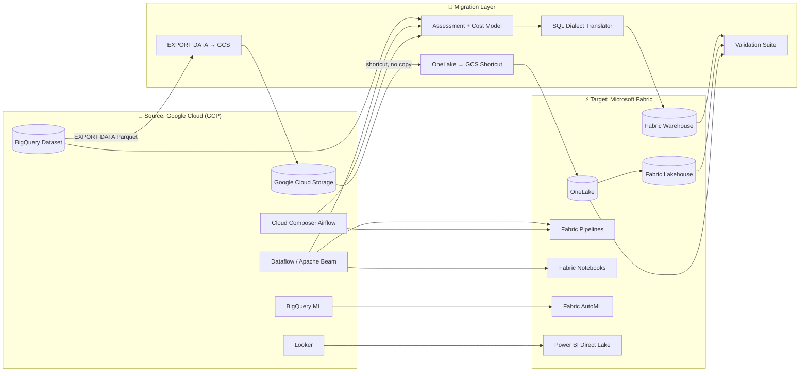

[Home](../../index.md) > [Tutorials](../) > Google BigQuery to Fabric Migration

# 🔵 Tutorial 44: Google BigQuery → Microsoft Fabric Migration

> **Last Updated**: 2026-04-27 | **Phase**: 14 (Wave 4) | **Multi-Cloud Migration Track**
> **Status**: ✅ Final | **Maintainer**: Platform Team

<div align="center" markdown>


</div>

---

## 🔵 Tutorial 44: Google BigQuery → Microsoft Fabric Migration

| | |
|---|---|
| **Difficulty** | ⭐⭐⭐ Advanced |
| **Time** | ⏱️ 210-300 minutes (longer than Synapse/Databricks due to cross-cloud egress) |
| **Focus** | Multi-cloud migration: BigQuery dataset, GCS, Dataflow (Apache Beam), Cloud Composer, Looker → Fabric Warehouse, OneLake (GCS shortcut), Fabric Pipelines, Fabric notebooks, Power BI |

---

## 📊 Progress Tracker

| Tutorial | Status |
|----------|:------:|
| 00 — Environment Setup → 38 — DOJ Justice | ✅ Complete (Phases 1-13) |
| 41 — Synapse → Fabric | ✅ Complete |
| 42 — Databricks → Fabric | ✅ Complete |
| 43 — Redshift → Fabric | ✅ Complete |
| **44 — BigQuery → Fabric (this tutorial)** | 🔵 **YOU ARE HERE** |
| 45 — On-Prem SSAS/SSIS/SSRS → Fabric | ⬜ |

| Navigation | |
|---|---|
| ⬅️ **Previous** | [43 — Redshift → Fabric](../43-redshift-to-fabric/README.md) |
| ➡️ **Next** | [45 — On-Prem SSAS/SSIS/SSRS → Fabric](../45-onprem-ssas-ssis-ssrs/README.md) |

---

## 📖 Overview

Google BigQuery is a high-performance serverless data warehouse, but a growing number of enterprises are consolidating analytics on Microsoft Fabric to reduce multi-cloud sprawl, simplify BI delivery, and unify governance with the rest of their Microsoft estate. This tutorial walks through migrating each BigQuery workload type into its Fabric equivalent — including the dialect translation, partitioning/clustering conversion, and the cross-cloud egress strategy that makes or breaks the project economics.

### Why Migrate from BigQuery to Fabric?

| Concern | BigQuery Behavior | Fabric Behavior |
|---------|-------------------|-----------------|
| **Cloud surface** | GCP-only (project, IAM, VPC-SC, billing) | Azure-native, integrates with M365, Entra, Purview |
| **Compute model** | Slots (on-demand or reserved), per-query billing | CU pool — predictable, all workloads share |
| **Storage** | BigQuery managed storage + GCS | OneLake unified — one copy, shortcut to GCS during transition |
| **BI integration** | Looker (separate license, separate tool) or external | Power BI Direct Lake — no copy, no refresh, included |
| **Real-time** | Pub/Sub + Dataflow + BigQuery streaming inserts | Eventstream + Eventhouse native, lower TCO |
| **ML lifecycle** | BigQuery ML inline + Vertex AI | Fabric AutoML + notebooks + Azure ML interop |
| **Governance** | Data Catalog + IAM + DLP (separate services) | Microsoft Purview unified across the estate |
| **Egress economics** | Reads cross-cloud incur egress fees from GCP | Once data is in OneLake, no further egress |

### What This Tutorial Covers

1. Inventory and complexity scoring of your BigQuery project(s)
2. BigQuery Standard SQL → T-SQL dialect translation
3. BigQuery EXPORT DATA → GCS → OneLake shortcut (egress-aware) 
4. Partitioning + clustering → Delta partitioning + Z-Order/V-Order
5. Authorized views / row-level security → Fabric Warehouse RLS
6. Standard SQL UDFs and JS UDFs → T-SQL functions or notebook UDFs
7. Materialized views → Materialized Lake Views
8. Dataflow (Apache Beam) → Fabric Pipelines or notebooks
9. Cloud Composer (Airflow) → Fabric Pipelines or Apache Airflow Job (preview)
10. BigQuery ML → Fabric AutoML / notebooks
11. Looker → Power BI semantic models
12. Slot consumption → CU sizing
13. Three-tier validation (row count, hash, query parity)
14. Coexistence with both engines reading the same OneLake/GCS data
15. Cutover and decommission with egress minimization

---

## 🎯 Learning Objectives

By the end of this tutorial, you will be able to:

- [ ] Run a BigQuery `INFORMATION_SCHEMA` + `JOBS_BY_PROJECT` inventory and produce a complexity score
- [ ] Translate BigQuery Standard SQL to T-SQL (dialect parity table included)
- [ ] Use `EXPORT DATA OPTIONS(...)` to land BigQuery contents into GCS as Parquet
- [ ] Create OneLake shortcuts to GCS to avoid duplicating petabyte-scale data
- [ ] Convert BigQuery date / integer / ingestion-time partitioning to Delta partitioning
- [ ] Convert clustering keys to Delta Z-Order or V-Order layout
- [ ] Migrate Standard SQL UDFs to T-SQL functions; JS UDFs to notebook Python
- [ ] Recreate authorized views as Fabric Warehouse row-level security policies
- [ ] Convert Dataflow pipelines to Fabric Pipelines or PySpark notebooks
- [ ] Convert BigQuery ML models to Fabric AutoML models
- [ ] Repoint Looker semantic layer to Power BI Direct Lake
- [ ] Size F-SKU capacity from historical slot consumption
- [ ] Minimize GCP egress charges during the cutover window

---

## 🏗️ Reference Architecture



### Component Mapping (the canonical reference)

| BigQuery Component | Fabric Equivalent | Migration Approach |
|--------------------|-------------------|--------------------|
| BigQuery dataset | Fabric Warehouse / Lakehouse | DDL conversion + EXPORT/COPY |
| Slot model (on-demand or reserved) | CU model (F-SKU) | Empirical sizing from query history |
| Date / integer / ingestion-time partitioning | Delta partitioning | Convert to `PARTITIONED BY (col)` |
| Clustering keys | Delta Z-Order / V-Order | Z-Order on Lakehouse; V-Order auto in Warehouse |
| Authorized views | Row-level security in Fabric | T-SQL `CREATE SECURITY POLICY` |
| Standard SQL | T-SQL | Dialect translator (see table below) |
| Standard SQL UDF | T-SQL UDF (`CREATE FUNCTION`) | Direct port for most |
| JavaScript UDF | Notebook Python UDF | Re-author logic in PySpark |
| Materialized views | Materialized Lake Views | Recreate in Lakehouse |
| Scripts / procedures | T-SQL procedures | Dialect translation + `BEGIN/END` blocks |
| Google Cloud Storage (GCS) | OneLake shortcut to GCS | **No data movement during coexistence** |
| BigQuery ML | Fabric AutoML / notebooks | Re-train; export coefficients where needed |
| Dataform | Fabric Notebooks + dbt | See [dbt feature doc](../../features/dbt-fabric-integration.md) |
| Cloud Composer (Airflow) | Fabric Pipelines OR Apache Airflow Job (preview) | Pipelines for most; Airflow Job to keep DAGs |
| Looker | Power BI semantic models | LookML → Tabular model |
| Looker Studio dashboards | Power BI reports | Manual recreation |
| GCP IAM | Microsoft Entra ID | Map principals; reissue role assignments |
| Pub/Sub + streaming inserts | Eventstream + Eventhouse | Re-author streams |
| Sensitive data discovery (DLP) | Microsoft Purview | Recreate classifications |

---

## 📋 Prerequisites

- [ ] Tutorial 00 (Environment Setup) complete
- [ ] Tutorials 01-03 (Bronze/Silver/Gold medallion) understood
- [ ] Tutorial 12 (CI/CD with fabric-cicd)
- [ ] Tutorial 13 (Migration Planning) for governance overview
- [ ] Tutorial 41 (Synapse → Fabric) read once — this tutorial mirrors that flow
- [ ] **Source**: Existing GCP project with BigQuery and GCS read access
- [ ] **Target**: Fabric F64+ capacity provisioned in a region near your GCS region (to minimize cross-cloud latency and egress)
- [ ] Service Account on GCP with `roles/bigquery.dataViewer`, `roles/bigquery.jobUser`, `roles/storage.objectViewer`
- [ ] Microsoft Entra Service Principal with `Workspace Admin` on the Fabric workspace
- [ ] `gcloud` CLI ≥ 470, `bq` CLI included
- [ ] Azure CLI ≥ 2.60 with `fabric` extension
- [ ] PowerShell 7.x with `Az.Fabric` module
- [ ] **Egress budget** approved by FinOps — see [GCP Egress section](#-special-section-gcp-network-egress-costs) below
- [ ] Estimated 3-5 hours active time + multi-day coexistence period

> ⚠️ **Gotcha**: Cross-cloud egress charges from GCP to Azure can dwarf Fabric capacity costs if you do this wrong. **Read the egress section before starting any data movement.**

---

## 🚀 Step-by-Step

### Step 1 — Assess Your BigQuery Project

Run the assessment script to inventory datasets, tables, query patterns, and slot consumption.

```bash
cd tutorials/44-bigquery-to-fabric/
python 01_assessment.py \
    --gcp-project "my-analytics-prod" \
    --regions "US,EU" \
    --output-dir "./assessment-output"
```

The script issues these underlying queries (you can also run them in the BigQuery console):

```sql
-- Dataset and table inventory with size
SELECT
  table_catalog AS project_id,
  table_schema  AS dataset_id,
  table_name,
  row_count,
  size_bytes / POW(1024, 3) AS size_gb,
  type AS table_type
FROM `region-us`.INFORMATION_SCHEMA.TABLE_STORAGE
WHERE table_schema NOT IN ('INFORMATION_SCHEMA');

-- Last 30 days of slot consumption per query
SELECT
  user_email,
  job_type,
  statement_type,
  TIMESTAMP_TRUNC(creation_time, DAY) AS day,
  SUM(total_slot_ms) / 1000 / 60 / 60 AS slot_hours,
  COUNT(*) AS query_count,
  SUM(total_bytes_processed) / POW(1024, 4) AS tb_processed
FROM `region-us`.INFORMATION_SCHEMA.JOBS_BY_PROJECT
WHERE creation_time >= TIMESTAMP_SUB(CURRENT_TIMESTAMP(), INTERVAL 30 DAY)
  AND state = 'DONE'
GROUP BY 1, 2, 3, 4
ORDER BY day DESC, slot_hours DESC;

-- Routines (UDFs and procedures)
SELECT routine_catalog, routine_schema, routine_name, routine_type, language
FROM `my-analytics-prod`.region-us.INFORMATION_SCHEMA.ROUTINES;

-- Materialized views
SELECT * FROM `my-analytics-prod`.region-us.INFORMATION_SCHEMA.MATERIALIZED_VIEWS;
```

> ✅ **Verification**: Output directory contains:
> - `inventory.csv` — every dataset, table, view, routine with size + last-modified
> - `slot_consumption.csv` — daily slot-hours per workload (used for F-SKU sizing)
> - `complexity_scores.csv` — per-table classification: Easy / Medium / Hard / Very Hard
> - `udfs.json` — all routines with body + language (SQL or JS)
> - `unsupported_features.md` — BigQuery features without a 1:1 Fabric equivalent

> 💡 **Tip**: If you have multiple regions (US + EU), run the script per region. BigQuery `INFORMATION_SCHEMA` is regional.

### Step 2 — Plan Migration Waves

Use the assessment to plan migration waves. Migrate small reference tables first, fact tables last.

```bash
python 01_assessment.py --command wave-plan \
    --inventory ./assessment-output/inventory.csv \
    --max-wave-effort-days 10 \
    --max-wave-egress-tb 5
```

The `--max-wave-egress-tb` flag is unique to BigQuery: each wave is also capped on egress so the GCP bill is predictable per pay period.

The tool produces `migration-waves.md` with:
- Wave 1: Reference dimensions (small, no consumers)
- Wave 2: Bronze tables (raw event tables, partition-aligned)
- Wave 3: Silver / curated tables
- Wave 4: Gold / fact tables (largest egress)
- Wave 5: BI semantic models, Looker → Power BI rebinding
- Wave 6: BigQuery ML retraining
- Wave 7: Decommission BigQuery datasets

> ⚠️ **Gotcha**: BigQuery cross-region (e.g., `US` to `EU`) charges its own egress *within* GCP. If you have multi-region datasets, copy them to a single region before exporting to Fabric.

### Step 3 — Convert BigQuery Standard SQL → T-SQL

This is the core engineering effort. The translator handles ~80% mechanically; the remaining 20% needs manual review.

```bash
python 02_sql_translator.py \
    --source-sql-folder ./bigquery-sql/ \
    --output-tsql-folder ./fabric-tsql/ \
    --dialect bigquery \
    --target fabric-warehouse
```

See the [BigQuery Standard SQL → T-SQL dialect table](#-special-section-bigquery-standard-sql--t-sql-dialect-translation) below for the full reference.

> ✅ **Verification**:
> ```bash
> # Each *.sql file should have a matching *.sql in the output folder
> diff <(ls ./bigquery-sql/) <(ls ./fabric-tsql/)
> ```

> 💡 **Tip**: After translation, run a syntax-only parse against Fabric Warehouse using `sqlcmd` with `-Y 0`. Catches the obvious errors before you waste compute on execution.

### Step 4 — Export BigQuery → GCS

Use BigQuery's native `EXPORT DATA` to land Parquet files in GCS. Parquet is the optimal format for downstream Delta conversion.

```sql
-- Run in BigQuery console for each in-scope table
EXPORT DATA OPTIONS(
  uri = 'gs://my-fabric-export-bucket/customers/part-*.parquet',
  format = 'PARQUET',
  compression = 'SNAPPY',
  overwrite = true
) AS
SELECT * FROM `my-analytics-prod.warehouse.customers`;
```

For partitioned tables, export per partition to preserve the partitioning scheme:

```sql
-- Partitioned export (one file set per date)
EXPORT DATA OPTIONS(
  uri = 'gs://my-fabric-export-bucket/events/dt=2026-04-01/part-*.parquet',
  format = 'PARQUET',
  compression = 'SNAPPY',
  overwrite = true
) AS
SELECT * EXCEPT(_PARTITIONDATE)
FROM `my-analytics-prod.warehouse.events`
WHERE _PARTITIONDATE = DATE '2026-04-01';
```

A driver script automates this for all in-scope tables and date ranges:

```bash
python 03_export_to_gcs.py \
    --gcp-project "my-analytics-prod" \
    --bucket "my-fabric-export-bucket" \
    --tables-yaml ./assessment-output/in-scope-tables.yaml \
    --parallelism 16
```

> ⚠️ **Gotcha**: BigQuery `EXPORT DATA` is a query job. It consumes slots and runtime. Schedule big exports during off-peak hours so you don't queue against business workloads.

> 💡 **Tip**: Snappy Parquet compresses well and is the format Delta Lake uses natively. **Don't** export as CSV unless you have a hard reason — it bloats egress and loses types.

### Step 5 — Bring GCS Data into OneLake (Shortcut, Don't Copy)

This is the **single biggest egress-saving move** in the entire migration. Shortcuts read in place — no data is copied across clouds during coexistence.

```bash
# Create a OneLake shortcut to a GCS bucket
az fabric onelake-shortcut create \
    --workspace-id "$WS_ID" \
    --lakehouse-id "$LH_ID" \
    --name "bigquery-export" \
    --path "Files/bigquery-export" \
    --target-gcs-uri "gs://my-fabric-export-bucket/" \
    --gcs-access-key-id "$GCS_KEY_ID" \
    --gcs-secret-access-key "$GCS_SECRET"
```

Or via Bicep:

```bicep
resource shortcutGcs 'Microsoft.Fabric/workspaces/items/shortcuts@2024-01-01' = {
  name: 'bigquery-export'
  properties: {
    target: {
      googleCloudStorage: {
        bucket: 'my-fabric-export-bucket'
        subpath: '/'
        connectionId: connectionId
      }
    }
  }
}
```

**What this gives you:**
- Petabyte-scale data is *not* copied
- GCS retains the source of truth during coexistence
- Fabric reads the shortcut as if it were native OneLake
- Bidirectional during coexistence: BigQuery and Fabric both read the same data
- You only pay GCS egress when Fabric reads the data — and Fabric caches aggressively

> ✅ **Verification**: From a Fabric notebook:
> ```python
> df = spark.read.parquet("Files/bigquery-export/customers/")
> print(df.count())   # Should match BigQuery row count
> df.printSchema()    # Should match BigQuery schema
> ```

> ⚠️ **Gotcha**: GCS shortcuts require a connection with HMAC keys (or workload identity federation in preview). Plan a 1-hour spike to set this up before you script anything.

### Step 6 — Load Fabric Warehouse via CTAS / COPY INTO

For Warehouse workloads (T-SQL analytics), load the GCS-backed shortcut data into managed Warehouse tables. This is the form most Looker → Power BI replacements need.

```sql
-- Option A: COPY INTO from OneLake shortcut
COPY INTO dbo.customers
FROM 'https://onelake.dfs.fabric.microsoft.com/<workspace>/<lakehouse>.Lakehouse/Files/bigquery-export/customers/'
WITH (
    FILE_TYPE = 'PARQUET',
    CREDENTIAL = (IDENTITY = 'Workspace Identity')
);

-- Option B: CTAS for transformation during load
CREATE TABLE dbo.customers_curated
AS
SELECT
    customer_id,
    TRY_CAST(signup_ts AS datetime2(6)) AS signup_ts,
    UPPER(TRIM(country_code)) AS country_code,
    -- BigQuery returned numeric as STRING; cast to DECIMAL
    TRY_CAST(lifetime_value AS decimal(18,2)) AS lifetime_value
FROM OPENROWSET(
    BULK 'https://onelake.dfs.fabric.microsoft.com/<workspace>/<lakehouse>.Lakehouse/Files/bigquery-export/customers/',
    FORMAT = 'PARQUET'
) AS src;
```

> 💡 **Tip**: Lean on CTAS rather than INSERT for first-load performance. CTAS is metadata-bulk; INSERT is row-bulk.

### Step 7 — Migrate UDFs (Standard SQL UDFs → T-SQL; JS UDFs → Notebook Functions)

BigQuery supports two UDF flavors. Each has a different Fabric path.

#### Standard SQL UDFs → T-SQL `CREATE FUNCTION`

```sql
-- BigQuery
CREATE FUNCTION analytics.fmt_phone(s STRING) AS (
  REGEXP_REPLACE(s, r'[^0-9]', '')
);

-- Fabric Warehouse T-SQL
CREATE FUNCTION analytics.fmt_phone(@s VARCHAR(50))
RETURNS VARCHAR(50)
AS
BEGIN
  RETURN (
    SELECT STRING_AGG(c, '') WITHIN GROUP (ORDER BY n)
    FROM (
      SELECT n, SUBSTRING(@s, n, 1) AS c
      FROM (VALUES (1),(2),(3),(4),(5),(6),(7),(8),(9),(10),
                   (11),(12),(13),(14),(15),(16),(17),(18),(19),(20)) AS v(n)
    ) x
    WHERE c LIKE '[0-9]'
  );
END;
```

> 💡 **Tip**: Use the simpler T-SQL `TRANSLATE` or string manipulation when feasible — avoid scalar UDFs in hot paths because they're row-iterative.

#### JavaScript UDFs → Notebook Python UDFs

JS UDFs in BigQuery do not translate to T-SQL. Re-author them as PySpark UDFs in a Fabric notebook.

```python
# notebooks/silver/migrated_js_udfs.py
from pyspark.sql.functions import udf
from pyspark.sql.types import StringType
import re

@udf(returnType=StringType())
def normalize_email(email: str) -> str:
    if not email:
        return None
    e = email.strip().lower()
    if not re.match(r'^[\w\.-]+@[\w\.-]+\.\w+$', e):
        return None
    return e

silver_df = bronze_df.withColumn("email_normalized", normalize_email("email_raw"))
silver_df.write.format("delta").mode("overwrite").save("Tables/silver_customers")
```

> ⚠️ **Gotcha**: BigQuery JS UDFs run in a sandboxed V8 with limited libraries. PySpark UDFs run in Python with the full ecosystem. Don't blindly port — many BigQuery JS UDFs exist *because* SQL was clumsy. In Spark, you may not need the UDF at all.

### Step 8 — Convert Partitioning + Clustering → Delta Partitioning + Z-Order

BigQuery's partitioning + clustering map cleanly to Delta partitioning + Z-Order.

| BigQuery Feature | Fabric Equivalent | Notes |
|------------------|-------------------|-------|
| Date partitioning (`PARTITION BY DATE(ts)`) | Delta `PARTITIONED BY (dt DATE)` | Add a derived `dt` column at ingest |
| Integer-range partitioning | Delta `PARTITIONED BY (bucket INT)` | Compute the bucket at ingest |
| Ingestion-time partitioning (`_PARTITIONDATE`) | Delta `PARTITIONED BY (ingestion_date)` | Capture `current_date()` at ingest |
| Clustering keys (1-4 columns) | Z-Order on Lakehouse / V-Order on Warehouse | Different mechanisms — see below |

```python
# PySpark: convert partitioning + clustering at write time
events_df.write \
    .format("delta") \
    .partitionBy("dt") \
    .save("Tables/silver_events")

# Optimize with Z-Order on what BigQuery had as cluster keys
spark.sql("""
    OPTIMIZE silver_events
    ZORDER BY (customer_id, product_category)
""")
```

> 💡 **Tip**: V-Order is automatic in Fabric Warehouse and Lakehouse — you don't run `OPTIMIZE V-ORDER`. Z-Order, however, is explicit. Use Z-Order on the columns BigQuery had as cluster keys.

> ⚠️ **Gotcha**: BigQuery allows up to 4,000 partitions per table; Delta is far more permissive but **avoid over-partitioning** (rule of thumb: each partition should hold at least 1 GB of data).

### Step 9 — Convert Dataflow Pipelines → Fabric Pipelines or Notebook

Dataflow pipelines (Apache Beam Java/Python) translate to one of two Fabric patterns:

| Dataflow Pattern | Fabric Pattern | When to Use |
|------------------|----------------|-------------|
| Batch Beam pipeline (Parquet/CSV → BQ) | Fabric Pipeline (Copy + Notebook) | Standard ELT |
| Streaming Beam (Pub/Sub → BQ) | Eventstream + Eventhouse | Real-time |
| Complex transforms (windowing, side inputs) | PySpark notebook | Logic-heavy |
| Cloud Composer (Airflow DAG) | Fabric Pipeline OR Apache Airflow Job (preview) | Keep DAG syntax, swap engine |

```bash
# Run the Dataflow → Fabric Pipeline converter
python 04_dataflow_to_fabric.py \
    --source-dag-folder ./airflow-dags/ \
    --target-workspace "$FABRIC_WS_ID" \
    --output-dir ./fabric-pipelines/
```

> 💡 **Tip**: For Cloud Composer DAGs you'd rather not rewrite, the [Apache Airflow Job (preview)](https://learn.microsoft.com/fabric/data-factory/apache-airflow-jobs-concepts) lets you import DAGs almost as-is. Good for big DAG portfolios.

### Step 10 — Convert BigQuery ML Models → Fabric AutoML or Notebooks

BigQuery ML models live inside the warehouse. They don't migrate directly — you re-train on the migrated dataset.

| BQML Model | Fabric Path |
|------------|-------------|
| Linear / logistic regression | Fabric AutoML or `MLlib` |
| Boosted trees (`BOOSTED_TREE_*`) | Fabric AutoML or XGBoost in notebook |
| `DNN_*` | Notebook with PyTorch/TensorFlow |
| `TIME_SERIES_*` (ARIMA_PLUS) | Notebook with `prophet`/`statsforecast` |
| `KMEANS` | `pyspark.ml.clustering.KMeans` |
| `MATRIX_FACTORIZATION` | `pyspark.ml.recommendation.ALS` |
| `AUTOML_*` | Fabric AutoML (closest equivalent) |
| Imported TensorFlow/ONNX models | Notebook + ONNX runtime |

```python
# Example: BQML logistic regression → Fabric AutoML
from synapse.ml.train import TrainClassifier
from pyspark.ml.classification import LogisticRegression

train_df = spark.read.format("delta").load("Tables/silver_churn_features")

model = TrainClassifier(model=LogisticRegression(), labelCol="churned").fit(train_df)
model.write().overwrite().save("Models/churn_model_v1")
```

### Step 11 — Convert Looker → Power BI Semantic Models

LookML is conceptually similar to a Tabular semantic model: views ≈ tables, measures ≈ measures, explores ≈ relationships. The conversion is largely manual.

| LookML Construct | Power BI Equivalent |
|------------------|---------------------|
| `view: customers { sql_table_name: ... }` | Direct Lake table over Fabric Warehouse |
| `dimension: signup_date { type: date }` | Column with date data type |
| `measure: lifetime_value { type: sum sql: ${TABLE}.ltv }` | DAX measure: `SUM(...)` |
| `explore: orders { join: customers { ... } }` | Model relationships |
| LookML access filters | RLS roles in Power BI |
| Looker dashboards | Power BI reports |
| Looker scheduled emails | Power BI subscriptions |

> 💡 **Tip**: If you have many Looker dashboards, prioritize converting the top-20 by usage first. Use Looker's `i__looker.history` to find them.

### Step 12 — Size Fabric Capacity from Slot Consumption

```bash
python 01_assessment.py --command capacity-recommendation \
    --slot-history ./assessment-output/slot_consumption.csv \
    --reservation-slots 2000 \
    --target-utilization 0.65
```

See the [Slot → CU sizing section](#-special-section-slot-consumption--cu-sizing) below for the rationale.

### Step 13 — Validate Migration

Same three-tier framework used in [Tutorial 41 (Synapse → Fabric)](../41-synapse-to-fabric/README.md#step-8--validate-migration).

```bash
python 05_validation_suite.py \
    --source-bq-project "my-analytics-prod" \
    --target-warehouse "$FAB_WH_ID" \
    --tables-yaml ./tables-to-validate.yaml \
    --output-report ./validation-report.html
```

```
Tier 1: ROW COUNT     ─────▶  count(*) match per table
Tier 2: CONTENT HASH  ─────▶  sha256 of canonicalized rows match
Tier 3: QUERY PARITY  ─────▶  representative aggregations match within 0.001%
```

> ⚠️ **Gotcha**: BigQuery hashes (`FARM_FINGERPRINT`, `MD5`) are not portable to T-SQL. Use canonicalized concat-and-SHA256 in both engines for parity.

> ✅ **Verification**: All three tiers pass for ≥ 95% of in-scope tables before declaring migration complete.

### Step 14 — Coexistence (Run Both for 2-4 Weeks)

During coexistence:
- Both BigQuery and Fabric read the same GCS data via OneLake shortcut (zero duplication)
- Writes can target both, but BigQuery is typically read-only during this phase
- BI consumers move to Power BI in waves, with Looker as a fallback
- Daily validation report confirms parity
- An egress dashboard tracks GCS → Azure data movement against budget

> 💡 **Tip**: If your egress budget is tight, configure Fabric Spark to cache hot tables aggressively (`spark.databricks.io.cache.enabled = true`-equivalent in Fabric) — once a table is read once it stays in capacity-local cache.

### Step 15 — Cutover and Decommission

When validation has been green for 7 consecutive days:

1. **Freeze writes to BigQuery** — pause Dataflow jobs, mark datasets read-only
2. **Final delta sync** — capture last incremental changes via `EXPORT DATA` of records changed in last 24 hours
3. **Materialize OneLake** — replace shortcuts with managed Delta tables (one-time copy, but ends GCS egress permanently)
4. **Switch BI** — repoint Power BI workspace; archive Looker
5. **Switch consumers** — apps, APIs, integrations
6. **Monitor for 48 hours** — close on-call bridge after no incidents
7. **Decommission BigQuery** — see below

```bash
# Materialize a shortcut into managed OneLake (ends GCS egress)
python 06_materialize_shortcut.py \
    --shortcut-path "Files/bigquery-export/customers" \
    --target-table "Tables/customers" \
    --partition-by "dt" \
    --zorder "customer_id"

# After 30-day grace period with all validation green:
# 1. Pause BigQuery dataset (no compute charges; storage only)
bq update --description "Decommissioned 2026-04-30" my-analytics-prod:warehouse

# 2. Backup metadata for audit
python 07_backup_bq_metadata.py --project my-analytics-prod --output ./bq-backup/

# 3. After 90 more days, delete dataset (data is in OneLake, not lost)
bq rm -r -f my-analytics-prod:warehouse

# 4. After 180 days total, retire the GCS bucket if no other workloads use it
gsutil rm -r gs://my-fabric-export-bucket/
```

> ⚠️ **Gotcha**: Don't delete the GCS bucket until **after** you've materialized any OneLake shortcuts that point to it. A live shortcut to a deleted bucket fails reads silently.

---

## 🌐 Special Section: BigQuery Standard SQL → T-SQL Dialect Translation

This is the most useful single table in the tutorial. It's the dialect cheat-sheet you'll come back to dozens of times during translation.

### Casting & Conversion

| BigQuery | T-SQL (Fabric Warehouse) | Notes |
|----------|--------------------------|-------|
| `CAST(x AS INT64)` | `CAST(x AS BIGINT)` | INT64 = BIGINT |
| `SAFE_CAST(x AS INT64)` | `TRY_CAST(x AS BIGINT)` | Returns NULL on failure |
| `CAST(x AS FLOAT64)` | `CAST(x AS FLOAT)` | |
| `CAST(x AS NUMERIC)` | `CAST(x AS DECIMAL(38,9))` | NUMERIC = DECIMAL(38,9) |
| `CAST(x AS BIGNUMERIC)` | `CAST(x AS DECIMAL(38,38))` | DECIMAL precision capped at 38 |
| `CAST(x AS STRING)` | `CAST(x AS VARCHAR(MAX))` | UTF-8 native in Fabric |
| `CAST(x AS BYTES)` | `CAST(x AS VARBINARY(MAX))` | |
| `CAST(x AS BOOL)` | `CAST(x AS BIT)` | |
| `PARSE_DATE('%Y-%m-%d', s)` | `TRY_PARSE(s AS DATE USING 'en-US')` or `CONVERT(DATE, s, 23)` | Use CONVERT for ISO dates |
| `PARSE_TIMESTAMP('%Y-%m-%d %H:%M:%S', s)` | `TRY_CAST(s AS DATETIME2(6))` | ISO formats parse natively |
| `FORMAT_DATE('%Y-%m', d)` | `FORMAT(d, 'yyyy-MM')` | |
| `FORMAT_TIMESTAMP('%Y-%m-%d %H:%M:%S', t)` | `FORMAT(t, 'yyyy-MM-dd HH:mm:ss')` | |

### Date / Time Functions

| BigQuery | T-SQL | Notes |
|----------|-------|-------|
| `CURRENT_DATE()` | `CAST(GETDATE() AS DATE)` or `CAST(SYSUTCDATETIME() AS DATE)` | Fabric is UTC by default |
| `CURRENT_TIMESTAMP()` | `SYSUTCDATETIME()` | |
| `DATE_ADD(d, INTERVAL 7 DAY)` | `DATEADD(DAY, 7, d)` | |
| `DATE_DIFF(d1, d2, DAY)` | `DATEDIFF(DAY, d2, d1)` | Argument order flipped |
| `DATE_TRUNC(d, MONTH)` | `DATEFROMPARTS(YEAR(d), MONTH(d), 1)` | No direct DATE_TRUNC; use DATETRUNC in Fabric |
| `TIMESTAMP_TRUNC(t, HOUR)` | `DATETRUNC(HOUR, t)` | Fabric supports DATETRUNC |
| `EXTRACT(DAYOFWEEK FROM d)` | `DATEPART(WEEKDAY, d)` | DOW numbering may differ |
| `LAST_DAY(d, MONTH)` | `EOMONTH(d)` | |
| `UNIX_SECONDS(t)` | `DATEDIFF_BIG(SECOND, '1970-01-01', t)` | |

### String Functions

| BigQuery | T-SQL | Notes |
|----------|-------|-------|
| `CONCAT(a, b, c)` | `CONCAT(a, b, c)` | Direct |
| `STRING_AGG(x, ',')` | `STRING_AGG(x, ',')` | Direct |
| `ARRAY_TO_STRING(arr, ',')` | `STRING_AGG(value, ',')` over OPENJSON | T-SQL has no native array |
| `SPLIT(s, ',')` | `STRING_SPLIT(s, ',')` | Returns table |
| `REGEXP_CONTAINS(s, r'^abc')` | `s LIKE 'abc%'` or use `regex` CLR | T-SQL has limited regex |
| `REGEXP_EXTRACT(s, r'(\d+)')` | Custom CLR or notebook UDF | No native regex extract |
| `REGEXP_REPLACE(s, r'\d+', 'X')` | Custom CLR or notebook UDF | No native; preview function exists |
| `LENGTH(s)` | `LEN(s)` | LEN trims trailing spaces — gotcha! |
| `LOWER(s)` / `UPPER(s)` | `LOWER(s)` / `UPPER(s)` | Direct |
| `TRIM(s)` | `TRIM(s)` | Direct |
| `LPAD(s, 10, '0')` | `RIGHT(REPLICATE('0', 10) + s, 10)` | No LPAD; emulate |
| `STARTS_WITH(s, 'foo')` | `s LIKE 'foo%'` | |
| `ENDS_WITH(s, 'bar')` | `s LIKE '%bar'` | |

### Numeric / Aggregate Functions

| BigQuery | T-SQL | Notes |
|----------|-------|-------|
| `IF(cond, a, b)` | `IIF(cond, a, b)` | |
| `IFNULL(x, y)` | `ISNULL(x, y)` or `COALESCE(x, y)` | |
| `NULLIF(x, y)` | `NULLIF(x, y)` | Direct |
| `COALESCE(...)` | `COALESCE(...)` | Direct |
| `SAFE_DIVIDE(a, b)` | `CASE WHEN b = 0 THEN NULL ELSE a / b END` | No SAFE_ namespace |
| `MOD(x, y)` | `x % y` | |
| `APPROX_COUNT_DISTINCT(x)` | `APPROX_COUNT_DISTINCT(x)` | T-SQL has it (HyperLogLog) |
| `APPROX_QUANTILES(x, 100)` | `PERCENTILE_CONT(...)` | Approx not exact-equivalent |
| `ANY_VALUE(x)` | `MIN(x)` or `FIRST_VALUE(x)` | |
| `COUNTIF(cond)` | `SUM(CASE WHEN cond THEN 1 ELSE 0 END)` | |

### STRUCT and ARRAY (the hardest part)

T-SQL has **no native STRUCT or ARRAY type**. You have three options.

| BigQuery Pattern | Fabric Option |
|------------------|---------------|
| `STRUCT(a, b, c)` (composite column) | (1) Flatten to scalar columns, or (2) Store as JSON `VARCHAR(MAX)` and use `JSON_VALUE`/`OPENJSON` |
| `ARRAY<INT64>` column | Store as JSON array string and use `OPENJSON` to unnest |
| `UNNEST(arr)` | `CROSS APPLY OPENJSON(arr_json) WITH (value INT '$')` |
| Nested repeated record | Move to a separate child table (relational normalization) |

```sql
-- BigQuery
SELECT customer_id, item.product, item.qty
FROM orders, UNNEST(items) AS item;

-- T-SQL (assuming items stored as JSON)
SELECT o.customer_id, item.product, item.qty
FROM orders AS o
CROSS APPLY OPENJSON(o.items) WITH (
    product VARCHAR(100) '$.product',
    qty     INT          '$.qty'
) AS item;
```

> 💡 **Tip**: For very nested data, use the **Lakehouse path** (PySpark + Delta) instead of Warehouse. Spark handles complex types natively. Warehouse is best for already-flattened relational data.

### Window Functions

Most window functions translate directly. Watch for:

| BigQuery | T-SQL | Notes |
|----------|-------|-------|
| `OVER (PARTITION BY x ORDER BY y ROWS BETWEEN ...)` | `OVER (PARTITION BY x ORDER BY y ROWS BETWEEN ...)` | Direct |
| `LAG(x, 1, 0) OVER (...)` | `LAG(x, 1, 0) OVER (...)` | Direct |
| `LEAD(x, 1, 0) OVER (...)` | `LEAD(x, 1, 0) OVER (...)` | Direct |
| `QUALIFY row_number() OVER (...) = 1` | Wrap in CTE + WHERE | T-SQL has no QUALIFY |
| `RANGE BETWEEN INTERVAL 7 DAY PRECEDING AND CURRENT ROW` | `RANGE BETWEEN ... ROWS` only | T-SQL window has limited RANGE |

```sql
-- BigQuery with QUALIFY
SELECT *
FROM events
QUALIFY ROW_NUMBER() OVER (PARTITION BY user_id ORDER BY ts DESC) = 1;

-- T-SQL equivalent
WITH ranked AS (
    SELECT *, ROW_NUMBER() OVER (PARTITION BY user_id ORDER BY ts DESC) AS rn
    FROM events
)
SELECT * FROM ranked WHERE rn = 1;
```

---

## 💸 Special Section: GCP Network Egress Costs

**Egress fees from GCS to Azure are real money.** A naïve migration on a multi-TB warehouse will spike your GCP bill by tens of thousands of dollars. Plan this carefully.

### Egress Pricing (GCS → Internet, as of 2026)

| Tier | Price |
|------|-------|
| First 1 TB / month | ~$0.12/GB ($120/TB) |
| 1-10 TB / month | ~$0.11/GB |
| 10-100 TB / month | ~$0.08/GB |
| Egress to non-GCP, same continent | typically lower if Azure region is in same continent |

> 💡 GCP publishes a [Network Service Tiers](https://cloud.google.com/network-tiers) page; FinOps should pull current prices for your region pair before signing off.

### Minimization Strategies (in priority order)

| Strategy | Egress Saved | Effort |
|----------|--------------|--------|
| **Use OneLake shortcuts during coexistence** | ~70% — no copy until cutover; reads pull what's needed | Low |
| **Compress with Snappy Parquet** | ~5-10x vs CSV | Low |
| **Filter columns at export (`SELECT only-needed`)** | proportional to width | Low |
| **Filter rows at export (date range, dedupe)** | proportional to depth | Medium |
| **Co-locate Azure region with GCP region** | ~20-40% (egress tier) | Medium |
| **Schedule big exports during GCP discount windows** | varies | Low |
| **Use a Cloud Storage Transfer Service to Azure Blob** | sometimes 0 egress for committed-use | High |
| **Don't materialize shortcut data — read-in-place forever** | continuous savings | Low (but ties you to GCP indefinitely) |

### Egress Budget Worksheet

Run this against the assessment data **before** kicking off any export:

```bash
python 01_assessment.py --command egress-estimate \
    --inventory ./assessment-output/inventory.csv \
    --target-region eastus \
    --strategy compressed-parquet
```

Output:

```
=== Egress Estimate ===
In-scope dataset size:         18.4 TB (Snappy Parquet)
Estimated egress on full copy: $1,840 - $2,210 (one-time)
With shortcuts during coexist: $185 (read-on-demand only)
Recommended budget:            $2,500 (includes 20% buffer)
```

> ⚠️ **Gotcha**: Egress is **per project**. If your data spans multiple GCP projects, sum across all of them.

---

## 📏 Special Section: Slot Consumption → CU Sizing

BigQuery uses slots; Fabric uses Capacity Units (CUs). They're fundamentally different — but you can use historical slot consumption to make a defensible starting recommendation, then validate empirically during coexistence.

### Conceptual Mapping

| BigQuery Concept | Fabric Concept |
|------------------|----------------|
| Slot (a unit of CPU + memory) | CU (a unit of capacity across all workloads) |
| 100 slots ≈ 1 vCPU equivalent (rough) | F-SKU = ~2 CUs per F-unit |
| On-demand pricing (per-byte processed) | Capacity-fixed pricing (predictable) |
| Reservation (committed slots) | F-SKU reservation |
| Slots are warehouse-only | CUs are pooled across Spark, Warehouse, BI, RTI |

### Starting Recommendation (Validate Empirically)

| BigQuery Slot Reservation | Approximate Fabric F-SKU | Rationale |
|---------------------------|--------------------------|-----------|
| 100 slots | F8 | Light analytical workload |
| 500 slots | F16-F32 | Mid-tier; depends on BI footprint |
| 1,000 slots | F32-F64 | Standard enterprise warehouse |
| 2,000 slots | F64 | Default starting point for most BQ migrations |
| 5,000 slots | F128 | Large enterprise |
| 10,000 slots | F256 | Multi-team analytics platform |
| 20,000 slots | F512 | Hyperscale |

> ⚠️ **Gotcha**: Unlike BigQuery, Fabric CUs are **shared across all workloads** (Spark, Warehouse, Power BI, Eventhouse, RTI). If your migration brings BI consolidation onto Fabric, size **higher** than the slot equivalent suggests.

### Empirical Sizing — The Right Way

```bash
# During coexistence, monitor CU usage
python 08_capacity_telemetry.py \
    --workspace "$FABRIC_WS_ID" \
    --window-days 7 \
    --output ./capacity-telemetry.csv
```

Read the [Capacity Planning best practices doc](../../best-practices/capacity-planning-cost-optimization.md) for the full framework.

> 💡 **Tip**: Fabric's capacity metrics app is free and shows hour-by-hour CU usage. After the first week, you'll know whether your initial F-SKU pick was right.

---

## ✅ Verification (Final Checklist)

- [ ] All in-scope BigQuery tables have Fabric Warehouse / Lakehouse equivalents
- [ ] Three-tier validation (count, hash, query parity) green for 7+ consecutive days
- [ ] OneLake shortcuts to GCS working at performance parity
- [ ] All Standard SQL UDFs converted to T-SQL functions
- [ ] All JS UDFs re-authored as PySpark UDFs in notebooks
- [ ] All authorized views recreated as RLS policies
- [ ] Materialized views recreated as Materialized Lake Views
- [ ] Dataflow pipelines converted to Fabric Pipelines or notebooks
- [ ] BigQuery ML models retrained on Fabric AutoML
- [ ] Looker dashboards rebuilt as Power BI reports
- [ ] Power BI semantic models on Direct Lake
- [ ] Apps, APIs, integrations cut over
- [ ] F-SKU sized correctly (CU usage in steady-state band)
- [ ] Egress spend matches FinOps budget
- [ ] BigQuery datasets paused (or deleted post-grace-period)
- [ ] GCS bucket retained for grace period or retired with retention copy
- [ ] Cutover postmortem published

---

## 🧹 Cleanup

This tutorial creates assessment artifacts in `./assessment-output/`, translation artifacts in `./fabric-tsql/`, and pipeline artifacts in `./fabric-pipelines/`. Retain for audit; archive to long-term storage.

If your assessment ran against a real BigQuery project, the read-only `INFORMATION_SCHEMA` queries leave no trace. No rollback needed for assessment.

If `EXPORT DATA` was run and you want to abandon the migration, delete the GCS export bucket (`gsutil rm -r gs://my-fabric-export-bucket/`). No source data is altered by export.

---

## 🚦 Next Steps

- **[Tutorial 45 — On-Prem SSAS/SSIS/SSRS → Fabric](../45-onprem-ssas-ssis-ssrs/README.md)** — for legacy SQL Server BI stacks
- **[Tutorial 41 — Synapse → Fabric](../41-synapse-to-fabric/README.md)** — sister migration playbook (Microsoft-to-Microsoft)
- **[Tutorial 42 — Databricks → Fabric](../42-databricks-to-fabric/README.md)** — for shops with Databricks alongside BigQuery
- **[Tutorial 43 — Redshift → Fabric](../43-redshift-to-fabric/README.md)** — sister AWS-to-Azure playbook
- **[Migration Patterns Best Practices](../../best-practices/migration-patterns.md)** — cross-source patterns
- **[fabric-cicd Deployment](../../best-practices/fabric-cicd-deployment.md)** — automate the deployment of migrated artifacts
- **[Capacity Planning](../../best-practices/capacity-planning-cost-optimization.md)** — validate F-SKU choice with telemetry
- **[dbt Fabric Integration](../../features/dbt-fabric-integration.md)** — replacement for Dataform

---

## 🛠️ Troubleshooting

| Issue | Cause | Resolution |
|-------|-------|------------|
| Egress spend exceeds budget by 5x | Cross-region GCS reads or full materialization | Switch to shortcuts; co-locate region; filter columns |
| `OPENROWSET` fails on GCS shortcut | Connection IAM lacks `storage.objects.get` | Grant `roles/storage.objectViewer` to the connection SA |
| Row counts off by exactly partition size | Partition not exported (`_PARTITIONDATE` filter dropped a day) | Re-export missing partition; verify `EXPORT DATA` predicate |
| `STRUCT` column lost on import | Parquet logical type not mapped | Read into Lakehouse with PySpark; flatten before Warehouse load |
| `ARRAY` column unreadable in T-SQL | T-SQL has no native array | Land as JSON `VARCHAR(MAX)`; use `OPENJSON` |
| Timestamps off by 4-8 hours | BigQuery TIMESTAMP is UTC; T-SQL DATETIME2 has no TZ | Cast at ingest; or use `DATETIMEOFFSET` consistently |
| `PARSE_DATE` translations failing | Locale-dependent format strings | Use `CONVERT(DATE, s, <style>)` with explicit ISO style |
| `QUALIFY` translations missed | T-SQL has no QUALIFY clause | Wrap in CTE + `WHERE rn = 1` |
| Shortcut returns 0 rows after working yesterday | GCS HMAC key rotated or expired | Refresh credentials; recreate connection |
| BigQuery ML model metrics differ from Fabric AutoML | Different algorithms, different feature engineering defaults | Validate against business KPIs, not ML metrics |
| F-SKU throttling after migration | Concurrent BI + Spark + Warehouse contention | Scale up; review [capacity throttling runbook](../../runbooks/capacity-throttling-response.md) |
| Looker dashboard expressions don't translate | LookML PDTs not in Fabric | Recreate PDT logic as Lakehouse table or DAX measure |
| Cross-cloud query latency unacceptable | Shortcut reads pulling fresh from GCS each query | Materialize hot tables to managed Delta; rely on V-Order |
| Time zone columns off by hours | BigQuery `TIMESTAMP` is always UTC; T-SQL `DATETIME2` is naive | Standardize on `DATETIMEOFFSET` or always-UTC convention |

---

## 📁 Key Files Referenced

| Step | File |
|------|------|
| 1, 2, 12 | `tutorials/44-bigquery-to-fabric/01_assessment.py` |
| 3 | `tutorials/44-bigquery-to-fabric/02_sql_translator.py` |
| 4 | `tutorials/44-bigquery-to-fabric/03_export_to_gcs.py` |
| 9 | `tutorials/44-bigquery-to-fabric/04_dataflow_to_fabric.py` |
| 13 | `tutorials/44-bigquery-to-fabric/05_validation_suite.py` |
| 15 | `tutorials/44-bigquery-to-fabric/06_materialize_shortcut.py` |
| 15 | `tutorials/44-bigquery-to-fabric/07_backup_bq_metadata.py` |
| 12 | `tutorials/44-bigquery-to-fabric/08_capacity_telemetry.py` |

---

## 📚 References

### Google Cloud Documentation
- [BigQuery `INFORMATION_SCHEMA` reference](https://cloud.google.com/bigquery/docs/information-schema-intro)
- [BigQuery `EXPORT DATA` statement](https://cloud.google.com/bigquery/docs/reference/standard-sql/other-statements#export_data_statement)
- [BigQuery Standard SQL reference](https://cloud.google.com/bigquery/docs/reference/standard-sql/)
- [GCS HMAC keys for cross-cloud access](https://cloud.google.com/storage/docs/authentication/hmackeys)
- [GCP Network Service Tiers](https://cloud.google.com/network-tiers)

### Microsoft Fabric Documentation
- [BigQuery to Fabric migration overview](https://learn.microsoft.com/fabric/migrate/bigquery)
- [Fabric Warehouse T-SQL surface area](https://learn.microsoft.com/fabric/data-warehouse/data-warehousing)
- [OneLake shortcuts (Google Cloud Storage)](https://learn.microsoft.com/fabric/onelake/onelake-shortcuts)
- [Fabric Pipelines](https://learn.microsoft.com/fabric/data-factory/)
- [Apache Airflow Job (preview)](https://learn.microsoft.com/fabric/data-factory/apache-airflow-jobs-concepts)
- [Materialized Lake Views](../../features/materialized-lake-views.md)
- [Fabric AutoML](../../features/automl-model-endpoints.md)

### Related Tutorials & Docs
- [Tutorial 41 — Synapse → Fabric](../41-synapse-to-fabric/README.md) (Wave 4 anchor)
- [Tutorial 42 — Databricks → Fabric](../42-databricks-to-fabric/README.md) (Wave 4)
- [Tutorial 43 — Redshift → Fabric](../43-redshift-to-fabric/README.md) (Wave 4)
- [Tutorial 24 — Snowflake → Fabric](../24-snowflake-to-fabric/README.md) (existing)
- [Migration Patterns](../../best-practices/migration-patterns.md)
- [fabric-cicd Deployment](../../best-practices/fabric-cicd-deployment.md)
- [Capacity Planning](../../best-practices/capacity-planning-cost-optimization.md)
- [dbt Fabric Integration](../../features/dbt-fabric-integration.md)

---

[⬆️ Back to Top](#-tutorial-44-google-bigquery--microsoft-fabric-migration) | [📚 Tutorial Index](../index.md) | [🏠 Home](../../index.md)
