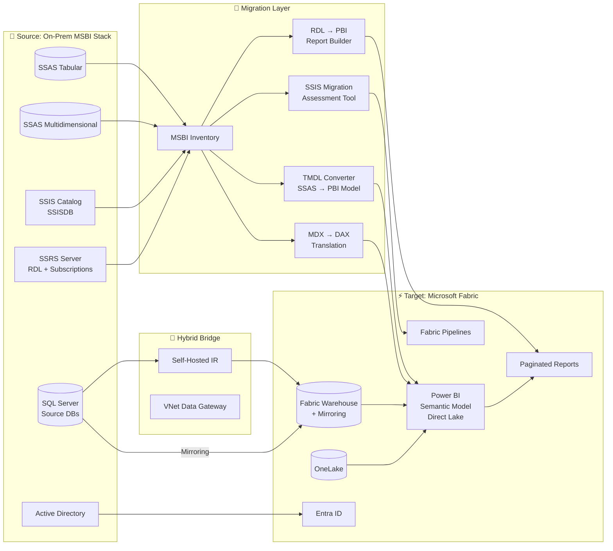
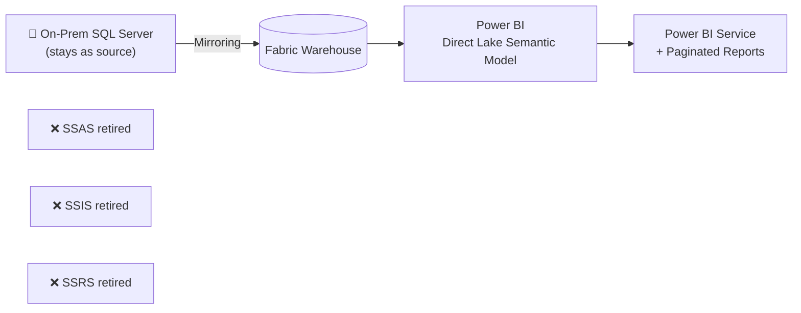

[Home](../../index.md) > [Tutorials](../) > On-Prem SSAS / SSIS / SSRS to Fabric Migration

# 📚 Tutorial 45: On-Prem SSAS / SSIS / SSRS → Microsoft Fabric Migration

> **Last Updated**: 2026-04-27 | **Phase**: 14 (Wave 4) | **Feature**: 4.10 — Legacy MSBI Stack Migration
> **Status**: ✅ Final | **Maintainer**: Platform Team

<div align="center" markdown>


</div>

---

!!! info "Third-party references — publicly sourced, good-faith comparison"
    This page references non-Microsoft products and services. That information is drawn from each vendor's **publicly available documentation** and is offered for honest, good-faith comparison only. This is a personal project written from a Microsoft Fabric and Azure perspective; it does **not** claim expertise in, or authority over, any third-party product, and nothing here is an official statement by, or endorsed by, those vendors. Capabilities, pricing, and features change often — always verify against the vendor's current official documentation. Where a third-party offering is the stronger choice, we say so plainly.

---

## 📊 Tutorial 45: On-Prem SSAS / SSIS / SSRS → Microsoft Fabric Migration

| | |
|---|---|
| **Difficulty** | ⭐⭐⭐⭐ Advanced |
| **Time** | ⏱️ 240-360 minutes (multi-product migration) |
| **Focus** | Legacy SQL Server BI stack — SSAS Tabular & Multidimensional, SSIS packages, SSRS reports → Fabric Power BI semantic models, Fabric Pipelines, Paginated Reports |

---

## 📊 Progress Tracker

| Tutorial | Status |
|----------|:------:|
| 00 — Environment Setup → 38 — DOJ Justice | ✅ Complete (Phases 1-13) |
| 41 — Synapse → Fabric | ✅ Complete |
| 42 — Databricks → Fabric | ✅ Complete |
| 43 — Redshift → Fabric | ✅ Complete |
| 44 — BigQuery → Fabric | ✅ Complete |
| **45 — On-Prem SSAS/SSIS/SSRS → Fabric (this tutorial)** | 🔵 **YOU ARE HERE** |

| Navigation | |
|---|---|
| ⬅️ **Previous** | [44 — BigQuery → Fabric](../44-bigquery-to-fabric/README.md) |
| ➡️ **Next** | [Tutorial Index](../index.md) |

---

## 📖 Overview

The **legacy Microsoft BI stack** — SQL Server Analysis Services (SSAS), SQL Server Integration Services (SSIS), and SQL Server Reporting Services (SSRS) — has powered enterprise reporting since the early 2000s. Many of these deployments are still running on Windows Server 2012/2016 hosts, against SQL Server 2014/2016/2019 source databases, with cubes refreshed nightly and RDL reports distributed via email subscription.

This tutorial walks through migrating each MSBI component into its Fabric equivalent, with conversion patterns for cubes, packages, and reports — and the hard-won guidance about MDX, custom SSIS components, and pixel-perfect RDL fidelity.

### Why Migrate the Legacy MSBI Stack?

| Concern | Legacy MSBI Behavior | Fabric Behavior |
|---------|----------------------|-----------------|
| **Lifecycle** | SQL Server 2016 out of mainstream support; SSAS Multidimensional in maintenance mode | Fabric Power BI is the strategic platform; new investment lands here |
| **Cost of on-prem** | Windows Server licensing + SQL Server core licensing + hardware refresh + DR site + power/cooling | F-SKU capacity covers compute, storage, BI, real-time, governance |
| **Modernization** | Cubes refresh nightly; reports email PDFs; users complain about freshness | Direct Lake = no copy, no refresh; Power BI Service = self-serve |
| **BI consolidation** | SSRS for ops, Power BI Premium for execs, SSAS for analysts — three tools | Single Fabric workspace covers paginated, interactive, and semantic |
| **Skills** | DAX/MDX/SSIS Script tasks/RDL — increasingly hard to hire | DAX + Python + Spark — modern, well-documented, abundant talent |
| **Hybrid friction** | On-prem cubes + cloud sources require Data Gateway hops | Mirroring + Direct Lake reduces hop count to 1 |

### What This Tutorial Covers

1. Inventory the MSBI estate (SSAS DBs, SSIS catalog, SSRS reports, SQL Server sources)
2. Plan migration waves (sources → ETL → semantic → reports)
3. Set up SHIR or VNet Data Gateway for hybrid data movement
4. Migrate SQL Server source data via Mirroring, Copy Job CDC, or pipelines
5. Convert SSAS Tabular databases to Power BI semantic models (TMDL)
6. Convert SSAS Multidimensional cubes (the hard one — Tabular pivot + MDX→DAX)
7. Convert SSIS packages to Fabric Pipelines (or Azure-SSIS interim bridge)
8. Convert SSRS RDL reports to Fabric Paginated Reports
9. Migrate row-level security and column-level encryption
10. Run BI consumers on both stacks during coexistence
11. Decommission MSBI servers safely

---

## 🎯 Learning Objectives

By the end of this tutorial, you will be able to:

- [ ] Inventory an MSBI estate (SSAS Tabular & Multidimensional, SSIS catalog, SSRS server)
- [ ] Plan a wave-ordered migration that respects dependencies between source DBs, packages, cubes, and reports
- [ ] Stand up SHIR or VNet Data Gateway for on-prem to Fabric hybrid connectivity
- [ ] Choose between Mirroring, Copy Job CDC, and SHIR pipeline patterns for source data
- [ ] Convert SSAS Tabular models to Power BI semantic models using TMDL
- [ ] Convert SSAS Multidimensional cubes (in-place to Tabular, then to Power BI) and translate MDX to DAX
- [ ] Convert SSIS packages to Fabric Pipelines using Microsoft's SSIS Migration Assessment tool
- [ ] Convert SSRS RDL files to Fabric Paginated Reports with full subscription parity
- [ ] Migrate row-level security (SSAS roles → Power BI RLS) and column-level encryption (→ sensitivity labels + OneLake Security)
- [ ] Establish a coexistence period with parallel SSRS and Power BI delivery for user validation
- [ ] Decommission the MSBI servers safely

---

## 🏗️ Reference Architecture



---

## 🧭 Component Mapping (the canonical reference)

This is the most important table in the tutorial. Every component on the left maps to a Fabric equivalent on the right.

### Source Data Layer

| MSBI Component | Fabric Equivalent | Migration Approach |
|----------------|-------------------|--------------------|
| SQL Server source DB (OLTP) | Fabric Warehouse via **Mirroring** | Near-real-time, no ETL. See [Tutorial 08](../08-database-mirroring/README.md) |
| SQL Server source DB (batch) | Fabric Warehouse via **Copy Job CDC** | Hourly/daily incremental load |
| SQL Server source DB (legacy ETL) | Fabric Lakehouse via **SHIR + Pipeline** | Lift-and-shift the existing nightly load pattern |
| File shares / FTP drops | OneLake + SHIR Copy activity | Direct port |
| Linked servers | Connections + cross-warehouse queries | Recreate; some require re-architecture |

### Semantic Layer

| MSBI Component | Fabric Equivalent | Migration Approach |
|----------------|-------------------|--------------------|
| **SSAS Tabular** model | **Power BI semantic model** (Direct Lake or Import) | Direct via **TMDL** export/import |
| **SSAS Multidimensional** cube | **Power BI semantic model** | **Two-step**: in-place to Tabular via SSDT, then to Power BI |
| DAX measure (Tabular) | DAX measure (Power BI) | **Direct** — copy over |
| DAX calculated column | DAX calculated column | Direct — but prefer Direct Lake-friendly patterns |
| **MDX measure** (Multidim) | DAX measure | **Manual translation** — the hardest part |
| **MDX calculated member** | DAX calculated column or measure | Manual translation |
| **MDX named set** | DAX table or filter | Manual translation |
| Tabular role (RLS) | Power BI RLS role | Direct (DAX filter expression) |
| Multidim Cell Security | Power BI OLS + RLS combination | Re-design (cell security has no direct equivalent) |
| Perspectives | Power BI perspectives | Direct |
| Translations | Field parameter / metadata translations | Direct (Tabular only) |
| KPIs | Power BI KPIs (in semantic model) | Direct |
| Hierarchies | Hierarchies | Direct |
| Partitions (Tabular) | Direct Lake partitions / Import partitions | Direct (but Direct Lake handles automatically) |
| Composite models (DirectQuery + Import) | Composite models in Power BI | Direct — see [composite-models.md](../../features/composite-models.md) |

### ETL Layer

| MSBI Component | Fabric Equivalent | Migration Approach |
|----------------|-------------------|--------------------|
| **SSIS package** (control flow) | **Fabric Pipeline** | Activity-by-activity mapping (most direct) |
| **SSIS package** (Azure-SSIS interim) | Azure Data Factory + Azure-SSIS IR | **Lift-and-shift** for high-complexity packages until rewrite |
| SSIS Data Flow | **Dataflow Gen2** OR **Notebook** | Power Query for simple flows; PySpark for complex |
| SSIS Lookup transform | Pipeline **Lookup** activity OR Notebook join | Direct |
| SSIS Conditional Split | Pipeline **If** activity OR Notebook | Direct |
| SSIS Derived Column | Notebook column expression | Direct |
| SSIS Aggregate | Notebook `groupBy` | Direct |
| SSIS Merge Join | Notebook `join` | Direct |
| SSIS Slowly Changing Dimension | Notebook SCD Type 2 pattern | Re-implement |
| SSIS Script Task (control flow) | **Notebook** OR Function activity | Re-implement Python |
| SSIS Script Component (data flow) | **Notebook** UDF | Re-implement Python |
| SSIS Custom Component | **Notebook** rewrite OR keep in Azure-SSIS | High-effort — see Special Section below |
| SSIS package configuration | Variable Library | Direct |
| SSIS event handler | Pipeline `On failure` / `On success` | Direct |
| SSIS catalog (SSISDB) | Fabric workspace + version control | Direct (artifact-level) |
| SSIS scheduled execution (SQL Agent) | Pipeline schedule | Direct |
| SSIS package parameter | Pipeline parameter | Direct |

### Reporting Layer

| MSBI Component | Fabric Equivalent | Migration Approach |
|----------------|-------------------|--------------------|
| **SSRS report (RDL)** | **Fabric Paginated Report** | Open in Power BI Report Builder, re-target data source |
| SSRS shared data source | Fabric Connection | Recreate |
| SSRS shared dataset | Paginated Report dataset (or semantic model query) | Direct |
| SSRS report parameter | Paginated Report parameter | Direct |
| SSRS subreport | Paginated Report subreport | Direct |
| SSRS subscription (email) | Power BI subscription | Direct |
| SSRS data-driven subscription | Power BI subscription with bursting OR Power Automate | Direct (some patterns) / Re-author (data-driven) |
| SSRS PBIRS-converted RDL | Paginated Report | Already most-of-the-way — re-target endpoint |
| SSRS My Subscriptions | Power BI Service `My subscriptions` | User self-migration |
| Reporting Services Configuration Manager | Power BI **workspace settings** + capacity admin | Re-configure |
| SSRS folder structure | Power BI workspace + apps | Re-design (workspaces are flatter) |

### Security and Identity

| MSBI Component | Fabric Equivalent | Migration Approach |
|----------------|-------------------|--------------------|
| Active Directory auth (Windows) | **Entra ID** | Sync via Entra Connect (most orgs already have this) |
| SQL Auth | Entra ID + Service Principal | Migrate; deprecate SQL Auth |
| AD group → SSAS role | Entra group → Power BI role | Direct |
| SSAS row filter (DAX or MDX) | Power BI RLS filter (DAX) | Direct (Tabular) / Translate (Multidim) |
| Column-level encryption (SQL Server Always Encrypted) | OneLake Security + sensitivity labels | Re-design — see [OneLake Security](../../features/onelake-security.md) |
| Transparent Data Encryption (TDE) | OneLake encryption + CMK | Direct (different mechanism, same outcome) |
| Reporting Services security model | Power BI workspace roles | Re-map |

---

## 📋 Prerequisites

- [ ] Tutorial 00 (Environment Setup) complete
- [ ] Tutorials 01-03 (medallion) understood
- [ ] [Tutorial 22 — Networking](../22-networking-connectivity/README.md) and/or [Tutorial 23 — SHIR & Data Gateways](../23-shir-data-gateways/README.md) for hybrid connectivity
- [ ] **Source**: Read access to on-prem SSAS instances, SSIS catalog (SSISDB), SSRS server, and SQL Server source DBs
- [ ] **Target**: Fabric F64+ capacity provisioned
- [ ] **Bridge**: SHIR host VM (Windows Server 2019+, 4 vCPU / 16 GB RAM minimum) **OR** VNet Data Gateway for VNet-injected sources
- [ ] **Tooling**:
  - SQL Server Management Studio (SSMS) 19+ for SSAS introspection
  - SQL Server Data Tools (SSDT) 17+ for Multidim → Tabular conversion
  - Power BI Desktop (latest)
  - Power BI Report Builder (latest)
  - Microsoft SSIS Migration Assessment tool ([download](https://learn.microsoft.com/sql/ssis/lift-shift/ssis-azure-lift-shift))
  - PowerShell 7.x with `SqlServer` and `Az.Fabric` modules
- [ ] Service Principal with Workspace Admin on target Fabric workspace
- [ ] Entra ID tenant with AD groups synced (Entra Connect)
- [ ] Estimated 4-6 hours active time per workload + multi-week coexistence period
- [ ] Hash salt env var set: `export FABRIC_POC_HASH_SALT=$(openssl rand -hex 32)`

---

## 🚀 Step-by-Step

### Step 1 — Assess the MSBI Estate

Run the MSBI inventory script to catalog every cube, package, and report.

```bash
cd tutorials/45-onprem-ssas-ssis-ssrs/

python 01_msbi_inventory.py \
    --ssas-server "tcp://onprem-ssas01" \
    --ssis-server "onprem-sql01" \
    --ssis-catalog "SSISDB" \
    --ssrs-url "http://onprem-ssrs01/reportserver" \
    --output-dir "./assessment-output"
```

> ✅ **Verification**: Output directory contains:
> - `ssas_inventory.csv` — every database, cube/model, measure group, partition, role, last-process-time
> - `ssis_inventory.csv` — every package, project, parameter, environment reference, last-execution-time
> - `ssrs_inventory.csv` — every report, shared dataset, subscription, last-render-time
> - `mdx_dax_translation_report.md` — auto-flagged MDX expressions that need DAX rewrite
> - `complexity_scores.csv` — per-artifact "Easy / Medium / Hard / Very Hard" classification
> - `dependency_graph.json` — what depends on what (used for migration ordering)
> - `unsupported_features.md` — MSBI features without a clean Fabric equivalent

> 💡 **Tip**: Run inventory **monthly** during the migration project. New reports show up here, and stale reports flagged for `last-render-time > 365d` are decommissioning candidates instead of migration candidates.

> ⚠️ **Gotcha**: The script connects to SSAS via XMLA, SSIS via T-SQL against `SSISDB.catalog.*`, and SSRS via the SOAP `ReportService2010` endpoint. Each may require a separate service account with appropriate read permissions.

### Step 2 — Plan Migration Waves

Use the dependency graph to plan migration waves. The order is **non-negotiable**: data sources first, then ETL, then semantic, then reports.

```bash
python 01_msbi_inventory.py --command wave-plan \
    --inventory ./assessment-output/ \
    --max-wave-effort-days 15
```

The tool produces `migration-waves.md` with this canonical order:

- **Wave 1 — Source Data**: SQL Server DBs migrated to Fabric (Mirroring or Copy Job CDC)
- **Wave 2 — ETL**: SSIS packages converted to Fabric Pipelines (or Azure-SSIS bridge for hard ones)
- **Wave 3 — Semantic (Tabular)**: SSAS Tabular models converted to Power BI semantic models
- **Wave 4 — Semantic (Multidimensional)**: SSAS Multidim cubes converted (Tabular pivot first)
- **Wave 5 — Reports**: SSRS reports converted to Paginated Reports
- **Wave 6 — Coexistence**: Run both stacks side by side for 4-8 weeks
- **Wave 7 — Cutover**: Decommission MSBI servers

> ⚠️ **Gotcha**: If any SSRS report queries an SSAS cube directly, that cube must finish Wave 3/4 **before** the report is migrated. The wave-plan tool flags these tight couplings.

### Step 3 — Set Up SHIR or VNet Data Gateway

For hybrid connectivity, follow [Tutorial 23 — SHIR & Data Gateways](../23-shir-data-gateways/README.md).

```powershell
# Quick reference — install and register SHIR on a Windows Server VM
$AuthKey = "YOUR-AUTH-KEY-FROM-FABRIC"

# 1. Download SHIR installer
Invoke-WebRequest -Uri "https://download.microsoft.com/download/E/4/7/E4771905-1079-445B-8BF9-8A1A075D8A10/IntegrationRuntime_5.39.8836.1.msi" -OutFile "shir.msi"

# 2. Silent install
msiexec /i shir.msi /quiet /qn /norestart

# 3. Register with Fabric
& "C:\Program Files\Microsoft Integration Runtime\5.0\Shared\dmgcmd.exe" -RegisterNewNode $AuthKey
```

> ✅ **Verification**: In Fabric portal → Workspace settings → Connections → On-premises data gateway, the SHIR shows as "Online".

> 💡 **Tip**: For high-throughput workloads, run **two SHIR nodes** in HA mode so cube refreshes survive a node reboot.

### Step 4 — Migrate Source Data

Choose the right pattern per source database. Don't use one pattern for everything.

#### Option A — Mirroring (preferred for OLTP / low-latency BI)

Mirroring delivers near-real-time replication from SQL Server to Fabric Warehouse with no ETL code.

```bash
# Create a Mirrored database via Fabric REST API
curl -X POST \
    "https://api.fabric.microsoft.com/v1/workspaces/$WS_ID/mirroredDatabases" \
    -H "Authorization: Bearer $TOKEN" \
    -H "Content-Type: application/json" \
    -d '{
      "displayName": "mirrored_sales_db",
      "definition": {
        "source": {
          "type": "SqlServer",
          "connection": {
            "server": "onprem-sql01.contoso.com",
            "database": "Sales",
            "gatewayId": "'$GATEWAY_ID'"
          }
        }
      }
    }'
```

> ✅ **Verification**: After 5-10 minutes, query the mirrored DB SQL endpoint and compare a row count to the source.
> ```sql
> -- Run in Fabric SQL endpoint
> SELECT COUNT(*) FROM dbo.SalesOrderHeader;
> -- Should match SELECT COUNT(*) FROM Sales.dbo.SalesOrderHeader on the source
> ```

> 💡 **Tip**: Mirroring is **free** under your F-SKU CU pool. It's almost always the right choice for SQL Server sources — see [Mirroring](../../features/mirroring.md).

#### Option B — Copy Job CDC (batch incremental)

For sources where Mirroring isn't feasible (e.g., SQL Server 2012 — too old for change tracking), use Copy Job CDC.

```bash
# Create a Copy Job that reads CDC tables hourly
python 02_create_copy_job.py \
    --source-server "onprem-sql01" \
    --source-database "Sales" \
    --tables "SalesOrderHeader,SalesOrderDetail,Customer" \
    --target-warehouse "$FAB_WH_ID" \
    --schedule "hourly"
```

See [Copy Job CDC](../../features/copy-job-cdc.md) for the full pattern.

#### Option C — SHIR + Pipeline (lift-and-shift the nightly batch)

For legacy SSIS ETL that you want to **temporarily preserve** before rewriting, run a Fabric Pipeline that mirrors the existing nightly job.

```json
{
  "name": "nightly_sales_load",
  "activities": [
    {
      "type": "Copy",
      "linkedService": { "referenceName": "shir_onprem_sql01" },
      "source": { "type": "SqlServerSource", "sqlReaderQuery": "SELECT * FROM Sales.SalesOrderHeader" },
      "sink": { "type": "LakehouseTableSink", "tableName": "bronze_sales_order_header" }
    }
  ]
}
```

> ⚠️ **Gotcha**: Choose **per source database**, not globally. A single estate often has all three patterns running simultaneously during migration.

### Step 5 — Convert SSAS Tabular → Power BI Semantic Model

SSAS Tabular and Power BI semantic models are the **same engine** under the hood (Vertipaq + Tabular Object Model). Migration is mostly a re-target exercise.

#### 5.1 Export TMDL from SSAS Tabular

[**TMDL** (Tabular Model Definition Language)](https://learn.microsoft.com/power-bi/developer/projects/projects-tmdl) is the modern source-control-friendly authoring format for semantic models. SSAS Tabular models export cleanly to TMDL.

```powershell
# Use Microsoft.AnalysisServices.Tabular .NET SDK
Install-Module -Name SqlServer
Import-Module SqlServer

$Server = "tcp://onprem-ssas01"
$Database = "SalesTabularModel"
$OutputDir = ".\tmdl-export\$Database"

Invoke-ASCmd -Server $Server -Query @"
<Backup xmlns='http://schemas.microsoft.com/analysisservices/2003/engine'>
  <Object><DatabaseID>$Database</DatabaseID></Object>
  <File>$OutputDir\$Database.abf</File>
</Backup>
"@

# Convert ABF to TMDL using Tabular Editor 3 (or open in PBI Desktop)
& "C:\Program Files\Tabular Editor 3\TabularEditor3.exe" `
    "$OutputDir\$Database.abf" `
    -SAVE-TO-FOLDER "$OutputDir\tmdl"
```

#### 5.2 Re-target the data source

In the exported TMDL, change every `dataSource` block from on-prem SSAS to your Fabric Warehouse / Lakehouse SQL endpoint.

```diff
 dataSource salesDB
-    type: sqlServer
-    connectionString: "Server=onprem-sql01;Database=Sales;Integrated Security=SSPI;"
+    type: sqlServer
+    connectionString: "Server=<workspace-id>.datawarehouse.fabric.microsoft.com;Database=wh_sales;"
```

#### 5.3 Import TMDL into Power BI

```powershell
# Open the TMDL folder in Power BI Desktop
& "C:\Program Files\Microsoft Power BI Desktop\bin\PBIDesktop.exe" `
    -Folder ".\tmdl-export\$Database\tmdl"

# Or use Tabular Editor 3 to publish directly
& "C:\Program Files\Tabular Editor 3\TabularEditor3.exe" `
    ".\tmdl-export\$Database\tmdl" `
    -DEPLOY -SERVER "powerbi://api.powerbi.com/v1.0/myorg/$WORKSPACE_NAME" `
    -DATABASE "$Database"
```

#### 5.4 Recommend Direct Lake (when model fits)

If the migrated model has < 1 billion rows per fact table and source data is in OneLake (after Step 4), switch the connection mode to **Direct Lake**:

- No import step
- No refresh schedule
- Real-time visibility into the warehouse
- Massive CU savings vs Import mode

```python
# In Power BI Desktop → Transform data → Source → switch from Import to Direct Lake
# Or programmatically via TMDL:
```

```diff
 partition Sales-Partition
-    mode: import
-    source = let Source = Sql.Database(...) in Source
+    mode: directLake
+    source = entity { schemaName: "dbo", entityName: "FactSales" }
```

> ✅ **Verification**: Open the published semantic model in Power BI Service. DAX measures should compute identical results to the source SSAS Tabular model. Use [DAX Studio](https://daxstudio.org/) to compare measure outputs side by side.

> 💡 **Tip**: DAX measures and roles port directly. **Calculated columns** are the gotcha — Direct Lake does not support traditional calculated columns. Convert to DAX measures or push computation into the Warehouse layer (e.g., a Gold-layer view).

> ⚠️ **Gotcha**: SSAS Tabular running in **compatibility level 1200** uses TOM but not TMDL-natively. Upgrade to compatibility level 1500+ before exporting (right-click DB → Properties → Compatibility Level in SSMS).

### Step 6 — Convert SSAS Multidimensional (the hard one)

Multidimensional cubes do **not** convert directly to Power BI. The path is two hops: **Multidim → Tabular → Power BI**.

#### 6.1 Convert Multidim to Tabular (in-place via SSDT)

```powershell
# 1. Open the existing Multidim project in SQL Server Data Tools (SSDT)
# 2. Use the "Migrate to Tabular" wizard:
#    File → New → Project → Analysis Services Tabular Project
#    Choose "From existing model" → Select Multidim cube
#    SSDT generates a Tabular shell — measure groups become tables
```

> ⚠️ **Gotcha**: The "Migrate to Tabular" wizard handles **structure only**. Every MDX expression (calculated members, named sets, scope assignments) must be rewritten as DAX. Budget **2-8 hours per cube** for non-trivial calculations.

#### 6.2 MDX → DAX Translation Patterns

This is the hardest part of MSBI migration. Common patterns:

| MDX Pattern | DAX Equivalent | Notes |
|-------------|----------------|-------|
| `[Measures].[Sales]` | `[Sales]` | Direct |
| `SUM([Date].[Calendar].CurrentMember.Children, [Measures].[Sales])` | `SUM(FactSales[Sales])` with date filter | Direct in most cases |
| `PARALLELPERIOD([Date].[Calendar], 1, [Date].[Calendar].CurrentMember)` | `DATEADD(DimDate[Date], -1, YEAR)` | Direct |
| `[Date].[Calendar].[Year].&[2026]` | `FILTER(DimDate, DimDate[Year] = 2026)` | Direct |
| `IIF([Measures].[Sales] > 0, ..., ...)` | `IF([Sales] > 0, ..., ...)` | Direct |
| `SUM(LASTPERIODS(12, ...), [Measures].[Sales])` | `CALCULATE([Sales], DATESINPERIOD(...))` | Direct |
| `EXISTS(...)` | `CALCULATETABLE(...)` | Pattern-similar |
| Named set `[Top10Customers]` | DAX table variable or calc table | Manual |
| Scope assignment `SCOPE(...)` | DAX `CALCULATE` with filter context override | **Hard** — re-think the calc |
| Cell calculation | (No equivalent) | Re-design |
| Custom rollup operators | (No equivalent) | Re-design |
| `MDX.Parent.Parent` (hierarchy nav) | `PATH()` + `PATHITEM()` | Pattern-similar |
| `MEMBERS` | `VALUES()` | Direct |
| `CROSSJOIN(...)` | `CROSSJOIN()` | Direct (DAX has the same function) |
| Multidim Cell Security | Power BI OLS + RLS | **Re-design** |

#### 6.3 Use the auto-translation report

The `01_msbi_inventory.py` script produces `mdx_dax_translation_report.md` with:
- Every MDX expression in the cube
- Auto-translated DAX where the pattern is unambiguous (about 60% of cases)
- Flagged for manual review where it isn't (the remaining 40%)

```bash
cat ./assessment-output/mdx_dax_translation_report.md | head -50
```

#### 6.4 Then follow Step 5 (Tabular → Power BI)

Once the Multidim cube is a working Tabular model, the rest of the migration is identical to Step 5.

> ✅ **Verification**: Pick 10 representative MDX queries from your historical query log. Run each MDX query against the source cube and the equivalent DAX query against the migrated semantic model. Compare results within 0.001% tolerance.

> 💡 **Tip**: Some Multidim features (writeback, custom rollup operators, action calculations) have **no Tabular or Power BI equivalent**. Inventory these early and decide: re-design, drop, or postpone migration of that cube.

### Step 7 — Convert SSIS Packages → Fabric Pipelines

Microsoft publishes the **SSIS Migration Assessment** tool that scans your SSISDB and reports per-package migration feasibility.

#### 7.1 Run the SSIS Migration Assessment Tool

```powershell
# Download and run from:
# https://learn.microsoft.com/sql/ssis/lift-shift/ssis-azure-lift-shift

.\SsisMigrationAssessment.exe `
    -SourceServer "onprem-sql01" `
    -SourceCatalog "SSISDB" `
    -OutputPath ".\ssis-assessment-report.html"
```

The report classifies each package:
- **Green** — Direct migration to Fabric Pipelines
- **Yellow** — Migration possible with modifications (custom Script tasks, deprecated components)
- **Red** — Lift-and-shift to Azure-SSIS recommended (complex custom components, third-party tasks)

#### 7.2 Map activities one-by-one

For Green packages, run the conversion:

```bash
python 03_ssis_to_pipeline.py \
    --source-folder "./ssis-packages-export/" \
    --target-workspace "$FABRIC_WS_ID" \
    --output-dir "./fabric-pipelines/"
```

Refer to the **Component Mapping table** above for the full activity-by-activity translation.

#### 7.3 Special: Lift-and-shift to Azure-SSIS (interim bridge)

For **Red** packages (or any where the rewrite cost exceeds 40 hours), use Azure-SSIS Integration Runtime as an interim bridge.

```bash
# Provision Azure-SSIS IR in Azure Data Factory
az datafactory integration-runtime managed create \
    --factory-name "adf-msbi-bridge" \
    --resource-group "rg-fabric-migration" \
    --name "azure-ssis-ir" \
    --node-size "Standard_D4_v3" \
    --number-of-nodes 2 \
    --catalog-server-endpoint "fabric-sql.database.windows.net" \
    --catalog-pricing-tier "S1"
```

Then deploy your existing SSIS packages **unchanged** to Azure-SSIS, and trigger them from Fabric Pipelines via the **Execute SSIS Package** activity.

> 💡 **Tip**: Azure-SSIS is a **bridge, not a destination**. Plan to retire each lifted-and-shifted package within 12-18 months as Fabric Pipeline / Notebook rewrites complete. Otherwise you've just moved the on-prem MSBI bill to Azure.

> ⚠️ **Gotcha**: Custom SSIS Components written in C# do not run in Fabric Pipelines or Dataflow Gen2. They must be either:
> 1. Rewritten as a **Notebook** (PySpark or Python) — preferred long-term
> 2. Lifted-and-shifted to **Azure-SSIS** — preferred interim
> 3. Replaced with an off-the-shelf Fabric activity if the custom logic was minor
>
> See the Special Section on Custom SSIS Components below.

### Step 8 — Convert SSRS RDL → Fabric Paginated Reports

[Paginated Reports](../../features/paginated-reports.md) in Fabric use the **same RDL standard** as SSRS. Migration is mostly a re-target operation.

#### 8.1 Open RDL in Power BI Report Builder

```powershell
# 1. Download the RDL files from SSRS
# 2. Open each RDL in Power BI Report Builder (free download)
& "C:\Program Files (x86)\Microsoft Power BI Report Builder\PBIReportBuilder.exe" `
    "C:\reports\sales_summary.rdl"
```

#### 8.2 Re-target the data source

In Report Builder → Report Data → Data Sources → right-click the data source → Properties:

- Change `Connection Type` from `Microsoft SQL Server` (or `Microsoft SQL Server Analysis Services`) to:
  - **Power BI semantic model** — for reports that previously hit an SSAS cube (now migrated to PBI)
  - **Microsoft Fabric SQL Database** — for reports that previously hit a SQL Server source DB (now mirrored)
  - **Microsoft Fabric Lakehouse** — for reports against Lakehouse data
- Update the connection string to your Fabric workspace endpoint

#### 8.3 Test pixel-perfect output

Critical for any report subject to regulatory or legal review. Render the RDL in both source and target, then compare PDFs visually and via `pdf-diff`.

```bash
# Bulk-render and compare 100 representative reports
python 04_rdl_pixel_compare.py \
    --source-ssrs "http://onprem-ssrs01/reportserver" \
    --target-fabric-workspace "$FABRIC_WS_ID" \
    --report-list "./reports-to-compare.csv" \
    --output ./pixel-diff-report.html
```

#### 8.4 Migrate subscriptions

```bash
# Export SSRS subscriptions to a portable manifest
python 04_export_ssrs_subscriptions.py \
    --ssrs-url "http://onprem-ssrs01/reportserver" \
    --output ./ssrs-subscriptions.json

# Apply to Power BI Service
python 04_create_pbi_subscriptions.py \
    --workspace "$FABRIC_WS_ID" \
    --manifest ./ssrs-subscriptions.json
```

> ✅ **Verification**: All migrated reports render in Fabric within ±2% of SSRS render time. All subscriptions deliver to recipients within their existing schedule.

> ⚠️ **Gotcha**: **Data-driven subscriptions** in SSRS (one subscription that fans out to a list of users from a SQL query) do not have a 1:1 equivalent in Power BI. Two options: (1) use Power Automate flow with `For each` over the recipient list, or (2) use Power BI **bursting** (Premium only).

> 💡 **Tip**: PBIRS-converted RDLs are already most of the way there. If you'd already migrated SSRS to **Power BI Report Server** (PBIRS) on-prem, the jump to Fabric Paginated Reports is just an endpoint change.

### Step 9 — Migrate Row-Level Security

#### 9.1 SSAS Roles → Power BI RLS

SSAS roles map directly to Power BI RLS roles. The DAX filter expression is the same.

```dax
// SSAS Tabular role: SalesRegionRLS
[Region] = USERNAME()

// Power BI RLS role: SalesRegionRLS (no change)
[Region] = USERPRINCIPALNAME()
```

> ⚠️ **Gotcha**: `USERNAME()` returns DOMAIN\user in SSAS but the UPN (`user@contoso.com`) in Power BI. Use `USERPRINCIPALNAME()` for Power BI; the value comes from Entra ID.

#### 9.2 Multidim Cell Security → Power BI OLS + RLS

Multidim cell security (which restricted specific cells of the cube based on dimension membership) has **no direct Power BI equivalent**. Re-design:

- Most use cases collapse into **RLS** (filter rows based on user identity)
- Sensitive **column** cases collapse into **OLS** (Object-Level Security, hides specific columns or measures)
- True cell-level cases (e.g., "this user can see only YTD totals, not transaction detail") become **two semantic models** with different audiences

### Step 10 — Migrate Column-Level Encryption

SQL Server **Always Encrypted** (column-level encryption) doesn't directly translate to Fabric. Instead, layer protection:

- **OneLake Security** restricts who can read the underlying data files — see [OneLake Security](../../features/onelake-security.md)
- **Sensitivity labels** (Microsoft Information Protection / Purview) classify and audit access — see [Tutorial 07](../07-governance-purview/README.md)
- **Power BI OLS** hides specific columns from users who shouldn't see them
- **Dynamic data masking** (Fabric SQL Database) masks the value at query time for unauthorized users

Most regulated workloads need a combination of all four.

> 💡 **Tip**: Column-level encryption was often used to satisfy a single audit checkbox. Talk to the audit team — sensitivity labels + OneLake Security + DDM together usually pass the same audit at lower complexity.

### Step 11 — Cut Over BI Consumers

This is **change management**, not technical work. Plan in waves:

1. **Pilot users** (5-10 power users) get access to Fabric workspace, run their reports, file feedback
2. **Department by department** rollout, with formal sign-off before enabling Power BI subscriptions for that department
3. **Decommission email lists** from SSRS one department at a time (don't flip the whole org at once)

### Step 12 — Coexistence (4-8 weeks)

Run SSRS, SSAS, and Fabric Power BI **side by side**:

- Source SQL Server is the truth (all writes still go there)
- Mirroring/Copy Job CDC replicates to Fabric continuously
- Both stacks render the same reports for the same users
- Daily diff report (counts, key aggregations) confirms parity
- Action Group alerts on parity drift (see [alerts-and-budgets.bicep](https://github.com/fgarofalo56/Suppercharge_Microsoft_Fabric/blob/main/infra/modules/alerts-and-budgets.bicep))

> 💡 **Tip**: This period is **expensive** (running both stacks at the same time). Budget for it, but don't extend it past 8 weeks. If users haven't validated by week 6, escalate.

### Step 13 — Decommission MSBI Servers

When parity has been green for 14 consecutive days and all users have signed off:

```powershell
# 1. Pause SSAS instances (stop service, retain data on disk for 30 days)
Stop-Service "MSSQLServerOLAPService" -Force
Set-Service "MSSQLServerOLAPService" -StartupType Disabled

# 2. Disable SSIS Agent jobs
Invoke-Sqlcmd -ServerInstance "onprem-sql01" -Query @"
EXEC msdb.dbo.sp_update_job @job_name = N'Nightly_Sales_Load', @enabled = 0;
"@

# 3. Disable SSRS subscriptions (stop sending emails)
Invoke-Sqlcmd -ServerInstance "onprem-ssrs01" -Database "ReportServer" -Query @"
UPDATE Subscriptions SET InactiveFlags = 1 WHERE InactiveFlags = 0;
"@

# 4. Wait 30 days. If no one screams, fully decommission:
#    - Backup SSAS .abf files to long-term archive
#    - Backup SSISDB to long-term archive
#    - Backup ReportServer DB to long-term archive
#    - Decommission Windows Server VMs
#    - Reclaim SQL Server core licenses
```

> ⚠️ **Gotcha**: Do **not** decommission the source SQL Server databases yet. Mirroring still depends on them. Source SQL Server retirement is a separate, later project once the legacy applications writing to those DBs are also retired or repointed to Fabric SQL Database.

---

## 🧩 Special Section — TMDL (Tabular Model Definition Language)

[**TMDL**](https://learn.microsoft.com/power-bi/developer/projects/projects-tmdl) is the modern, source-control-friendly authoring format for Power BI / SSAS Tabular semantic models. Instead of one giant `model.bim` JSON blob, TMDL emits one human-readable text file per object (table, measure, role, perspective).

```tmdl
// Example: measures/SalesYTD.tmdl
measure SalesYTD =
    TOTALYTD(SUM(FactSales[Amount]), DimDate[Date])
    formatString: "\\$#,0;(\\$#,0)"
    description: "Year-to-date sales, fiscal year"
    displayFolder: "Sales \\ YTD"
```

**Why this matters for migration:**
- Diff-friendly — Git PR reviews on semantic model changes
- Tool-agnostic — Tabular Editor, Power BI Desktop, VS Code all read TMDL
- The native format of the migrated model after Step 5

**Recommendation**: Adopt TMDL **during** the migration, not after. Don't import a `.bim` file and then "migrate to TMDL" in a separate project.

---

## 🧩 Special Section — MDX → DAX Translation Patterns (the hardest part)

Multidim → Tabular is the **#1 source of migration delays** in this tutorial. Two strategies to manage the risk:

### Strategy A — Auto-translate the easy 60%

The `mdx_dax_translation_report.md` (from Step 1) auto-translates the patterns in the Component Mapping table. Apply these in bulk via a script:

```python
# Pseudocode of auto-translation
patterns = {
    r"\[Measures\]\.\[(\w+)\]": r"[\1]",
    r"PARALLELPERIOD\(\[Date\]\.\[Calendar\], 1, .*\)": r"DATEADD(DimDate[Date], -1, YEAR)",
    # ... 20+ more patterns
}
for mdx, dax in patterns.items():
    dax_file = re.sub(mdx, dax, mdx_file)
```

### Strategy B — Manual rewrite the hard 40%

Some MDX has no direct DAX equivalent:
- `SCOPE` assignments (DAX has no SCOPE — re-think as `CALCULATE` with filter context override)
- Cell calculations (no equivalent — re-design as separate measures or as part of the data model)
- Custom rollup operators (e.g., averaging instead of summing for time dimensions — re-design via `CALCULATE` + `AVERAGEX`)
- `LinkMember`, `Strict` cube features

Budget **2-3 person-days per "hard" cube**. Test exhaustively against historical query results.

### Strategy C — Don't migrate calcs that aren't used

The inventory script captures the cube's **query log** (last 90 days from SSAS DMVs `$system.discover_command_objects`). Calculations with **zero queries** in 90 days are decommissioning candidates, not migration candidates. This typically eliminates 30-50% of the calc migration work.

---

## 🧩 Special Section — Custom SSIS Components

SSIS allows custom .NET components written in C#. These are the single biggest reason to use Azure-SSIS as an interim bridge.

### Decision tree

```
Custom SSIS Component
        │
        ├── Used in < 5 packages, < 100 LOC?
        │       └── Rewrite as Notebook (PySpark) — 1-2 days each
        │
        ├── Used in many packages, well-documented?
        │       └── Rewrite as a shared Notebook helper module
        │
        ├── Critical path, complex, third-party?
        │       └── Lift-and-shift to Azure-SSIS, plan rewrite later
        │
        └── Vendor-supplied (e.g., Theobald, Cozyroc)?
                └── Check vendor for Fabric / Spark version
                └── If none: Azure-SSIS bridge only
```

### Common custom-component categories and Fabric replacements

| Custom Component Category | Fabric Replacement |
|---------------------------|--------------------|
| File parsing (fixed-width, EBCDIC, mainframe) | `pyspark.sql.functions.substring` + Notebook |
| Encryption / decryption (PGP, GPG) | `python-gnupg` in Notebook + Key Vault |
| Web service callout (legacy SOAP) | `requests` library in Notebook |
| Custom logging / auditing | Workspace Monitoring + `notebookutils.runtime.context` |
| Mainframe connector (Theobald, etc.) | Vendor's Fabric/Spark version OR Azure-SSIS |
| Salesforce connector | Native Fabric Salesforce connector |

---

## 🧩 Special Section — Hybrid Pattern (Keep On-Prem SQL Server, Move BI to Fabric)

Not every org wants to fully retire on-prem SQL Server. A common pattern:

- **Source SQL Server stays on-prem** (the operational app writing to it isn't ready to move)
- **Mirroring** replicates to Fabric continuously
- **Direct Lake** semantic model in Fabric reads from the mirrored copy
- **Power BI Service** delivers reports
- **SSAS, SSIS, SSRS retire** even though the source DB does not

This delivers **80% of the modernization benefit** with 20% of the source-system risk.



> 💡 **Tip**: This is often the **right first step** even when the eventual goal is full SQL Server retirement. Migrate the BI tier first (low operational risk), then plan source-DB migration as a separate project.

---

## ✅ Verification (Final Checklist)

- [ ] All in-scope SSAS Tabular models converted to Power BI semantic models (TMDL committed to git)
- [ ] All in-scope SSAS Multidimensional cubes converted (Tabular pivot + DAX)
- [ ] All MDX-to-DAX translations validated against historical query results (within 0.001%)
- [ ] All in-scope SSIS packages converted to Fabric Pipelines (Green packages) or running on Azure-SSIS bridge (Yellow/Red packages)
- [ ] All in-scope SSRS RDL files converted to Paginated Reports
- [ ] Pixel-diff < 1% on top 100 reports (subset to 100% on regulatory reports)
- [ ] All subscriptions migrated (or replaced with Power Automate where data-driven)
- [ ] Row-Level Security ported (SSAS roles → Power BI RLS)
- [ ] Column-level encryption replaced with OneLake Security + sensitivity labels + OLS
- [ ] Hybrid bridge stable (SHIR / VNet Data Gateway HA)
- [ ] Mirroring stable for source DBs (lag < 60 seconds)
- [ ] BI consumers cut over (departments signed off)
- [ ] Coexistence period green for 14+ consecutive days
- [ ] MSBI servers paused (or fully decommissioned post-grace-period)
- [ ] SQL Server core licenses reclaimed (cost reduction documented)
- [ ] Cutover postmortem published

---

## 🧹 Cleanup

This tutorial creates assessment artifacts in `./assessment-output/`, TMDL exports in `./tmdl-export/`, and Pipeline conversion artifacts in `./fabric-pipelines/`. Retain for audit; archive to long-term storage.

If your assessment ran against a real MSBI estate, the read-only queries leave no trace. No rollback needed.

---

## 🚦 Next Steps

- **[Tutorial 41 — Synapse → Fabric](../41-synapse-to-fabric/README.md)** — for shops with both legacy MSBI **and** Synapse Analytics
- **[Tutorial 08 — Database Mirroring](../08-database-mirroring/README.md)** — deep dive on the recommended source data pattern
- **[Tutorial 23 — SHIR & Data Gateways](../23-shir-data-gateways/README.md)** — the hybrid bridge that powers Steps 3-4
- **[Migration Patterns](../../best-practices/migration-patterns.md)** — cross-source migration framework
- **[Paginated Reports](../../features/paginated-reports.md)** — feature deep-dive for the SSRS replacement
- **[Composite Models](../../features/composite-models.md)** — for hybrid Direct Lake + DirectQuery scenarios
- **[Data Modeling Star Schema](../../best-practices/data-modeling-star-schema.md)** — how to refactor cube schemas during migration
- **[fabric-cicd Deployment](../../best-practices/fabric-cicd-deployment.md)** — automate the deployment of migrated TMDL, Pipelines, and Paginated Reports

---

## 🛠️ Troubleshooting

| Issue | Likely Cause | Resolution |
|-------|--------------|------------|
| SHIR shows "Offline" in Fabric | Outbound HTTPS blocked or auth key expired | Open 443 to `*.servicebus.windows.net`; re-register node with fresh auth key |
| Mirroring shows "Snapshot in progress" for hours | Large source table + slow link | Increase SHIR cores; or seed via Copy Activity, then start Mirroring |
| `USERNAME()` returns empty in migrated RLS | SSAS used Windows Integrated; PBI uses Entra ID | Replace `USERNAME()` with `USERPRINCIPALNAME()` |
| MDX query "BACK_COLOR" or scope assignments unsupported | Multidim-only feature with no DAX equivalent | Re-design as separate measure or in conditional formatting |
| Paginated report renders blank in PDF | Data source still pointing to SSRS endpoint | Update Connection in Report Builder → Report Data → Data Sources |
| Subscription emails go to spam | SPF/DKIM not configured for Fabric tenant | IT to add Fabric SMTP origin to allowed senders |
| Custom SSIS component "Cannot load assembly" in Pipeline | Pipeline runtime has no .NET extensibility | Rewrite as Notebook OR keep on Azure-SSIS |
| RDL pixel diff > 1% on regulatory report | Font missing on Fabric render farm | Embed font in RDL OR file support ticket to add corporate font |
| Multidim cube migration produces wrong totals | Custom rollup or scope assignment lost in translation | Manual DAX rewrite — see Special Section on MDX→DAX |
| Direct Lake refresh fails after migration | Calculated column not supported in Direct Lake | Convert to measure OR push to Warehouse view |
| Fabric Pipeline "Lookup" returns 0 rows but SSIS Lookup worked | Case sensitivity or trailing whitespace difference in join keys | Add `TRIM()` and case normalization in the source query |
| Power BI semantic model fails RLS test for nested groups | AD nested group not flattened in Entra | Enable group writeback or flatten manually in DAX role filter |
| Capacity throttles after migration | F-SKU undersized for combined workload | Scale F-SKU; see [capacity-throttling runbook](../../runbooks/capacity-throttling-response.md) |
| MDX scope assignments missing | No DAX equivalent | Re-design as `CALCULATE` with filter override |

---

## 📁 Key Files Referenced

| Step | File |
|------|------|
| 1, 2 | `tutorials/45-onprem-ssas-ssis-ssrs/01_msbi_inventory.py` |
| 4 | `tutorials/45-onprem-ssas-ssis-ssrs/02_create_copy_job.py` |
| 7 | `tutorials/45-onprem-ssas-ssis-ssrs/03_ssis_to_pipeline.py` |
| 8 | `tutorials/45-onprem-ssas-ssis-ssrs/04_rdl_pixel_compare.py` |
| 8 | `tutorials/45-onprem-ssas-ssis-ssrs/04_export_ssrs_subscriptions.py` |
| 8 | `tutorials/45-onprem-ssas-ssis-ssrs/04_create_pbi_subscriptions.py` |
| All | `data_generation/generators/migration/msbi_workload_inventory.py` |

---

## 📚 References

### Microsoft Documentation
- [SSIS to Fabric / ADF migration guide](https://learn.microsoft.com/sql/ssis/lift-shift/ssis-azure-lift-shift)
- [SSAS Tabular to Power BI migration](https://learn.microsoft.com/power-bi/guidance/migrate-ssas-tabular-power-bi)
- [SSAS Multidimensional → Tabular conversion](https://learn.microsoft.com/analysis-services/comparing-tabular-and-multidimensional-solutions-ssas)
- [TMDL — Tabular Model Definition Language](https://learn.microsoft.com/power-bi/developer/projects/projects-tmdl)
- [Paginated Reports in Fabric](https://learn.microsoft.com/power-bi/paginated-reports/paginated-reports-report-builder-power-bi)
- [Migrate SSRS reports to Power BI](https://learn.microsoft.com/power-bi/guidance/migrate-ssrs-reports-to-power-bi)
- [Power BI RLS](https://learn.microsoft.com/power-bi/enterprise/service-admin-rls)
- [Mirroring for Azure SQL / SQL Server](https://learn.microsoft.com/fabric/database/mirrored-database/sql-server)
- [Power BI Report Builder download](https://www.microsoft.com/download/details.aspx?id=105942)

### Related Tutorials & Docs
- [Tutorial 08 — Database Mirroring](../08-database-mirroring/README.md)
- [Tutorial 23 — SHIR & Data Gateways](../23-shir-data-gateways/README.md)
- [Tutorial 41 — Synapse → Fabric](../41-synapse-to-fabric/README.md)
- [Tutorial 42 — Databricks → Fabric](../42-databricks-to-fabric/README.md)
- [Tutorial 43 — Redshift → Fabric](../43-redshift-to-fabric/README.md)
- [Tutorial 44 — BigQuery → Fabric](../44-bigquery-to-fabric/README.md)
- [Migration Patterns](../../best-practices/migration-patterns.md)
- [Paginated Reports](../../features/paginated-reports.md)
- [Composite Models](../../features/composite-models.md)
- [Data Modeling Star Schema](../../best-practices/data-modeling-star-schema.md)
- [Mirroring](../../features/mirroring.md)
- [Copy Job CDC](../../features/copy-job-cdc.md)
- [OneLake Security](../../features/onelake-security.md)
- [Direct Lake](../../features/direct-lake.md)
- [fabric-cicd Deployment](../../best-practices/fabric-cicd-deployment.md)
- [Capacity Planning](../../best-practices/capacity-planning-cost-optimization.md)

---

[⬆️ Back to Top](#-tutorial-45-on-prem-ssas--ssis--ssrs--microsoft-fabric-migration) | [📚 Tutorial Index](../index.md) | [🏠 Home](../../index.md)
