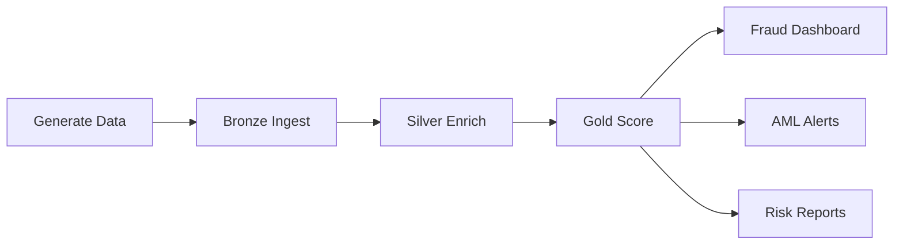
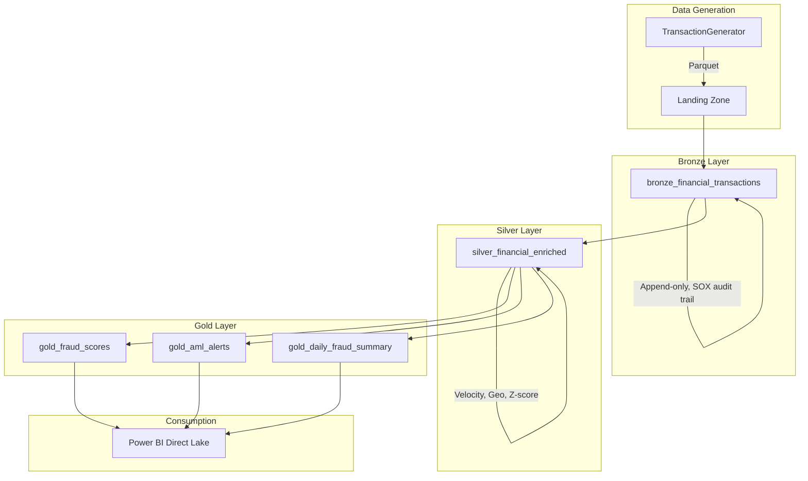

# Tutorial 47: Financial Services - Real-Time Fraud Detection & AML


## Overview

Build an end-to-end financial services analytics platform in Microsoft Fabric that handles real-time fraud detection, anti-money laundering (AML) monitoring, and regulatory reporting for a mid-tier commercial bank.

### What You'll Build



### Learning Objectives

- Generate PCI-compliant synthetic financial transactions
- Build a medallion pipeline for fraud detection
- Compute velocity features and geo-anomaly detection
- Implement BSA/AML monitoring (CTR and structuring detection)
- Create fraud operations dashboards with Direct Lake

---

## Prerequisites

| Requirement | Details |
|-------------|---------|
| Microsoft Fabric | F64 capacity or trial |
| Workspace | `ws-financial-services` |
| Lakehouses | `lh_bronze`, `lh_silver`, `lh_gold` |
| Python | 3.10+ (for data generation) |
| Environment variable | `FABRIC_POC_HASH_SALT` set for PII hashing |

---

## Step 1: Generate Synthetic Transaction Data

### 1.1 Install Dependencies

```bash
pip install pandas numpy faker tqdm pyarrow
```

### 1.2 Generate Transactions

```python
from data_generation.generators.financial.transaction_generator import TransactionGenerator

# Create generator with reproducible seed
gen = TransactionGenerator(
    seed=42,
    num_customers=10000,
    fraud_rate=0.0015,  # 0.15% - industry average
)

# Generate 500K transactions
df = gen.generate(num_records=500000)
print(f"Total transactions: {len(df):,}")
print(f"Fraud rate: {df['is_fraud'].mean():.4%}")
print(f"Fraud patterns:\n{df[df['is_fraud']]['fraud_pattern'].value_counts()}")

# Save to landing zone
gen.to_parquet(df, "landing/financial/transactions.parquet")

# Also generate account profiles
accounts = gen.generate_accounts()
gen.to_parquet(accounts, "landing/financial/accounts.parquet")
print(f"Accounts generated: {len(accounts):,}")
```

### 1.3 Verify PCI Compliance

Confirm no raw PAN exists in the output:

```python
# card_hash should be a 64-char hex string, NOT a card number
assert all(len(h) == 64 for h in df['card_hash']), "PCI violation: raw PAN detected!"
assert not any(df['card_hash'].str.match(r'^\d{13,19}$')), "PCI violation: numeric PAN!"
print("PCI DSS check passed: No raw PAN in output")
```

> **PCI DSS v4.0 Req 3.4**: Render PAN unreadable anywhere it is stored. The generator uses SHA-256 hashing so only `card_hash` is persisted.

---

## Step 2: Upload to Fabric

### 2.1 Upload Landing Files

1. Open your `lh_bronze` Lakehouse in Fabric
2. Navigate to **Files** > create folder `landing/financial/`
3. Upload `transactions.parquet` and `accounts.parquet`

### 2.2 Verify Upload

```python
# In a Fabric notebook
files = mssparkutils.fs.ls("Files/landing/financial/")
for f in files:
    print(f"{f.name} - {f.size / 1024 / 1024:.1f} MB")
```

---

## Step 3: Bronze Layer - Raw Ingestion

### 3.1 Import Notebook

Import `notebooks/bronze/51_financial_transactions.py` into your Fabric workspace.

### 3.2 Run the Notebook

The Bronze notebook:
- Reads Parquet from `Files/landing/financial/`
- Enforces schema with explicit StructType
- Adds metadata: `_ingested_at`, `_input_file`, `_source_system`
- Validates no raw PAN exists (PCI compliance gate)
- Appends to `bronze_financial_transactions` Delta table

### 3.3 Verify Bronze Output

```sql
SELECT COUNT(*) AS total,
       COUNT(DISTINCT acct_id) AS accounts,
       MIN(txn_timestamp) AS earliest,
       MAX(txn_timestamp) AS latest
FROM lh_bronze.bronze_financial_transactions
```

Expected: ~500K records, 10K unique accounts.

---

## Step 4: Silver Layer - Enrichment

### 4.1 Import Notebook

Import `notebooks/silver/51_financial_enriched.py`.

### 4.2 Run the Notebook

The Silver notebook computes:

| Feature | Description | Purpose |
|---------|-------------|---------|
| `txn_count_1h` | Transactions in last 1 hour | Velocity detection |
| `txn_count_24h` | Transactions in last 24 hours | Velocity detection |
| `txn_count_7d` | Transactions in last 7 days | Behavioral baseline |
| `avg_amount_30d` | 30-day rolling average amount | Amount spike detection |
| `amount_zscore` | Z-score of amount vs. 30-day avg | Anomaly quantification |
| `geo_distance_km` | Haversine distance from last txn | Impossible travel detection |
| `time_since_last_txn_sec` | Seconds since previous txn | Rapid-fire detection |
| `merchant_risk` | MCC-based risk classification | Risk weighting |

### 4.3 Verify Silver Output

```sql
SELECT ROUND(AVG(txn_count_1h), 2) AS avg_velocity_1h,
       ROUND(AVG(geo_distance_km), 1) AS avg_geo_km,
       ROUND(AVG(amount_zscore), 2) AS avg_zscore,
       SUM(CASE WHEN merchant_risk = 'high' THEN 1 ELSE 0 END) AS high_risk_count
FROM lh_silver.silver_financial_enriched
```

---

## Step 5: Gold Layer - Fraud Scoring & AML

### 5.1 Import Notebook

Import `notebooks/gold/51_financial_fraud_scoring.py`.

### 5.2 Run the Notebook

The Gold notebook produces three output tables:

#### gold_fraud_scores

Each transaction gets a composite fraud score (0-1):

| Score Component | Trigger | Weight |
|----------------|---------|--------|
| Velocity | >5 txns/1h | +0.25 |
| Geo-anomaly | >500 km in <1h | +0.30 |
| Amount spike | Z-score >3 | +0.20 |
| High-risk MCC | Gambling, crypto, etc. | +0.15 |
| Card-not-present | CNP channel | +0.10 |

Decision logic:
- Score >= 0.85 -> **DECLINE**
- Score 0.50-0.84 -> **STEP-UP AUTH** (OTP, biometric)
- Score < 0.50 -> **APPROVE**

#### gold_aml_alerts

| Alert Type | Trigger | Regulation |
|-----------|---------|------------|
| CTR | Amount >= $10,000 | 31 CFR 1010.311 |
| STRUCTURING | 2+ txns $8K-$9.9K in 48h | 31 CFR 1010.314 |

#### gold_daily_fraud_summary

Daily KPIs: fraud rate, total losses, declined count, step-up count, total volume.

### 5.3 Verify Gold Output

```sql
-- Fraud score distribution
SELECT fraud_decision, COUNT(*) AS cnt,
       ROUND(AVG(fraud_score), 4) AS avg_score
FROM lh_gold.gold_fraud_scores
GROUP BY fraud_decision

-- AML alerts
SELECT alert_type, alert_priority, COUNT(*) AS alerts
FROM lh_gold.gold_aml_alerts
GROUP BY alert_type, alert_priority
```

---

## Step 6: Power BI Dashboard

### 6.1 Create Semantic Model

1. In `lh_gold`, select **New semantic model**
2. Include: `gold_fraud_scores`, `gold_aml_alerts`, `gold_daily_fraud_summary`
3. Connection mode: **Direct Lake**

### 6.2 Build Fraud Operations Dashboard

Create the following visuals:

| Visual | Type | Data |
|--------|------|------|
| Fraud Rate Trend | Line chart | `gold_daily_fraud_summary.fraud_rate` by date |
| Fraud by Channel | Stacked bar | `gold_fraud_scores` grouped by channel |
| Decision Distribution | Donut | APPROVE / STEP_UP / DECLINE counts |
| AML Alert Queue | Table | `gold_aml_alerts` sorted by priority |
| KPI Cards | Cards | Total losses, fraud rate %, alert count |
| Geo Heat Map | Map | Fraud locations from `gold_fraud_scores` |

### 6.3 Configure Row-Level Security

```dax
// BSA Officers see all alerts
[UserRole] = "BSA_Officer"

// Analysts see only aggregated data
[UserRole] = "Analyst" && [alert_type] = BLANK()
```

---

## Step 7: Validate & Test

### 7.1 Run Unit Tests

```bash
pytest validation/unit_tests/financial/test_transaction_generator.py -v
```

Expected: 6 tests passing.

### 7.2 Data Quality Checks

| Check | Expected |
|-------|----------|
| No raw PAN in any table | 0 violations |
| All amounts > 0 | 100% pass |
| Fraud rate 0.05%-0.50% | Within range |
| CTR alerts match txns > $10K | Counts match |
| No orphan accounts | All acct_ids link |

---

## PCI-DSS v4.0 Compliance Checklist

Use this checklist to validate your deployment meets PCI requirements:

- [ ] **Req 3.4** - PAN rendered unreadable (card_hash only, no raw PAN)
- [ ] **Req 3.5** - Cryptographic keys in Azure Key Vault
- [ ] **Req 7.1** - Access restricted via Workspace RBAC
- [ ] **Req 8.3** - MFA enforced via Entra ID Conditional Access
- [ ] **Req 10.1** - Audit logging enabled (Fabric workspace monitoring)
- [ ] **Req 10.4** - Time synchronization (Azure platform NTP)
- [ ] **Req 11.3** - Vulnerability scanning (Defender for Cloud)
- [ ] **Req 12.8** - Azure compliance certifications documented

---

## Troubleshooting

| Issue | Cause | Solution |
|-------|-------|----------|
| `PCI VIOLATION` assertion | Raw PAN in data | Re-run generator; verify card_hash is 64-char hex |
| Empty AML alerts | No txns above $10K | Increase wire transfer volume or lower threshold for testing |
| Slow velocity features | Large dataset window joins | Increase Spark executor memory; partition by date |
| Missing `mssparkutils` | Running outside Fabric | Use Fabric notebook environment |
| `FABRIC_POC_HASH_SALT` error | Env var not set | Set via Fabric environment or notebook config |

---

## Architecture Summary



---

## Next Steps

- [ ] Connect real Event Hub for streaming card authorizations
- [ ] Deploy ML model (LightGBM) to Fabric ML endpoint
- [ ] Set up Reflex alerts for high-priority fraud decisions
- [ ] Configure Data Activator for AML alert escalation
- [ ] Build CCAR/DFAST stress testing pipeline

---

## References

- [31 CFR 1020 - BSA Rules for Banks](https://www.ecfr.gov/current/title-31/subtitle-B/chapter-X/part-1020)
- [PCI DSS v4.0 Requirements](https://www.pcisecuritystandards.org/document_library/)
- [12 CFR 217 - Basel III Capital Rules](https://www.ecfr.gov/current/title-12/chapter-II/subchapter-A/part-217)
- [Microsoft Fabric Real-Time Intelligence](https://learn.microsoft.com/en-us/fabric/real-time-intelligence/)
- [Direct Lake in Power BI](https://learn.microsoft.com/en-us/power-bi/enterprise/directlake-overview)

---

[< Tutorial 46](../46-previous-tutorial/README.md) | [Tutorial 48 >](../48-next-tutorial/README.md)

*Last Updated: 2026-04-27 | Phase 14 - Wave 6 (Commercial Verticals)*
