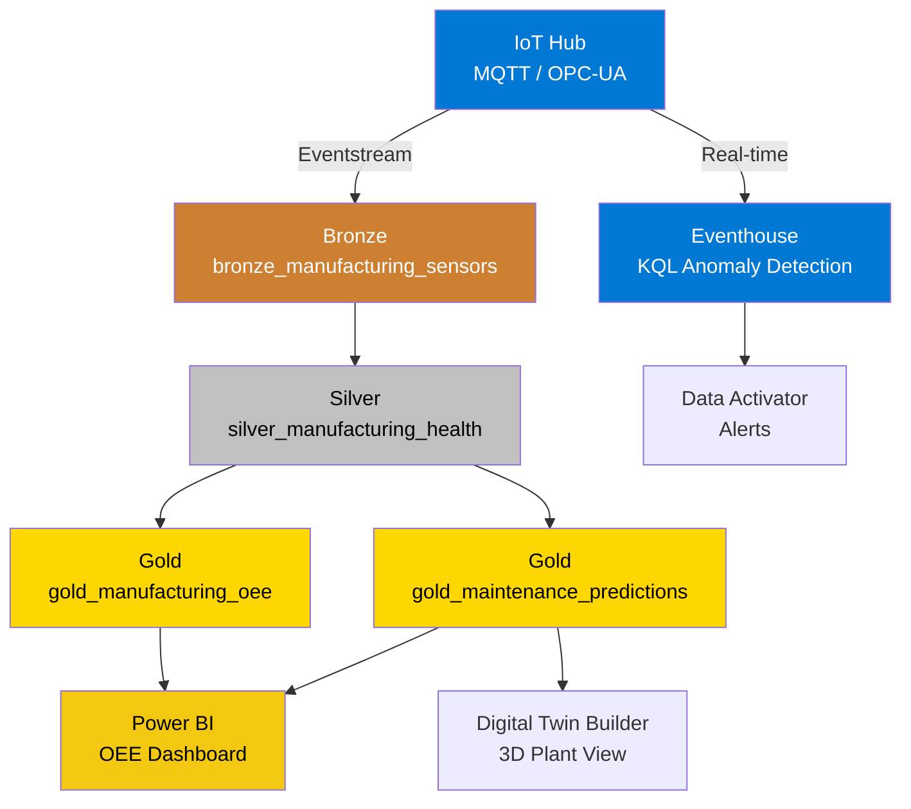

# Tutorial 50: Manufacturing IoT & Predictive Maintenance


---

## Overview

Build an end-to-end predictive maintenance and OEE analytics solution for a
discrete manufacturing plant with 200 CNC machines across 4 production lines
running 24/7 operations.

**What you will learn:**

- Ingest IoT sensor telemetry through Eventstream
- Build a medallion architecture for manufacturing data
- Compute OEE (Availability x Performance x Quality)
- Detect anomalies with z-score analysis
- Generate predictive maintenance risk scores
- Visualize with Power BI Direct Lake dashboards

**Time to complete:** ~90 minutes

---

## Architecture



---

## Prerequisites

- [ ] Microsoft Fabric workspace (F64 capacity)
- [ ] Lakehouse: `lh_bronze`, `lh_silver`, `lh_gold`
- [ ] Python 3.10+ (for data generation)
- [ ] Azure IoT Hub (optional -- for real-time path)

---

## Step 1: Generate Synthetic Data

Generate realistic sensor telemetry with degradation patterns.

```bash
cd data_generation
pip install -r requirements.txt
```

```python
from generators.manufacturing.sensor_generator import ManufacturingSensorGenerator

# Initialize generator (200 machines, 10% showing degradation)
gen = ManufacturingSensorGenerator(seed=42, num_machines=200, degradation_pct=0.10)

# Generate sensor readings
sensors_df = gen.generate(num_records=50000, show_progress=True)
print(f"Generated {len(sensors_df):,} sensor readings")
print(sensors_df.head())

# Generate work orders
work_orders_df = gen.generate_work_orders(num_orders=500)
print(f"Generated {len(work_orders_df):,} work orders")

# Export to Parquet for Fabric upload
gen.to_parquet(sensors_df, "output/bronze_manufacturing_sensors.parquet")
gen.to_parquet(work_orders_df, "output/bronze_manufacturing_work_orders.parquet")
```

**Verification:**

- [ ] 50,000 sensor records generated
- [ ] 500 work orders generated
- [ ] Parquet files in `output/` directory
- [ ] Machine types include CNC, press, robot, conveyor

---

## Step 2: Upload to Fabric Lakehouse

1. Open your Fabric workspace
2. Navigate to `lh_bronze` Lakehouse
3. Click **Get data** > **Upload files**
4. Upload both Parquet files to `Files/output/`

**Verification:**

- [ ] Files visible in `lh_bronze/Files/output/`

---

## Step 3: Run Bronze Notebook

Import and run the Bronze ingestion notebook.

1. In your workspace, click **Import notebook**
2. Select `notebooks/bronze/54_manufacturing_sensors.py`
3. Attach to your Lakehouse
4. Click **Run all**

**What this does:**

- Reads raw Parquet sensor data
- Validates critical fields (sensor_id, machine_id, timestamp)
- Adds Bronze metadata (_bronze_ingested_at, _bronze_batch_id)
- Writes to `bronze_manufacturing_sensors` Delta table

**Verification:**

- [ ] `bronze_manufacturing_sensors` table created
- [ ] All critical field null checks pass
- [ ] Machine type distribution shows all 4 types

---

## Step 4: Run Silver Notebook

Import and run the Silver transformation notebook.

1. Import `notebooks/silver/54_manufacturing_aggregated.py`
2. Attach to Lakehouse
3. Click **Run all**

**What this does:**

- Aggregates sensor data into 1-minute windows
- Computes avg, max, stddev per sensor per machine
- Calculates z-scores over 1-hour rolling windows
- Flags anomalies where z-score > 3.0
- Adds days-since-last-maintenance

**Verification:**

- [ ] `silver_manufacturing_health` table created
- [ ] Anomaly rate between 5-15% (expected with 10% degradation)
- [ ] All sensor aggregation columns populated

---

## Step 5: Run Gold Notebook

Import and run the Gold analytics notebook.

1. Import `notebooks/gold/54_manufacturing_oee.py`
2. Attach to Lakehouse
3. Click **Run all**

**What this does:**

- Assigns shifts (Day/Swing/Night)
- Computes OEE = Availability x Performance x Quality
- Calculates energy consumption per unit
- Generates predictive maintenance risk scores (0-100)
- Classifies machines: NORMAL / MONITOR / SOON / IMMEDIATE

**Verification:**

- [ ] `gold_manufacturing_oee` table created
- [ ] `gold_maintenance_predictions` table created
- [ ] Average OEE between 60-85%
- [ ] Some machines flagged as IMMEDIATE or SOON

---

## Step 6: Explore Results

### OEE by Machine Type

```sql
SELECT machine_type,
       ROUND(AVG(oee) * 100, 1) AS avg_oee_pct,
       ROUND(AVG(availability) * 100, 1) AS avg_availability_pct,
       ROUND(AVG(quality) * 100, 1) AS avg_quality_pct,
       COUNT(*) AS shift_count
FROM lh_gold.gold_manufacturing_oee
GROUP BY machine_type
ORDER BY avg_oee_pct DESC
```

### Machines Needing Maintenance

```sql
SELECT machine_id,
       machine_type,
       ROUND(maintenance_risk_score, 1) AS risk_score,
       ROUND(oee * 100, 1) AS oee_pct,
       recommended_action
FROM lh_gold.gold_maintenance_predictions
WHERE maintenance_risk_score > 60
ORDER BY maintenance_risk_score DESC
```

### Energy Efficiency Leaders

```sql
SELECT machine_id,
       machine_type,
       ROUND(AVG(energy_kwh_per_unit), 2) AS avg_energy_per_unit,
       ROUND(AVG(oee) * 100, 1) AS avg_oee_pct
FROM lh_gold.gold_manufacturing_oee
GROUP BY machine_id, machine_type
ORDER BY avg_energy_per_unit ASC
LIMIT 10
```

---

## Step 7: Build Power BI Dashboard (Optional)

1. In your workspace, click **New** > **Report** > **Pick a dataset**
2. Select `gold_manufacturing_oee` (Direct Lake)
3. Create the following visuals:

| Visual | X-Axis | Y-Axis | Filter |
|--------|--------|--------|--------|
| Card | -- | AVG(oee) | -- |
| Bar chart | machine_type | AVG(oee) | -- |
| Line chart | shift_date | AVG(oee) | machine_type |
| Matrix | machine_id | maintenance_risk_score | risk > 60 |
| Gauge | -- | AVG(availability) | -- |

---

## Step 8: Real-Time Path (Optional)

For sub-minute anomaly detection, configure Eventstream + Eventhouse:

1. **Create Eventstream** connected to Azure IoT Hub
2. **Route to Eventhouse** for KQL anomaly queries
3. **Create KQL Queryset** with the vibration anomaly query from the
   [use case doc](../../docs/use-cases/manufacturing-predictive-maintenance.md)
4. **Configure Data Activator** to alert when anomaly count > 5 in 10 minutes

---

## IEC 62443 Security Checklist

| Control | Status | Notes |
|---------|--------|-------|
| OT/IT network segmentation | Required | Separate VLANs, firewall rules |
| Industrial DMZ | Required | IoT Edge gateway in DMZ |
| TLS 1.2+ for all data in transit | Required | IoT Hub enforces TLS |
| X.509 device certificates | Required | No shared keys |
| One-way data flow (OT -> IT) | Required | No cloud-to-OT commands |
| Fabric private endpoints | Recommended | Network isolation |
| Sensitivity labels | Recommended | Auto-apply "Confidential" |

---

## Troubleshooting

| Issue | Resolution |
|-------|-----------|
| No anomalies detected | Increase `degradation_pct` in generator (e.g., 0.20) |
| OEE always 100% | Check Silver anomaly flags; verify Bronze data has variance |
| Empty predictions table | Ensure Silver table has data; check shift assignment logic |
| Slow Silver notebook | Reduce Bronze data volume or increase Spark executors |

---

## Key Concepts

### OEE Formula

```
OEE = Availability x Performance x Quality

Availability = Run Time / Planned Time
Performance  = (Ideal Cycle x Parts) / Run Time
Quality      = Good Parts / Total Parts
```

### Predictive Maintenance Score

```
Risk = (Vibration x 0.35) + (Temperature x 0.25)
     + (Current x 0.20) + (Maintenance Age x 0.20)

0-40:  NORMAL   -- standard schedule
40-60: MONITOR  -- increase inspections
60-80: SOON     -- schedule within 7 days
80+:   IMMEDIATE -- schedule within 24 hours
```

---

## Related Resources

- [Use Case: Manufacturing Predictive Maintenance](../../docs/use-cases/manufacturing-predictive-maintenance.md)
- [Digital Twin Builder](../../docs/features/digital-twin-builder.md)
- [Real-Time Intelligence](../../docs/features/real-time-intelligence.md)
- [Network Security](../../docs/best-practices/network-security.md)
- [Tutorial 04: Real-Time Analytics](../04-real-time-analytics/README.md)

---

## Next Steps

- Connect real IoT devices via Azure IoT Hub
- Train a survival analysis model for RUL (Remaining Useful Life)
- Integrate with Digital Twin Builder for 3D visualization
- Set up Data Activator alerts for production notifications
- Expand to supply chain and inventory optimization
