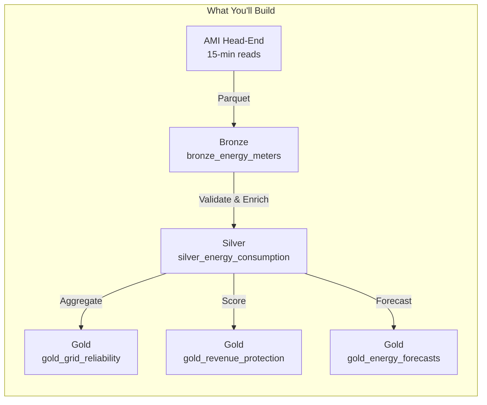
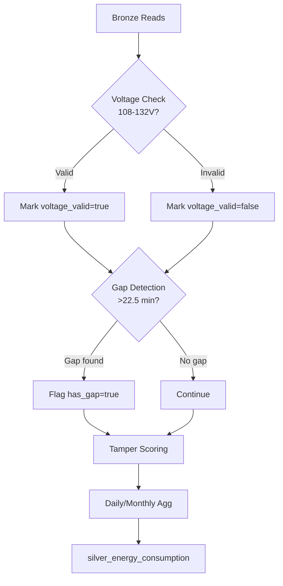

# ⚡ Tutorial 51: Energy & Utilities - Smart Grid Analytics

> **Last Updated**: 2026-04-27 | **Version**: 1.0
> **Status**: Phase 14 - Commercial Verticals | **Vertical**: Energy & Utilities

> :house: **[Home](../../README.md)** > :book: **[Tutorials](../README.md)** > ⚡ **Energy & Utilities**

---

<div align="center">


</div>

---

## :book: Overview

In this tutorial you will build a complete smart grid analytics pipeline on Microsoft Fabric for a regional electric utility serving **1.2 million smart meters**. You will ingest AMI (Advanced Metering Infrastructure) 15-minute interval readings, validate voltage and consumption data, compute IEEE 1366 reliability indices (SAIDI/SAIFI/CAIDI), and build a revenue protection model to detect energy theft.



---

## :dart: Learning Objectives

By the end of this tutorial you will be able to:

- Generate realistic AMI smart meter data with daily load curves
- Build a Bronze ingestion pipeline with data quality quarantine
- Apply ANSI C84.1 voltage validation and gap interpolation in the Silver layer
- Calculate SAIDI, SAIFI, and CAIDI reliability indices per IEEE 1366
- Detect energy theft patterns and score meters for investigation
- Understand NERC CIP compliance requirements for grid data

---

## :clipboard: Prerequisites

| Requirement | Details |
|------------|---------|
| Fabric Workspace | Completed [Tutorial 00](../00-environment-setup/README.md) |
| Lakehouses | `lh_bronze`, `lh_silver`, `lh_gold` created |
| Python environment | Python 3.10+ with `pip install -r requirements.txt` |
| Domain knowledge | Basic understanding of electric utility operations (helpful, not required) |

---

## :one: Step 1: Generate AMI Meter Data

First, generate synthetic meter readings that simulate 15-minute interval data from a fleet of smart meters.

### 1.1 Run the Generator

```bash
cd data_generation
python -m generators.energy.meter_generator
```

Or from Python:

```python
from data_generation.generators.energy.meter_generator import MeterReadingGenerator
from datetime import datetime, timedelta

gen = MeterReadingGenerator(
    seed=42,
    num_meters=1000,
    start_date=datetime(2025, 1, 1),
    end_date=datetime(2025, 1, 31),
)

# Generate 15-min interval readings
df_readings = gen.generate(num_records=50000, show_progress=True)
print(f"Generated {len(df_readings):,} readings")
print(df_readings.head())

# Generate outage events
outages = [gen.generate_outage_event() for _ in range(200)]
print(f"Generated {len(outages)} outage events")

# Export to Parquet
gen.to_parquet(df_readings, "output/energy_meters.parquet")
```

### 1.2 Verify the Data

```python
# Check load curve shape
import pandas as pd
df_readings["hour"] = pd.to_datetime(df_readings["reading_timestamp"]).dt.hour
hourly_avg = df_readings.groupby("hour")["kwh_delivered"].mean()
print("Hourly average kWh (should show morning + evening peaks):")
print(hourly_avg)
```

> :white_check_mark: **Verification**: You should see higher consumption during hours 7-9 (morning) and 17-21 (evening), with a trough overnight and midday.

---

## :two: Step 2: Upload Data to Fabric

### 2.1 Upload Files

1. In Fabric, open **lh_bronze** Lakehouse
2. Click **Upload** > **Upload files**
3. Upload `output/energy_meters.parquet` to `Files/landing/energy_meters/`
4. Upload outage data to `Files/landing/energy_outages/`

### 2.2 Verify Upload

```python
# In a Fabric notebook
files = mssparkutils.fs.ls("Files/landing/energy_meters/")
for f in files:
    print(f"{f.name} - {f.size:,} bytes")
```

> :white_check_mark: **Verification**: Parquet files are visible in the Lakehouse explorer.

---

## :three: Step 3: Bronze Ingestion

### 3.1 Import the Notebook

1. Download `notebooks/bronze/55_energy_meters.py`
2. In Fabric, go to your workspace > **Import** > **Notebook**
3. Select the file and attach to `lh_bronze`

### 3.2 Run the Notebook

Execute all cells. The notebook will:

- Read Parquet files with explicit schema enforcement
- Add Fabric ingestion metadata (`_fabric_ingested_at`, `_fabric_batch_id`)
- Quarantine records with null `meter_id` or `reading_timestamp`
- Write valid records to `bronze_energy_meters` Delta table
- Save a watermark for incremental loading

### 3.3 Verify Bronze Table

```sql
-- In a SQL endpoint
SELECT COUNT(*) as total_records,
       COUNT(DISTINCT meter_id) as unique_meters,
       MIN(reading_timestamp) as earliest,
       MAX(reading_timestamp) as latest
FROM lh_bronze.bronze_energy_meters;
```

> :white_check_mark: **Verification**: Record count matches generator output, meter count matches `num_meters`.

---

## :four: Step 4: Silver Transformation

### 4.1 Import and Run

1. Import `notebooks/silver/55_energy_validated.py`
2. Attach to `lh_silver` (with `lh_bronze` as additional Lakehouse)
3. Execute all cells

### 4.2 What Happens in Silver

The notebook applies these transformations:



**Tamper Score Components**:
| Signal | Score | Description |
|--------|-------|-------------|
| Sudden zero | +0.30 | Previous read >0.5 kWh, current = 0 |
| Reverse anomaly | +0.25 | Received > 2x delivered (non-solar residential) |
| Device tamper | +0.45 | Hardware tamper flag from meter |

### 4.3 Verify Silver Table

```sql
SELECT voltage_range,
       COUNT(*) as records,
       AVG(tamper_score) as avg_tamper,
       AVG(kwh_delivered) as avg_kwh
FROM lh_silver.silver_energy_consumption
GROUP BY voltage_range;
```

> :white_check_mark: **Verification**: Majority of records in `RANGE_A`, avg tamper score < 0.1.

---

## :five: Step 5: Gold KPIs - Grid Reliability

### 5.1 Import and Run

1. Import `notebooks/gold/55_energy_grid_kpis.py`
2. Attach to `lh_gold` (with `lh_silver` and `lh_bronze` as additional)
3. Execute all cells

### 5.2 Understanding IEEE 1366 Indices

| Index | Formula | What It Measures |
|-------|---------|-----------------|
| **SAIDI** | `Sum(CMI) / Total Customers` | Average outage duration per customer (minutes) |
| **SAIFI** | `Sum(Customers Interrupted) / Total Customers` | Average number of interruptions per customer |
| **CAIDI** | `SAIDI / SAIFI` | Average restoration time per interruption (minutes) |
| **ASAI** | `1 - (SAIDI / Minutes in Period)` | Service availability (target: >0.9999) |

> :bulb: **Note**: Major Event Days (MED) are excluded per IEEE 1366 2.5 Beta method. This prevents extreme weather from skewing normal reliability metrics.

### 5.3 Verify Reliability KPIs

```sql
SELECT district,
       ROUND(AVG(saidi), 2) as avg_saidi,
       ROUND(AVG(saifi), 4) as avg_saifi,
       ROUND(AVG(caidi), 2) as avg_caidi,
       SUM(outage_count) as total_outages
FROM lh_gold.gold_grid_reliability
WHERE feeder_id IS NULL  -- district level
GROUP BY district
ORDER BY avg_saidi DESC;
```

> :white_check_mark: **Verification**: SAIDI values typically range 50-200 minutes annually; SAIFI 0.8-1.5.

---

## :six: Step 6: Gold KPIs - Revenue Protection

### 6.1 Review Theft Detection Results

```sql
SELECT priority,
       COUNT(*) as meter_count,
       ROUND(AVG(theft_score), 3) as avg_score,
       ROUND(SUM(estimated_loss_usd), 2) as total_est_loss
FROM lh_gold.gold_revenue_protection
GROUP BY priority
ORDER BY
    CASE priority WHEN 'HIGH' THEN 1 WHEN 'MEDIUM' THEN 2 ELSE 3 END;
```

### 6.2 Investigation Queue

```sql
-- Top 10 meters for field investigation
SELECT meter_id, district, theft_score, anomaly_type,
       estimated_loss_usd, priority
FROM lh_gold.gold_revenue_protection
WHERE priority = 'HIGH'
ORDER BY theft_score DESC
LIMIT 10;
```

> :white_check_mark: **Verification**: HIGH priority meters have `theft_score > 0.7` and non-zero estimated loss.

---

## :seven: Step 7: NERC CIP Compliance Checks

### 7.1 Audit Trail Verification

Every notebook writes a NERC CIP audit entry. Verify the trail:

```python
# Check audit entries in notebook output
# Each entry contains: timestamp, notebook, operation, table, records, batch_id
```

### 7.2 Access Control Checklist

| Control | Implementation | Status |
|---------|---------------|--------|
| Electronic Security Perimeter | Private endpoints on Fabric workspace | :white_check_mark: |
| Role-Based Access | Workspace roles: Admin, Member, Contributor, Viewer | :white_check_mark: |
| Audit Logging | Fabric audit logs + notebook-level entries | :white_check_mark: |
| Data Encryption | OneLake encryption at rest (Microsoft-managed or CMK) | :white_check_mark: |
| Sensitivity Labels | Purview labels on BES data tables | :white_check_mark: |

### 7.3 Data Classification

```sql
-- Verify no BES Cyber System data in unrestricted tables
-- All SCADA/EMS data must be in workspace with ESP controls
SELECT DISTINCT _silver_notebook, COUNT(*)
FROM lh_silver.silver_energy_consumption
GROUP BY _silver_notebook;
```

---

## :eight: Step 8: Power BI Dashboard (Optional)

### 8.1 Create Direct Lake Dataset

1. In `lh_gold`, click **New semantic model**
2. Select tables: `gold_grid_reliability`, `gold_energy_forecasts`, `gold_revenue_protection`
3. Define relationships:
   - `gold_grid_reliability.district` → `gold_energy_forecasts.district`

### 8.2 Key Visuals

| Visual | Table | Measures |
|--------|-------|----------|
| SAIDI/SAIFI gauge | `gold_grid_reliability` | `AVG(saidi)`, `AVG(saifi)` |
| Reliability trend | `gold_grid_reliability` | `saidi` by `period_start` |
| Worst feeders bar chart | `gold_grid_reliability` | `total_cmi` by `feeder_id` (Top 10) |
| Theft heatmap | `gold_revenue_protection` | `theft_score` by `district` |
| Load factor line chart | `gold_energy_forecasts` | `load_factor` by `forecast_date` |

---

## :test_tube: Validation

Run the unit tests to verify generator correctness:

```bash
pytest validation/unit_tests/energy/test_meter_generator.py -v
```

Expected output:
```
test_generate_readings ............ PASSED
test_kwh_non_negative ............. PASSED
test_voltage_range ................ PASSED
test_load_curve_shape ............. PASSED
test_interval_spacing ............. PASSED
test_reproducibility .............. PASSED
```

---

## :broom: Cleanup

To remove tutorial artifacts:

```sql
DROP TABLE IF EXISTS lh_bronze.bronze_energy_meters;
DROP TABLE IF EXISTS lh_bronze.bronze_energy_meters_quarantine;
DROP TABLE IF EXISTS lh_bronze.bronze_energy_outage_events;
DROP TABLE IF EXISTS lh_silver.silver_energy_consumption;
DROP TABLE IF EXISTS lh_gold.gold_grid_reliability;
DROP TABLE IF EXISTS lh_gold.gold_energy_forecasts;
DROP TABLE IF EXISTS lh_gold.gold_revenue_protection;
```

---

## :books: Further Reading

- [Use Case: Energy Grid Analytics](../../docs/use-cases/energy-grid-analytics.md) - Full architecture and ROI analysis
- [NERC CIP Standards](https://www.nerc.com/pa/Stand/Pages/CIPStandards.aspx)
- [IEEE 1366 Reliability Indices](https://standards.ieee.org/standard/1366-2012.html)
- [ANSI C84.1 Voltage Standards](https://www.nema.org/standards/view/ansi-c84-1)
- [Fabric Real-Time Intelligence](https://learn.microsoft.com/en-us/fabric/real-time-intelligence/)
- [Medallion Architecture Deep Dive](../../docs/best-practices/medallion-architecture-deep-dive.md)

---

## :arrow_forward: Next Steps

| Tutorial | Topic |
|----------|-------|
| [Tutorial 52](../52-healthcare-clinical/README.md) | Healthcare & Clinical Analytics |
| [Tutorial 00](../00-environment-setup/README.md) | Environment Setup (if not done) |

---

> :house: **[Home](../../README.md)** > :book: **[Tutorials](../README.md)** > ⚡ **Energy & Utilities**
