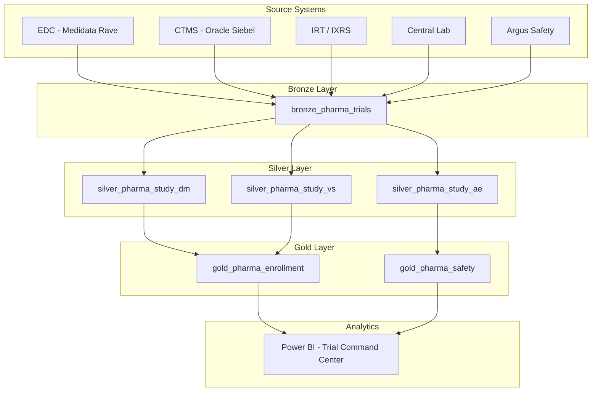

# 💊 Tutorial 53: Pharma Clinical Trial Analytics

<div align="center" markdown>


</div>

> 🏠 **[Home](https://github.com/fgarofalo56/Suppercharge_Microsoft_Fabric/blob/main/README.md)** > 📖 **[Tutorials](../index.md)** > 💊 **Pharma Clinical Trial Analytics**

---

!!! info "Third-party references — publicly sourced, good-faith comparison"
    This page references non-Microsoft products and services. That information is drawn from each vendor's **publicly available documentation** and is offered for honest, good-faith comparison only. This is a personal project written from a Microsoft Fabric and Azure perspective; it does **not** claim expertise in, or authority over, any third-party product, and nothing here is an official statement by, or endorsed by, those vendors. Capabilities, pricing, and features change often — always verify against the vendor's current official documentation. Where a third-party offering is the stronger choice, we say so plainly.

---

## 💊 Tutorial 53: Pharma Clinical Trial Analytics

| | |
|---|---|
| **Difficulty** | ⭐⭐⭐⭐ Advanced |
| **Time** | ⏱️ 120-150 minutes |
| **Focus** | Clinical Trial Data Integration, Safety Signal Detection, 21 CFR Part 11, GxP Compliance |
| **Industry** | Pharma & Life Sciences |

---

### 📊 Progress Tracker

```
┌──────┬──────┬──────┬──────┬──────┬──────┬──────┬──────┬──────┬──────┬──────┬──────┬──────┬──────┐
│  00  │  01  │  02  │  03  │  04  │  05  │  06  │  07  │  08  │  09  │  10  │  11  │  12  │  13  │
│SETUP │BRNZE │SILVR │ GOLD │  RT  │ PBI  │PIPES │ GOV  │MIRRR │AI/ML │TDATA │ SAS  │CICD  │MIGR  │
├──────┼──────┼──────┼──────┼──────┼──────┼──────┼──────┼──────┼──────┼──────┼──────┼──────┼──────┤
│  ✅  │  ✅  │  ✅  │  ✅  │  ✅  │  ✅  │  ✅  │  ✅  │  ✅  │  ✅  │  ✅  │  ✅  │  ✅  │  ✅  │
└──────┴──────┴──────┴──────┴──────┴──────┴──────┴──────┴──────┴──────┴──────┴──────┴──────┴──────┘

┌──────┐
│  53  │
│PHARMA│
├──────┤
│  🔵  │
└──────┘
   ▲
YOU ARE HERE
```

| Navigation | |
|---|---|
| ⬅️ **Previous** | [38-DOJ Justice Analytics](../38-doj-justice/README.md) |
| ➡️ **Next** | Coming soon |

---

## 📖 Overview

In this tutorial, you will build a complete **clinical trial analytics platform** on
Microsoft Fabric, processing data from a top-20 pharmaceutical company managing
45 active trials across 12,000 enrolled subjects. You will implement the full
medallion architecture with **21 CFR Part 11** electronic records compliance and
**GxP** data integrity (ALCOA+ principles).

### 🎯 What You Will Learn

- Ingest clinical trial data from EDC, CTMS, IRT, ePRO, lab, and safety systems
- Apply SDTM-like transformations in the Silver layer
- Validate MedDRA adverse event coding (PT-to-SOC hierarchy)
- Detect safety signals using disproportionality analysis (PRR)
- Track enrollment velocity and site performance rankings
- Implement 21 CFR Part 11 audit trails with Delta Lake
- Apply GxP ALCOA+ data integrity principles

### 🏗️ Architecture



---

## 📋 Prerequisites

Before starting this tutorial, ensure you have completed:

- [x] **Tutorial 00** — Environment Setup
- [x] **Tutorial 01** — Bronze Layer Fundamentals
- [x] **Tutorial 02** — Silver Layer Transformations
- [x] **Tutorial 03** — Gold Layer KPIs
- [x] Python 3.10+ with `pip install faker numpy pandas tqdm`
- [x] Microsoft Fabric workspace (F64 or trial capacity)

---

## 🚀 Step 1: Generate Synthetic Trial Data

### 1.1 Install the Trial Generator

The `TrialGenerator` creates realistic clinical trial data with subjects, adverse
events, and visits.

```python
# From the repository root
from data_generation.generators.pharma.trial_generator import TrialGenerator

gen = TrialGenerator(seed=42, num_studies=45)

# Generate subjects
subjects = [gen.generate_record(domain="subject") for _ in range(12000)]

# Generate adverse events
aes = [gen.generate_record(domain="adverse_event") for _ in range(8000)]

# Generate visits
visits = [gen.generate_record(domain="visit") for _ in range(35000)]

print(f"Subjects: {len(subjects):,}")
print(f"Adverse Events: {len(aes):,}")
print(f"Visits: {len(visits):,}")
```

### 1.2 Export to Parquet

```python
import pandas as pd

df_subjects = pd.DataFrame(subjects)
df_aes = pd.DataFrame(aes)
df_visits = pd.DataFrame(visits)

df_subjects.to_parquet("output/pharma_trials/subjects/subjects.parquet", index=False)
df_aes.to_parquet("output/pharma_trials/adverse_events/aes.parquet", index=False)
df_visits.to_parquet("output/pharma_trials/visits/visits.parquet", index=False)
```

### ✅ Verification

```python
assert len(subjects) == 12000
assert all("subject_id" in s for s in subjects)
assert all("meddra_pt" in ae for ae in aes)
print("✅ Data generation verified")
```

---

## 🥉 Step 2: Bronze Layer Ingestion

Upload the Parquet files to your Fabric Lakehouse under `Files/landing/pharma_trials/`.

### 2.1 Import the Bronze Notebook

Import `notebooks/bronze/57_pharma_trials.py` into your Fabric workspace.

### 2.2 Run for Each Domain

Run the notebook three times, setting the `domain` parameter:

| Run | Parameter | Records |
|-----|-----------|---------|
| 1 | `domain = subjects` | 12,000 |
| 2 | `domain = adverse_events` | 8,000 |
| 3 | `domain = visits` | 35,000 |

### 2.3 21 CFR Part 11 Audit Trail

The bronze layer uses **append-only** Delta Lake writes. Every record version is
preserved — this is your electronic record audit trail.

```sql
-- Verify audit trail
DESCRIBE HISTORY lh_bronze.bronze_pharma_trials;
```

### ✅ Verification

```sql
SELECT _bronze_domain, COUNT(*) as record_count
FROM lh_bronze.bronze_pharma_trials
GROUP BY _bronze_domain;
```

Expected output:

| _bronze_domain | record_count |
|---------------|-------------|
| subjects | 12,000 |
| adverse_events | 8,000 |
| visits | 35,000 |

---

## 🥈 Step 3: Silver Layer — SDTM Transformations

### 3.1 Import the Silver Notebook

Import `notebooks/silver/57_pharma_validated.py` into your Fabric workspace.

### 3.2 Key Transformations

| Domain | Transformation | Compliance |
|--------|---------------|-----------|
| DM (Demographics) | Status standardization, age validation | ALCOA+ Accurate |
| AE (Adverse Events) | MedDRA PT-to-SOC validation | ICH E2B |
| VS (Visits) | Visit window compliance (+-3 days) | ICH E6 GCP |

### 3.3 MedDRA Coding Validation

The silver notebook validates that each adverse event's Preferred Term (PT) maps
to the correct System Organ Class (SOC):

```
Headache → Nervous system disorders ✅
Nausea → Gastrointestinal disorders ✅
Nausea → Nervous system disorders ❌ (INVALID_MEDDRA_MAPPING)
```

### 3.4 Data Quality Scoring

Each record receives a `_dq_score` from 0.0 to 1.0:

| Score | Meaning |
|-------|---------|
| 1.0 | All quality checks passed |
| 0.8 | One minor issue (e.g., missing optional field) |
| 0.6 | Two issues |
| < 0.6 | Requires manual review |

### ✅ Verification

```sql
-- Check MedDRA validation results
SELECT meddra_valid, COUNT(*) as cnt
FROM lh_silver.silver_pharma_study_ae
GROUP BY meddra_valid;

-- Check visit window compliance
SELECT visit_window_compliant, COUNT(*) as cnt
FROM lh_silver.silver_pharma_study_vs
GROUP BY visit_window_compliant;
```

---

## 🥇 Step 4: Gold Layer — Enrollment & Safety KPIs

### 4.1 Import the Gold Notebook

Import `notebooks/gold/57_pharma_outcomes.py` into your Fabric workspace.

### 4.2 Enrollment KPIs

The gold layer produces three enrollment tables:

#### Study Summary (`gold_pharma_enrollment_study_summary`)

| Column | Description |
|--------|-------------|
| `screen_failure_rate` | % of subjects who screened but didn't enroll |
| `dropout_rate` | % of subjects who withdrew |
| `enrollment_duration_days` | Time from first to last enrollment |
| `active_sites` | Number of recruiting sites |

#### Site Ranking (`gold_pharma_enrollment_site_ranking`)

Sites are ranked by composite score:

```
Composite = 0.40 × Enrollment Rate
          + 0.30 × Retention Rate
          + 0.30 × Visit Compliance
```

#### Enrollment Curve (`gold_pharma_enrollment_curve`)

Monthly enrollment with cumulative totals for actual-vs-planned tracking.

### 4.3 Safety Signal Detection

#### Disproportionality Analysis (`gold_pharma_safety_signals`)

| Column | Description |
|--------|-------------|
| `prr` | Proportional Reporting Ratio |
| `signal_flag` | True if PRR > 2.0 (potential signal) |
| `sae_count` | Serious adverse event count |
| `drug_related_count` | Possibly/probably/definitely related AEs |

#### SAE Compliance (`gold_pharma_safety_sae_compliance`)

Tracks CIOMS reporting timeline adherence:
- **Fatal SUSARs:** Must report within 7 calendar days
- **Other serious SUSARs:** Within 15 calendar days
- **SAEs to sponsor:** Within 24 hours

### ✅ Verification

```sql
-- Top safety signals
SELECT meddra_pt, meddra_soc, ae_count, prr, signal_flag
FROM lh_gold.gold_pharma_safety_signals
WHERE signal_flag = TRUE
ORDER BY prr DESC
LIMIT 10;

-- Site performance bottom quartile
SELECT study_id, site_id, composite_score, site_rank
FROM lh_gold.gold_pharma_enrollment_site_ranking
WHERE site_rank < 0.25
ORDER BY composite_score ASC
LIMIT 10;
```

---

## 📊 Step 5: Power BI Dashboard

### 5.1 Create Direct Lake Semantic Model

Connect Power BI to the gold tables using Direct Lake mode:

1. Open your Fabric workspace
2. Navigate to the gold Lakehouse
3. Click **New semantic model**
4. Select all `gold_pharma_*` tables
5. Define relationships:
   - `enrollment_study_summary.study_id` → `safety_signals.study_id`
   - `enrollment_site_ranking.study_id` → `enrollment_study_summary.study_id`

### 5.2 Dashboard Pages

| Page | Visuals | Data Source |
|------|---------|-------------|
| Enrollment Overview | Enrollment curve (line), screen failure funnel, site map | `gold_pharma_enrollment_*` |
| Safety Surveillance | SOC treemap, PRR scorecard, SAE compliance gauge | `gold_pharma_safety_*` |
| Site Performance | Composite score bar chart, ranking table | `gold_pharma_enrollment_site_ranking` |

---

## 🔒 Step 6: Compliance Validation

### 6.1 21 CFR Part 11 Checklist

| Requirement | Implementation | Status |
|------------|---------------|--------|
| Electronic signatures | Entra ID + MFA on workspace | ☐ |
| Audit trails | Delta Lake append-only + DESCRIBE HISTORY | ☐ |
| Record retention | Delta Lake time travel (25-year policy) | ☐ |
| System validation | pytest + Great Expectations test suites | ☐ |
| Access controls | Workspace roles (Viewer/Contributor/Admin) | ☐ |

### 6.2 GxP ALCOA+ Validation

| Principle | How to Verify | Status |
|-----------|--------------|--------|
| Attributable | Check `_source` metadata on every record | ☐ |
| Legible | Verify Purview business glossary definitions | ☐ |
| Contemporaneous | Compare `_ingested_at` vs source timestamps | ☐ |
| Original | Confirm bronze append-only mode | ☐ |
| Accurate | Review `_dq_score` distribution (>0.8 target) | ☐ |

---

## 🧪 Step 7: Run Unit Tests

```bash
# Run pharma generator tests
pytest validation/unit_tests/pharma/test_trial_generator.py -v

# Expected: 6 tests passing
# - test_generate_subjects
# - test_status_values
# - test_ae_severity
# - test_meddra_format
# - test_dropout_rate
# - test_reproducibility
```

---

## 🎓 Key Takeaways

1. **Clinical trial data** spans multiple operational systems (EDC, CTMS, IRT, Lab, Safety) — Fabric unifies them in OneLake
2. **MedDRA coding validation** in the silver layer catches adverse event miscoding before it reaches safety reports
3. **Disproportionality analysis** (PRR) provides automated safety signal detection at the gold layer
4. **21 CFR Part 11** compliance is achieved through Delta Lake's immutable audit trail, Entra ID authentication, and validated system documentation
5. **GxP ALCOA+ principles** map directly to Fabric's metadata, schema enforcement, and governance capabilities
6. **Site performance ranking** enables data-driven monitoring strategies, focusing resources on underperforming sites

---

## 📚 References

- [FDA 21 CFR Part 11](https://www.ecfr.gov/current/title-21/chapter-I/subchapter-A/part-11)
- [ICH E6(R2) Good Clinical Practice](https://www.ich.org/page/efficacy-guidelines)
- [CDISC SDTM Implementation Guide](https://www.cdisc.org/standards/foundational/sdtm)
- [MedDRA Introductory Guide](https://www.meddra.org/how-to-use/support-documentation)
- [Microsoft Fabric Documentation](https://learn.microsoft.com/fabric/)
- [GAMP 5 Guide](https://ispe.org/publications/guidance-documents/gamp-5)

---

## 🔗 Related Tutorials

| Tutorial | Topic |
|----------|-------|
| [01 - Bronze Layer](../01-bronze-layer/README.md) | Foundational ingestion patterns |
| [02 - Silver Layer](../02-silver-layer/README.md) | Data quality and cleansing |
| [03 - Gold Layer](../03-gold-layer/README.md) | KPI aggregation patterns |
| [07 - Governance](../07-governance-purview/README.md) | Purview lineage and catalog |
| [14 - Security](../14-security-networking/README.md) | Access controls and encryption |

---

*Last Updated: 2026-04-27*
*Industry Vertical: Pharma & Life Sciences*
*Compliance: 21 CFR Part 11, GxP, ICH E6(R2) GCP*
