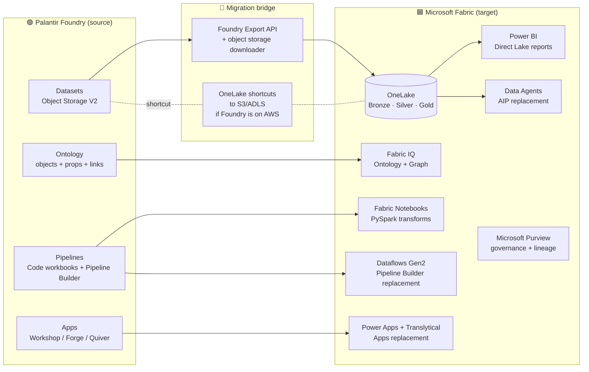

[Home](../../index.md) > [Tutorials](../) > Palantir Foundry to Fabric Migration

# 🟣 Tutorial 55: Palantir Foundry → Microsoft Fabric Migration

> **Last Updated**: 2026-05-21 | **Status**: ✅ Final | **Maintainer**: Platform Team

<div align="center">


</div>

---

|  |  |
|---|---|
| **Difficulty** | ⭐⭐⭐⭐ Advanced |
| **Time** | ⏱️ 360-480 minutes (multi-component migration) |
| **Focus** | Palantir Foundry ontology, transforms, datasets, and pipelines → Microsoft Fabric medallion architecture, Fabric IQ ontology, OneLake, and Direct Lake reporting |

---

## 📋 Table of Contents

- [Overview](#-overview)
- [Why migrate](#-why-migrate)
- [Component mapping](#-component-mapping)
- [Reference architecture](#-reference-architecture)
- [Prerequisites](#-prerequisites)
- [Step-by-step migration](#-step-by-step-migration)
- [Ontology migration deep dive](#-ontology-migration-deep-dive)
- [Egress, network, and cost considerations](#-egress-network-and-cost-considerations)
- [Validation checklist](#-validation-checklist)
- [Troubleshooting](#-troubleshooting)
- [References](#-references)

---

## 📖 Overview

Palantir Foundry is an end-to-end data platform with a strong ontology layer (semantic objects + properties + links), transforms (Python or SQL), datasets (Parquet + Delta in the platform's object store), pipelines, and apps. Migrations from Foundry to Microsoft Fabric typically cluster around four motivations:

1. **License consolidation** — collapsing Foundry, Power BI, and Azure analytics spend into a single Fabric F-SKU.
2. **Microsoft-native tooling** — preferring Power BI, Purview, Entra ID, and Microsoft Defender over Foundry-native equivalents.
3. **OneLake gravity** — operational systems already write to OneLake, and Foundry sits as an island.
4. **AI estate consolidation** — using Fabric IQ, Data Agents, and Azure OpenAI rather than Foundry AIP.

This tutorial covers the canonical migration path: **export Foundry datasets and ontology to OneLake, rebuild the ontology in Fabric IQ, port transforms to PySpark / Dataflows Gen2, and republish dashboards in Power BI Direct Lake.**

> 📝 **Scope:** This is a *technical* migration tutorial. Contract, licensing, and procurement work should be sequenced ahead of any of the steps below — Foundry is typically an enterprise contract with a fixed term, and the migration timeline must align with renewal windows.

---

## 🎯 Why migrate

| Pain point in Foundry | What Fabric offers in its place |
|---|---|
| Foundry ontology locked into the platform | **Fabric IQ ontology** — open, queryable from notebooks, agents, and Power BI |
| Per-seat + per-pipeline pricing | F64 capacity covers all workloads under one SKU |
| Foundry Forge (apps) | Power Apps + Translytical Task Flows + Power BI |
| Foundry AIP (LLM agents) | Data Agents, Azure OpenAI, and the Fabric MCP server |
| Foundry's proprietary dataset format | OneLake Delta tables (open Parquet + Delta Lake spec) |
| Limited Microsoft 365 / Teams / Entra integration | Native — Entra ID, Teams cards, Outlook embedded reports |
| Egress costs when integrating with non-Foundry sources | OneLake shortcuts (S3, GCS, ADLS, Dataverse) — zero copy |

---

## 🧭 Component mapping

The canonical Foundry → Fabric translation:

| Palantir Foundry component | Microsoft Fabric equivalent | Notes |
|---|---|---|
| **Ontology** (object types, properties, links) | **Fabric IQ** ontology + Knowledge Graph | Map object types → entities, properties → fields, links → relationships. See [Fabric IQ](../../features/fabric-iq.md). |
| **Object Storage V2 datasets** | **OneLake Delta tables** in Bronze/Silver/Gold lakehouses | Foundry datasets are already Parquet — bulk export to OneLake is straightforward. |
| **Code Workbooks / Code Repositories** (PySpark transforms) | **Fabric notebooks** in Data Engineering | Mostly drop-in; refactor `foundry_*` SDK imports to PySpark + `pyspark.sql`. |
| **Pipeline Builder** (visual SQL) | **Dataflows Gen2** | Visual paradigm, same Power Query M language Power BI uses. |
| **Object Explorer** (search the ontology) | **OneLake Catalog** + Fabric IQ | Catalog handles discovery; IQ handles semantic queries. |
| **Foundry Slate / Workshop / Foundry Forge** (apps) | **Power Apps** + **Translytical Task Flows** + **Power BI** | Workshop write-back → [Translytical task flows](../../features/translytical-task-flows.md). |
| **Quiver / Contour** (interactive analysis) | **Power BI** + Fabric notebooks | Power BI for dashboards, notebooks for ad-hoc exploration. |
| **AIP Logic / AIP Agents** | **Data Agents** + Azure OpenAI | See [Data Agents](../../features/data-agents.md). |
| **Health Checks / Data Lineage** | **Microsoft Purview** + Fabric Workspace Monitoring | Native lineage from OneLake through PBI. |
| **Foundry permissions (projects, marks, organizations)** | **Workspace RBAC + OneLake Security + Purview sensitivity labels** | Marks → sensitivity labels; projects → workspaces; organizations → Entra groups. |
| **Foundry user-defined functions (UDF)** | **PySpark UDFs / Fabric User Data Functions** | Most UDFs translate without changes; review for any `foundry_*` calls. |
| **Object Set syntax** in code | Replace with `pyspark.sql.DataFrame` joins + Fabric IQ queries | Behavioral equivalence, not syntactic. |

---

## 🏗️ Reference architecture



The bridge is built once and torn down at the end of migration. The steady state is **OneLake → Fabric IQ → Power BI / Data Agents**, with Purview wrapping everything for governance.

---

## 📋 Prerequisites

- ✅ Fabric F64 capacity provisioned with workspace identity ([Tutorial 00](../00-environment-setup/README.md))
- ✅ Bronze/Silver/Gold lakehouses in OneLake ([Tutorials 01-03](../01-bronze-layer/README.md))
- ✅ Foundry **Administrator** role and **Data Engineer** in the source workspace
- ✅ Foundry API token with read access to source datasets and the ontology
- ✅ A target landing location in OneLake (recommend a dedicated `lh_foundry_migration` lakehouse during the cutover, then promote to Bronze)
- ✅ Migration assessment from [Tutorial 13](../13-migration-planning/README.md) signed off by stakeholders

---

## 🚀 Step-by-step migration

### Step 1 — Inventory the Foundry estate

Pull a complete inventory before touching anything. Foundry's REST API lets you enumerate without exporting data.

```python
# foundry_inventory.py
import requests, os, json

FOUNDRY = os.environ["FOUNDRY_HOSTNAME"]            # e.g. yourtenant.palantirfoundry.com
TOKEN   = os.environ["FOUNDRY_TOKEN"]
HDRS    = {"Authorization": f"Bearer {TOKEN}"}

# 1. Datasets
datasets = requests.get(f"https://{FOUNDRY}/api/v2/datasets", headers=HDRS).json()
# 2. Ontology object types
objects  = requests.get(f"https://{FOUNDRY}/api/v2/ontologies/default/objectTypes", headers=HDRS).json()
# 3. Code repos (transforms)
repos    = requests.get(f"https://{FOUNDRY}/api/v2/codeRepositories", headers=HDRS).json()

inventory = {
    "datasets":  [{"rid": d["rid"], "name": d["name"], "size_gb": d.get("sizeBytes", 0) / 1e9} for d in datasets["data"]],
    "object_types": [{"rid": o["rid"], "apiName": o["apiName"]} for o in objects["data"]],
    "repositories": [{"rid": r["rid"], "name": r["name"]} for r in repos["data"]],
}
print(json.dumps(inventory, indent=2))
```

Save this inventory — it drives the wave plan in Step 2.

### Step 2 — Build a wave plan

Group datasets into migration waves. Recommended waves:

1. **Wave 1 — Foundational reference data** (small, low blast radius)
2. **Wave 2 — Core operational datasets** (the ones every dashboard depends on)
3. **Wave 3 — Domain-specific marts**
4. **Wave 4 — Ontology and applications** (must come after data lands)

For each dataset, decide: **bulk export** (Parquet/JSON dump → OneLake) or **shortcut** (point OneLake at the underlying S3/ADLS Foundry storage if available).

### Step 3 — Land Bronze data in OneLake

Two patterns: **shortcut** (preferred when possible) and **export**.

#### 3a. OneLake shortcut (zero copy)

If Foundry is deployed on Azure or AWS and your administrator can grant read access to the underlying object store, point OneLake shortcuts directly at it. This avoids any data movement.

```python
# notebook cell — register a shortcut to the Foundry Parquet location
mssparkutils.fs.mssparkutils.fs.mount(
    "abfss://<container>@<foundry-storage>.dfs.core.windows.net/path/to/dataset",
    "/lakehouse/default/Files/foundry_<dataset>"
)
```

#### 3b. Bulk export via Foundry API

When shortcuts aren't viable (different cloud, network constraints, or contractual reasons), bulk export.

```python
# foundry_export.py — sketch
from foundry_dev_tools import FoundryContext
import shutil, os

ctx = FoundryContext(token=os.environ["FOUNDRY_TOKEN"],
                     foundry_url=f"https://{os.environ['FOUNDRY_HOSTNAME']}")

DATASETS = [
    "ri.foundry.main.dataset.<rid>",
    # ...
]

for rid in DATASETS:
    ds = ctx.dataset(rid)
    parquet_dir = ds.transactions.last_committed.download_to_local("./tmp/" + rid)
    # Upload to OneLake via Spark write
    # (run from inside a Fabric notebook — write directly to lh_bronze)
    df = spark.read.parquet("./tmp/" + rid)
    df.write.format("delta").mode("overwrite").save(f"abfss://workspace@onelake.dfs.fabric.microsoft.com/lh_bronze.Lakehouse/Tables/foundry_{rid}")
```

> 💡 **Foundry Dev Tools** (`pip install foundry-dev-tools`) is the open-source Palantir-published client library. It handles auth, transactions, and chunked downloads cleanly.

### Step 4 — Port transforms

Foundry Code Workbooks are mostly PySpark with a few `foundry_*` SDK calls (mainly `input`/`output` decorators and `Transforms` lineage hooks).

**Foundry transform:**

```python
from transforms.api import transform_df, Input, Output

@transform_df(
    Output("ri.foundry.main.dataset.gold_cust"),
    raw=Input("ri.foundry.main.dataset.bronze_cust"),
)
def compute(raw):
    return raw.filter(raw.status == "active").select("id", "name", "tier")
```

**Fabric notebook equivalent:**

```python
# notebook cell — same logic, no Foundry decorators
df_raw = spark.read.format("delta").table("lh_bronze.bronze_cust")
df_gold = df_raw.filter(df_raw.status == "active").select("id", "name", "tier")
df_gold.write.format("delta").mode("overwrite").saveAsTable("lh_gold.gold_cust")
```

**Patterns to handle during port:**

1. **`Input` / `Output` decorators** → Replace with `spark.read.format("delta").table(...)` / `df.write.saveAsTable(...)`.
2. **`Markings` (PII / sensitivity)** → Map to Purview sensitivity labels.
3. **`Profile` definitions** → Translate to Delta partition + Z-ORDER strategies.
4. **Custom validation hooks** → Move to Great Expectations suites ([validation framework](../../validation/README.md)).
5. **Foundry-native `expectations` package** → Replace with Great Expectations or `pyspark.sql.dataframe`-level assertions.

### Step 5 — Rebuild the ontology in Fabric IQ

This is the highest-value piece of the migration. The Foundry ontology becomes a **Fabric IQ** ontology + **Knowledge Graph**.

Export the Foundry ontology to JSON, then map:

| Foundry concept | Fabric IQ concept |
|---|---|
| Object Type | Entity |
| Property | Field |
| Link | Relationship |
| Search index | Catalog index |
| Action (writeback) | Translytical task |

See [Fabric IQ](../../features/fabric-iq.md) for the authoring workflow. The ontology is defined in YAML and round-trips through Git.

### Step 6 — Republish dashboards

Foundry Quiver / Contour / Workshop dashboards become Power BI Direct Lake reports.

1. Identify the source dataset for each Foundry dashboard.
2. Build the Fabric semantic model on top of the Gold lakehouse table.
3. Recreate visuals in Power BI Desktop.
4. Connect via Direct Lake (preferred) or DirectQuery if the model exceeds Direct Lake limits.

See [Direct Lake](../../features/direct-lake.md) and [Tutorial 05](../05-direct-lake-powerbi/README.md).

### Step 7 — Replace Foundry Apps (Workshop / Forge / Slate)

Three replacement patterns depending on the app complexity:

| Foundry app type | Fabric replacement | When to use |
|---|---|---|
| Read-only dashboard (Quiver / Contour) | Power BI Direct Lake report | Default |
| Read + write-back (Workshop with Actions) | Power BI report + Translytical task flow | Operational write-back from the report itself |
| Custom UX with workflows (Forge / Slate) | Power Apps canvas + Power Automate + Fabric REST API | When the app is genuinely bespoke |

### Step 8 — Cutover and decommission

1. Run both platforms in parallel for one reporting cycle.
2. Reconcile core KPIs to within an agreed tolerance (typically ≤ 0.5% drift).
3. Repoint downstream consumers (BI, ML, external APIs).
4. Freeze writes to Foundry.
5. Take a final archive snapshot to OneLake `lh_archive`.
6. Cancel the Foundry contract at the renewal boundary.

---

## 🧩 Ontology migration deep dive

The ontology is the highest-leverage piece of Foundry — and the trickiest piece to migrate. A naive table-level migration will lose the semantic layer entirely.

**Pattern: Object Type → Fabric IQ Entity**

```yaml
# Fabric IQ ontology file (excerpt)
entities:
  - name: Customer
    primary_key: customer_id
    fields:
      - { name: customer_id, type: string, source: lh_gold.gold_customer.customer_id }
      - { name: name,        type: string, source: lh_gold.gold_customer.name }
      - { name: tier,        type: enum,   values: [bronze, silver, gold, platinum] }
    relationships:
      - { name: orders,   to: Order,   cardinality: one_to_many, fk: orders.customer_id }
      - { name: account,  to: Account, cardinality: one_to_one,  fk: account.customer_id }
```

This becomes queryable by Data Agents, Power BI semantic models, and Fabric REST APIs in one place.

---

## 💰 Egress, network, and cost considerations

| Concern | Mitigation |
|---|---|
| **Foundry on AWS, Fabric in Azure** | Cross-cloud egress charged by AWS. Use OneLake shortcuts where possible (zero copy). For bulk migration, use Azure Data Box or AWS Snowball. |
| **Foundry on Azure, different tenant** | Cross-tenant network paths via private link. Verify subscription RBAC. |
| **Large dataset bulk export** | Foundry's API rate-limits per token. Use multiple service accounts and parallel transactions; expect 4-6 hours per TB. |
| **Re-derivation cost** | Don't migrate computed datasets if the upstream sources are also being migrated — re-derive on Fabric. Saves 30-50% of migration time. |

---

## ✅ Validation checklist

- [ ] Every Foundry dataset has a corresponding OneLake Delta table
- [ ] Row counts match (Foundry vs. OneLake) for every Bronze table
- [ ] All transforms ported, tests added in `validation/`
- [ ] Ontology rebuilt in Fabric IQ — each object type mapped
- [ ] Sensitivity labels (formerly Foundry marks) applied via Purview
- [ ] Every Foundry dashboard has an equivalent Power BI report
- [ ] All Foundry apps (Workshop / Forge) replaced or formally retired
- [ ] Downstream consumers repointed
- [ ] Reconciliation report signed off by data stewards
- [ ] Foundry account frozen and archived

---

## 🛠️ Troubleshooting

| Symptom | Likely cause | Fix |
|---|---|---|
| Foundry API rate limit (429) | Single service account exceeding RPS quota | Stripe across 4-8 service accounts; back off on 429 |
| OneLake write throughput drop during bulk export | Single-writer Spark job | Use `repartition(N)` to parallelize; size N to capacity vCores |
| Ontology fields don't appear in Fabric IQ | Source Delta tables not yet refreshed | Check the lineage from Bronze upward; refresh the materialized view |
| Power BI Direct Lake fallback to DirectQuery | Table size > Direct Lake SKU limit | Move to import mode or partition the table |
| Foundry transform uses `MultipassContext` | Auth/identity context that Fabric doesn't have | Map to managed identity + Entra group claims |

---

## 📚 References

- [Tutorial 13 — Migration Planning](../13-migration-planning/README.md)
- [Fabric IQ](../../features/fabric-iq.md) — the ontology replacement for Foundry's ontology
- [Data Agents](../../features/data-agents.md) — replacement for Foundry AIP
- [OneLake Shortcuts](../../features/onelake-shortcuts-s3-gcs-dataverse.md) — zero-copy bridging to AWS/GCP storage
- [Translytical task flows](../../features/translytical-task-flows.md) — Workshop write-back replacement
- [Best practices — Migration patterns](../../best-practices/migration-patterns.md)
- [Palantir Foundry Dev Tools (open source client)](https://github.com/emdgroup/foundry-dev-tools)
- [Fabric API for GraphQL](../../features/api-for-graphql.md) — REST API replacement for Foundry's APIs

---

> **Navigation:** [⬅️ 45 — On-Prem SSAS/SSIS/SSRS](../45-onprem-ssas-ssis-ssrs/README.md) | [Tutorials Home](../) | [56 — Informatica → Fabric ➡️](../56-informatica-to-fabric/README.md)
